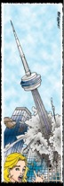

A really, really, really **NERD** novel by [Cory Doctorow][doctorow-archive]
that tells about a bunch of sysadmins that strive to keep the good ol' Net
online after a catastrophic event that brought the entire world to its knees.
They fight with scarce power and food supplies and communicate over the Usenet…
using the *good old alt. hierarchy*.

Vote: 10+ for the geekiest thing I've ever read. It's really worth the hour
needed to read it completely. [Enjoy it][novel-archive]

[doctorow-archive]: https://web.archive.org/web/20110201185322/http://baens-universe.com/authors/Cory_Doctorow
[novel-archive]: https://web.archive.org/web/20110216142848/http://baens-universe.com/articles/when_sysadmins_ruled_the_earth
