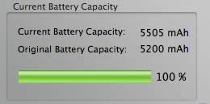

3 simple rules:

- DO NOT leave your charger connected when the battery is charged, even when
you go to sleep.

- DO let it discharge completely, when using it wait till it reaches 0%, when
sleeping it leave it alone, when you’ll wake up and you’ll open it, a resume
from suspend to disk will greet you. OSX FTW.

- Monitor it and show off OSX performance counters to your friends (images
courtesy of
[CoconutBattery.app](http://www.coconut-flavour.com/coconutbattery/) and System
Profiler.app)

