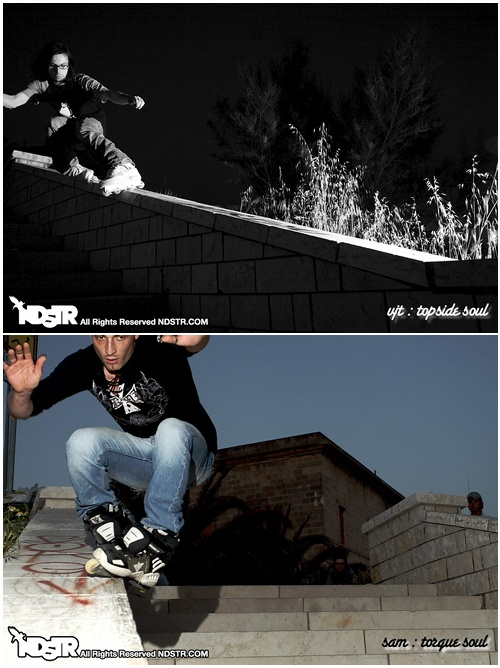

Well, it seems that I've got no reason to be paranoid about my age: I still can
do inline like I did (everyday) when I was a bit younger :).

On international workers day, 1st of May, Sam literally carried me out from
home, far from the computer, and we went skating. It's been an **awesome** day,
we skated a lot, and shot some nice photos.

But the real good ones have been shot when [ndstr](http://ndstr.com/) caught
us. He is by far the best photographer you could meet, and of course my
favorite one (take a look at [his site](http://ndstr.com/)!).

He's been also a skater, so he knows very very well how and when to shoot in
order to take out the most from your tricks :). Here are two of them,
portraying me and Sam while doing our best!

It was fun. Really fun. Thank you Sam for taking me out of home :D.

Oh, and don't forget to visit my [deviantArt](http://devjt.deviantart.com/),
and look at [this
one](http://devjt.deviantart.com/art/disaster-soul-slide-84469475) :D
