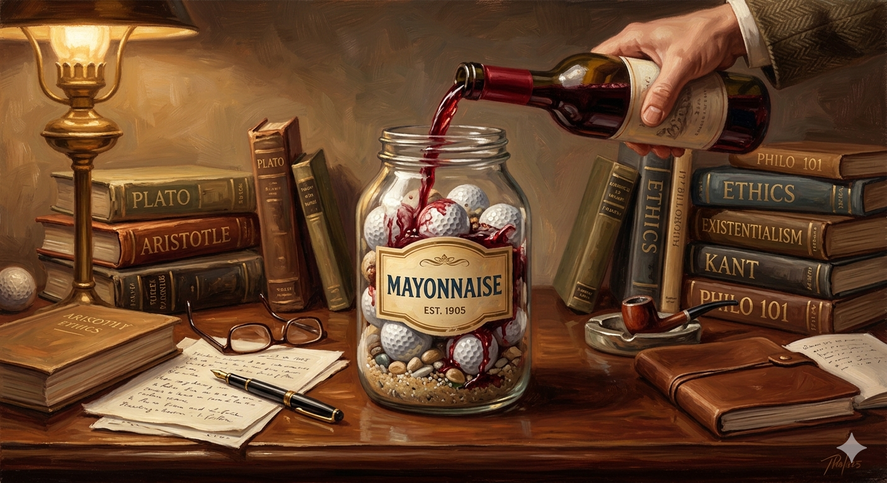

When things in your life seem almost too much to handle, when 24 hours in a day
are not enough, remember the mayonnaise jar and the 2 glasses of wine.

A professor stood before his philosophy class and had some items in front of
him.  When the class began, he wordlessly picked up a very large and empty
mayonnaise jar and proceeded to fill it with golf balls.  He then asked the
students if the jar was full. They agreed that it was.

The professor then picked up a box of pebbles and poured them into the jar. He
shook the jar lightly. The pebbles rolled into the open areas between the golf
balls. He then asked the students again if the jar was full. They agreed it
was.

The professor next picked up a box of sand and poured it into the jar. Of
course, the sand filled up everything else. He asked once more if the jar was
full. The students responded with a unanimous "yes!"

The professor then produced two glasses of wine from under the table and poured
the entire contents into the jar effectively filling the empty space between
the sand. The students laughed.

"Now," said the professor as the laughter subsided, "I want you to recognize
that this jar represents your life. The golf balls are the important things –
your family, your children, your health, your friends and your favorite
passions – and if everything else was lost and only they remained, your life
would still be full. The pebbles are the other things that matter like your
job, your house and your car."

"The sand is everything else – the small stuff."

"If you put the sand into the jar first," he continued, "there is no room for
the pebbles or the golf balls. The same goes for life. If you spend all your
time and energy on the small stuff you will never have room for the things that
are important to you."

Pay attention to the things that are critical to your happiness.  Spend time
with your children.  Spend time with your parents.  Visit with grandparents.

Take time to get medical checkups.  Take your spouse out to dinner.  Play
another 18.  There will always be time to clean the house and fix the disposal.

Take care of the golf balls first – the things that really matter.

Set your priorities. The rest is just sand.

One of the students raised her hand and inquired what the wine represented.

The professor smiled and said, "I'm glad you asked."

"The wine just shows you that no matter how full your life may seem, there's
always room for a couple of glasses of wine with a friend."

---

*Share and enjoy.*
