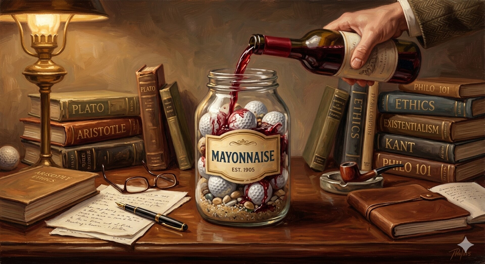

"Quando ti sembra di avere troppe cose da gestire nella vita, quando 24 ore in
un giorno non sono abbastanza, ricordati del vaso della Maionese e dei due
bicchieri di vino..."

Un professore stava davanti alla sua classe di filosofia e aveva davanti alcuni
oggetti.

Quando la classe incominciò a zittirsi, prese un grande barattolo di maionese
vuoto e lo iniziò a riempire di palline da golf. Chiese poi agli studenti se il
barattolo fosse pieno e costoro risposero che lo fosse.

Il professore allora prese un barattolo di ghiaia e la rovesciò nel barattolo
di maionese. Lo scosse leggermente e i sassolini si posizionarono negli spazi
vuoti, tra le palline da golf. Chiese di nuovo agli studenti se il barattolo
fosse pieno e questi concordarono che lo fosse.

Il professore prese allora una scatola di sabbia e la rovesciò, aggiungendola
nel barattolo; ovviamente la sabbia si sparse ovunque all'interno. Chiese
ancora una volta se il barattolo fosse pieno e gli studenti risposero con un
unanime "Si!".

Il professore estrasse quindi due bicchieri di vino da sotto la cattedra e
aggiunse il loro intero contenuto nel barattolo, andando cosi effettivamente a
riempire gli spazi vuoti nella sabbia. Gli studenti risero.

"Ora", disse il professore non appena la risata si fu placata, "voglio che
consideriate questo barattolo come la vostra Vita. Le palle da golf sono le
cose importanti: la vostra famiglia, i vostri bambini, la vostra salute, i
vostri amici e le vostre Passioni; le cose per cui, se anche tutto il resto
andasse perduto e solo queste rimanessero, la vostra vita continuerebbe ad
essere piena. I sassolini sono le altre cose che hanno importanza, come il
vostro lavoro, la casa, la macchina... La sabbia è tutto il resto: le piccole
cose.

Se voi mettete nel barattolo la sabbia per prima, non ci sarà spazio per la
ghiaia e nemmeno per le palle da golf.

Lo stesso vale per la vita: se spendete tutto il vostro tempo e le vostre
energie dietro le piccole cose, non avrete più spazio per le cose che sono
importanti per voi.

Prestate attenzione alle cose che sono indispensabili per la vostra felicità:
giocate con i vostri bambini, godetevi la famiglia ed i genitori finché ci
sono; portate il vostro compagno/a fuori a cena... E non solo nelle occasioni
importanti! Dedicatevi a ciò che amate e alle passioni, tanto ci sarà sempre
tempo per pulire la casa o fissare gli appuntamenti. Prendetevi cura per prima
cosa delle palle da golf, le cose che contano davvero. Fissate le priorità...

Il resto è solo sabbia.

Uno degli studenti alzò la mano e chiese cosa rappresentasse il vino. Il
professore sorrise: "Sono felice che tu l'abbia chiesto. Serve solo per
mostrarvi che non importa quanto piena possa sembrare la vostra vita: ci sarà
sempre spazio per un paio di bicchieri di vino con un amico."

---

*Condividi e buon divertimento.*
