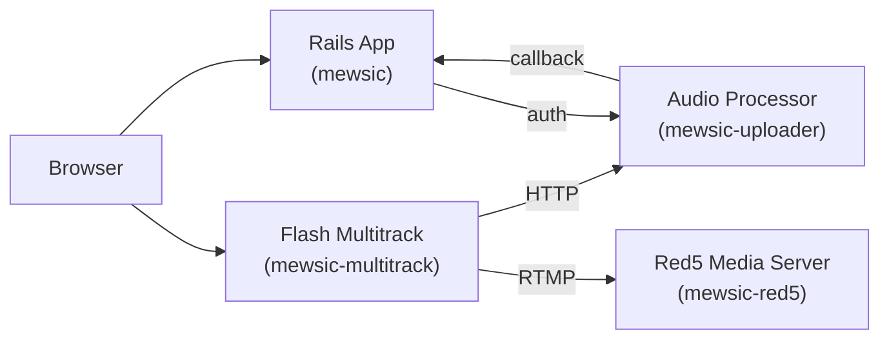
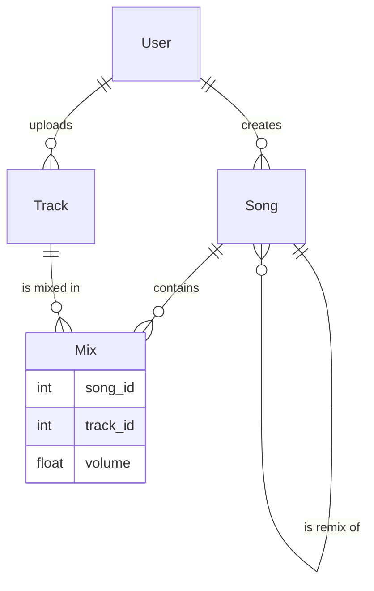

Today we're releasing the source code of Myousica — the collaborative music remixing platform we've been building since late 2007. The project has been rebranded to [Mewsic](https://github.com/mewsic) along the way, but the idea is the same. The project reached a hiatus, and rather than letting the code rot on a private server, we're putting it all on GitHub. Full history preserved, warts and all.

This is the first of three posts walking through the codebase. This one covers the main Rails application — the platform itself. The next two will cover the [Flash multitrack editor](/posts/2010-10-16-mewsic-multitrack-audio-mixing-in-the-browser/) and the [audio processing pipeline](/posts/2010-10-18-mewsic-from-microphone-to-mp3/).

## The idea

The pitch is simple: I upload a bass track for *Let It Be*, you upload your voice, someone else adds guitar and drums. Through Myousica, there's a multitrack editor running in your browser where you can mix everything together, adjust volumes, and publish the result. Other people can then take your remix, add their own tracks, and remix the remix.

Collaborative music creation, entirely in the browser.

## The architecture

Myousica is not a single application — it's four services working together:



- **[mewsic](https://github.com/mewsic/mewsic)** — the main Rails 2.2 application. User accounts, songs, tracks, social features, search. 36 models, 26 controllers, ~1,700 commits.
- **[mewsic-multitrack](https://github.com/mewsic/mewsic-multitrack)** — a Flash/Flex multitrack audio editor. 16-track synchronized playback, real-time recording, waveform visualization.
- **[mewsic-red5](https://github.com/mewsic/mewsic-red5)** — a [Red5](http://www.intechgrity.com/media-server/red5/) instance that handles RTMP streaming for live microphone recording.
- **[mewsic-uploader](https://github.com/mewsic/mewsic-uploader)** — a headless Rails service that handles audio upload, format conversion, normalization, MP3 encoding, and waveform generation.

The services communicate via HTTP callbacks and a token-based authorization scheme. The multitrack editor talks to Rails for metadata and to the uploader for audio files. Red5 captures microphone input via RTMP and writes raw streams to disk. The uploader picks them up, encodes to MP3, and notifies Rails when the job is done.

## The data model

At the heart of Myousica is the relationship between songs and tracks. A Song is a container — a remix. A Track is an individual instrument recording. They're connected through a Mix join model that also stores the per-track volume level:



The clever bit is the remix tree. Songs use `acts_as_nested_set` — each song can be a remix of another song, forming a tree. When you remix a published song, Myousica clones the track list into a new private song and sets it as a child of the original:

```ruby
def create_remix_by(user)
  remix = self.clone
  remix.tracks = self.tracks
  remix.user = user
  remix.status = :private
  remix.save!
  remix.move_to_child_of self
  return remix
end
```

This means tracks flow through the system. My bass track can end up in dozens of remixes. The `find_most_collaborated` method finds songs that share tracks with the most other songs — the most remixed material in the system:

```ruby
def self.find_most_collaborated(options = {})
  collaboration_count = options[:minimum] || 2
  songs = find_by_sql(["
    SELECT s.*, COUNT(DISTINCT m.song_id) -1 AS collaboration_count,
      GROUP_CONCAT(DISTINCT m.song_id ORDER BY m.song_id) AS signature
    FROM mixes m LEFT OUTER JOIN mixes t ON m.track_id = t.track_id
    LEFT OUTER JOIN songs s ON t.song_id = s.id
    LEFT OUTER JOIN songs x ON m.song_id = x.id
    WHERE s.status = :published AND x.status = :published AND m.deleted = 0
    GROUP BY s.id
    HAVING collaboration_count >= :minimum
    ORDER BY collaboration_count DESC, s.rating_avg DESC
  ", {:published => statuses.public, :minimum => collaboration_count}])

  # Deduplicate by track signature
  signatures = []
  songs.select { |song|
    next if signatures.include? song.signature
    signatures.push song.signature
  }
end
```

MySQL-only, unapologetically. The `GROUP_CONCAT` signature trick deduplicates songs that share the exact same set of tracks. Not pretty, but it works.

## The status system

Both songs and tracks have a lifecycle managed by a custom `MultipleStatuses` module. Four states: `:temporary` (created when entering the multitrack), `:private` (saved but not published), `:public` (visible to everyone), and `:deleted` (soft-deleted, invisible).

```ruby
class Song < ActiveRecord::Base
  has_multiple_statuses :public => 1, :private => 2, :deleted => -1, :temporary => -2
end
```

The module defines query methods (`song.public?`, `song.temporary?`), a symbol accessor (`song.status #=> :public`), and a database accessor (`song.status(:db) #=> 1`). Validations only trigger when a song is being published — you can save an incomplete temporary song without a title, but the moment you try to make it public, the full validation suite kicks in:

```ruby
validates_presence_of :title, :author,      :if => :published?
validates_associated :user,                 :if => :published?
validates_length_of :tracks, :minimum => 1, :if => :published?
```

This is a pattern I'm quite happy with. Temporary songs are cheap scratchpads. The multitrack creates one the moment you enter the editor, so there's always something to save tracks against. A weekly cron job cleans up temporary songs older than a week.

## Search

Myousica uses [Sphinx](http://sphinxsearch.com/) via the [thinking-sphinx](https://github.com/pat/thinking-sphinx) plugin for full-text search. The multitrack editor consumes the search API via XML to let you find tracks to add to your mix — filtered by instrument, genre, BPM, key signature, country, or just free text:

```ruby
# XML search parameters for the multitrack SWF
# GET /search.xml?q=query&instrument=5&genre=3&country=italy&bpm=120&key=C#
```

The search indexes are defined right in the models:

```ruby
class Track < ActiveRecord::Base
  define_index do
    has :instrument_id
    indexes :title, :description
    indexes user.country, :as => :country
    indexes instrument.description, :as => :instrument
    where "status = #{statuses.public}"
  end
end
```

Only public content gets indexed. Sphinx handles the full-text ranking while ActiveRecord conditions handle the structured filters.

## The multitrack integration

The multitrack editor is a Flash SWF. When a logged-in user enters it, the controller generates a secure token and creates a temporary song:

```ruby
def index
  if logged_in?
    load_user_stuff
    current_user.enter_multitrack!
    @song = current_user.songs.create_temporary!
  else
    flash.now[:notice] = 'You are not logged in. Save and record will be disabled.'
    @song = Song.new
  end
end
```

The Flash client fetches its configuration from `/multitrack.xml`, which includes all the service URLs and the authentication token:

```xml
<config>
  <host>http://mewsic.com</host>
  <fms>rtmp://upload.mewsic.com/</fms>
  <media>http://upload.mewsic.com</media>
  <current_user>42</current_user>
  <url_request>
    <media>
      <upload method="post">/upload?id=42&amp;token=a1b2c3...</upload>
    </media>
  </url_request>
</config>
```

The upload service is stateless — it validates every request by asking the main app whether the token is valid:

```ruby
def authorize
  @user = User.find_by_id_and_multitrack_token(params[:user_id], params[:token])
  head(@user ? :ok : :forbidden)
end
```

When encoding finishes, the uploader calls back to update the song or track with the final filename and duration. The whole thing is asynchronous — the user doesn't wait for encoding to complete.

## Social features

Beyond the core music functionality, Myousica is a full social platform: friend requests, private messaging, virtual bands (M-Bands) with token-based invitations, 5-star ratings on songs and tracks, polymorphic comments, content flagging, user profiles with avatars, gear lists, musical influences, and the usual Web 2.0 accoutrements.

The User model has fields for MySpace URL and MSN Messenger. That should give you a sense of the era.

## The team

The git history tells the story:

| Who | Commits | What |
|-----|---------|------|
| [Marcello Barnaba](https://github.com/vjt) | 1,196 | Core platform, backend, infrastructure |
| [Andrea Franz](https://github.com/pilu) | 346 | Early development, upload service |
| Giovanni Intini | 64 | Initial Rails setup, foundation |
| Aleksandr Kreynin | 40 | Feature work (2009) |
| Fabio Grande | 21 | UI and frontend |

Development started October 25, 2007 (migrated from Subversion) and the last functional commit was June 2009. The October 2010 commits are just cleanup for this open-source release.

## What's next

The code is out there. The README has setup instructions if you want to run it — you'll need Ruby 1.8, Rails 2.2.2, MySQL, Sphinx, ffmpeg, sox, and a Red5 instance. Or you can just read the source.

Next up: the [multitrack editor](/posts/2010-10-16-mewsic-multitrack-audio-mixing-in-the-browser/) — how Vaclav Vancura built a 16-track audio mixer in Flash, and how we wired it to the backend. That's where the real engineering magic lives.

**Repositories:**
- [mewsic/mewsic](https://github.com/mewsic/mewsic) — main Rails application
- [mewsic/mewsic-multitrack](https://github.com/mewsic/mewsic-multitrack) — Flash multitrack editor
- [mewsic/mewsic-uploader](https://github.com/mewsic/mewsic-uploader) — audio processing service
- [mewsic/mewsic-red5](https://github.com/mewsic/mewsic-red5) — Red5 media server instance
