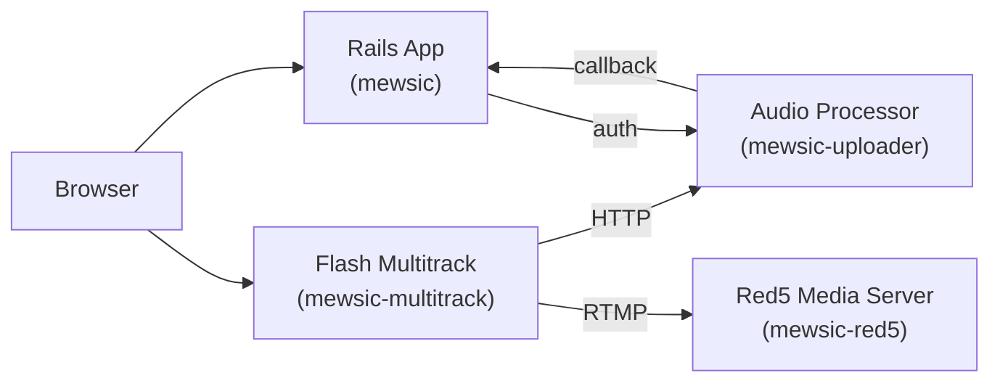
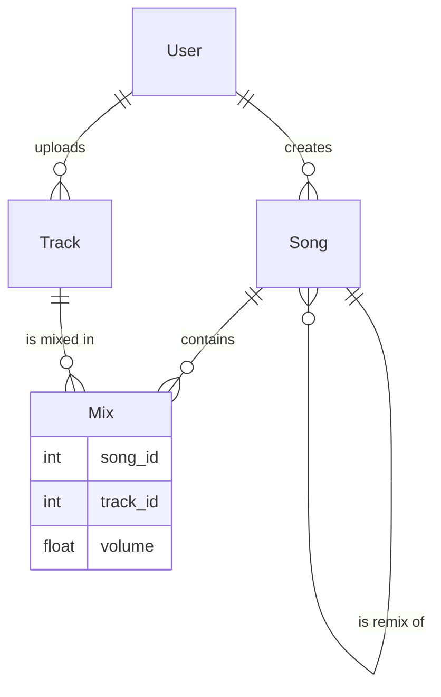


For the big picture — why Myousica was ahead of its time and who does it today — see the [2026 retrospective](/posts/2026-04-11-myousica-eighteen-years-later/).



Today we're releasing the source code of Myousica — the collaborative music remixing platform we've been building since late 2007. We [launched in September 2008](/posts/2008-09-11-myousica-com-was-born-today/) after 9 months of development, ran it for about 5 months, and paused the site in February 2009. The project has been rebranded to [Mewsic](https://github.com/mewsic) along the way, but the idea is the same. Rather than letting the code rot on a private server, we're putting it all on GitHub. Full history preserved, warts and all.

This is the first of three posts walking through the codebase. This one covers the main Rails application — the platform itself. The next two will cover the [Flash multitrack editor](/posts/2010-10-16-myousica-multitrack-audio-mixing-in-the-browser/) and the [audio processing pipeline](/posts/2010-10-18-myousica-from-microphone-to-mp3/).

## The idea

The pitch is simple: I upload a bass track for *Let It Be*, you upload your voice, someone else adds guitar and drums. Through Myousica, there's a multitrack editor running in your browser where you can mix everything together, adjust volumes, and publish the result. Other people can then take your remix, add their own tracks, and remix the remix.

Collaborative music creation, entirely in the browser. No software to install, no files to email around. You sign up, you pick up your instrument, you record, and you're jamming with people across the world.

The platform supports 35 instruments across multiple categories — from electric guitar and bass to vocals, drums, keyboards, strings, brass, and more exotic things. Every track is tagged with its instrument, so you can search for "a bass line in E minor at 120 BPM" and find something to remix. The idea is that the platform builds a library of reusable musical parts that anyone can recombine.

Three years of development, ~1,700 commits on the main app alone. The busiest day saw [43 commits](https://github.com/mewsic/mewsic/commits/master/?since=2008-05-16&until=2008-05-17) in a single day. The `style.css` file was touched 254 times. It was intense.

## The architecture

Myousica is not a single application — it's four services working together:



- **[mewsic](https://github.com/mewsic/mewsic)** — the main Rails 2.2 application. User accounts, songs, tracks, social features, search. 36 models, 26 controllers, ~1,700 commits.
- **[mewsic-multitrack](https://github.com/mewsic/mewsic-multitrack)** — a Flash/Flex multitrack audio editor. 16-track synchronized playback, real-time recording, waveform visualization.
- **[mewsic-red5](https://github.com/mewsic/mewsic-red5)** — a [Red5](http://www.intechgrity.com/media-server/red5/) instance that handles RTMP streaming for live microphone recording.
- **[mewsic-uploader](https://github.com/mewsic/mewsic-uploader)** — a headless Rails service that handles audio upload, format conversion, normalization, MP3 encoding, and waveform generation.

The services communicate via HTTP callbacks and a token-based authorization scheme. The multitrack editor talks to Rails for metadata and to the uploader for audio files. Red5 captures microphone input via RTMP and writes raw streams to disk. The uploader picks them up, encodes to MP3, and notifies Rails when the job is done.

## The data model

At the heart of Myousica is the relationship between songs and tracks. A Song is a container — a remix. A Track is an individual instrument recording. They're connected through a Mix join model that also stores the per-track volume level:



The clever bit is the remix tree. Songs use `acts_as_nested_set` — each song can be a remix of another song, forming a tree. When you remix a published song, Myousica clones the track list into a new private song and sets it as a child of the original:

```ruby
def create_remix_by(user)
  remix = self.clone
  remix.tracks = self.tracks
  remix.user = user
  remix.status = :private
  remix.save!
  remix.move_to_child_of self
  return remix
end
```

Here's what the remix tree looks like in the UI — [Vaclav's original screenshot](https://dribbble.com/shots/192454-Myousica-remix) showing how songs connect through remixes:


This means tracks flow through the system. My bass track can end up in dozens of remixes. The `find_most_collaborated` method finds songs that share tracks with the most other songs — the most remixed material in the system:

```ruby
def self.find_most_collaborated(options = {})
  collaboration_count = options[:minimum] || 2
  songs = find_by_sql(["
    SELECT s.*, COUNT(DISTINCT m.song_id) -1 AS collaboration_count,
      GROUP_CONCAT(DISTINCT m.song_id ORDER BY m.song_id) AS signature
    FROM mixes m LEFT OUTER JOIN mixes t ON m.track_id = t.track_id
    LEFT OUTER JOIN songs s ON t.song_id = s.id
    LEFT OUTER JOIN songs x ON m.song_id = x.id
    WHERE s.status = :published AND x.status = :published AND m.deleted = 0
    GROUP BY s.id
    HAVING collaboration_count >= :minimum
    ORDER BY collaboration_count DESC, s.rating_avg DESC
  ", {:published => statuses.public, :minimum => collaboration_count}])

  # Deduplicate by track signature
  signatures = []
  songs.select { |song|
    next if signatures.include? song.signature
    signatures.push song.signature
  }
end
```

MySQL-only, unapologetically. The `GROUP_CONCAT` signature trick deduplicates songs that share the exact same set of tracks. Not pretty, but it works.

## The status system

Both songs and tracks have a lifecycle managed by a custom `MultipleStatuses` module. Four states: `:temporary` (created when entering the multitrack), `:private` (saved but not published), `:public` (visible to everyone), and `:deleted` (soft-deleted, invisible).

```ruby
class Song < ActiveRecord::Base
  has_multiple_statuses :public => 1, :private => 2, :deleted => -1, :temporary => -2
end
```

The module defines query methods (`song.public?`, `song.temporary?`), a symbol accessor (`song.status #=> :public`), and a database accessor (`song.status(:db) #=> 1`). Validations only trigger when a song is being published — you can save an incomplete temporary song without a title, but the moment you try to make it public, the full validation suite kicks in:

```ruby
validates_presence_of :title, :author,      :if => :published?
validates_associated :user,                 :if => :published?
validates_length_of :tracks, :minimum => 1, :if => :published?
```

This is a pattern I'm quite happy with. Temporary songs are cheap scratchpads. The multitrack creates one the moment you enter the editor, so there's always something to save tracks against. A weekly cron job cleans up temporary songs older than a week.

The full `MultipleStatuses` module is [in the repo](https://github.com/mewsic/mewsic/blob/master/lib/statuses.rb) — it's ~60 lines of metaprogramming that uses `define_method` to generate the query methods and `write_inheritable_attribute` to store the status mapping on the class. I released it under MIT and I've used variations of this pattern in every Rails project since.

## The Playable module

Every Song and Track has an associated MP3 stream and a waveform PNG. The `Playable` module handles the file lifecycle — filenames, paths, cleanup on destroy:

```ruby
module Playable
  module InstanceMethods
    def public_filename(kind = :stream)
      [APPLICATION[:audio_url], filename_of(kind)].join('/') rescue nil
    end

    def absolute_filename(kind = :stream)
      File.join APPLICATION[:media_path], filename_of(kind) rescue nil
    end

    private
      def filename_of(kind)
        case kind
        when :stream   then self.filename
        when :waveform then self.filename.sub /\.mp3$/, '.png'
        end
      end
  end
end
```

The convention is simple: for every `track_42.mp3` there's a `track_42.png` with the waveform image. The waveform is generated server-side by the uploader service using [wav2png](http://github.com/beschulz/wav2png) and loaded by the Flash multitrack editor to show a visual representation of the audio. The width is proportional to the track length — roughly 10 pixels per second — so a 3-minute track gets a ~1800px wide waveform.

Getting the audio encoding pipeline right took some iteration. The uploader's git history from May 2008 has a chain of commits reading "whoops.", "whoops. [2]", "whoops²" — the kind of rapid-fire debugging you do when ffmpeg and sox don't behave the way you expect them to.

## Search


Myousica uses [Sphinx](http://sphinxsearch.com/) via the [thinking-sphinx](https://github.com/pat/thinking-sphinx) plugin for full-text search. The multitrack editor consumes the search API via XML to let you find tracks to add to your mix — filtered by instrument, genre, BPM, key signature, country, or just free text:

```ruby
# XML search parameters for the multitrack SWF
# GET /search.xml?q=query&instrument=5&genre=3&country=italy&bpm=120&key=C#
```

The search indexes are defined right in the models:

```ruby
class Track < ActiveRecord::Base
  define_index do
    has :instrument_id
    indexes :title, :description
    indexes user.country, :as => :country
    indexes instrument.description, :as => :instrument
    where "status = #{statuses.public}"
  end
end
```

Only public content gets indexed. Sphinx handles the full-text ranking while ActiveRecord conditions handle the structured filters.

## The multitrack integration

The multitrack editor is a Flash SWF. When a logged-in user enters it, the controller generates a secure token and creates a temporary song:

```ruby
def index
  if logged_in?
    load_user_stuff
    current_user.enter_multitrack!
    @song = current_user.songs.create_temporary!
  else
    flash.now[:notice] = 'You are not logged in. Save and record will be disabled.'
    @song = Song.new
  end
end
```

The Flash client fetches its configuration from `/multitrack.xml`, which includes all the service URLs and the authentication token:

```xml
<config>
  <host>http://mewsic.com</host>
  <fms>rtmp://upload.mewsic.com/</fms>
  <media>http://upload.mewsic.com</media>
  <current_user>42</current_user>
  <url_request>
    <media>
      <upload method="post">/upload?id=42&amp;token=a1b2c3...</upload>
    </media>
  </url_request>
</config>
```

The upload service is stateless — it validates every request by asking the main app whether the token is valid:

```ruby
def authorize
  @user = User.find_by_id_and_multitrack_token(params[:user_id], params[:token])
  head(@user ? :ok : :forbidden)
end
```

When encoding finishes, the uploader calls back to update the song or track with the final filename and duration. The whole thing is asynchronous — the user doesn't wait for encoding to complete.

Getting all four services to talk to each other was not trivial. The git log for the day recording [finally worked end to end](https://github.com/mewsic/mewsic-multitrack/commit/cce23f8) reads: *"Holy cow! Recording actually works!"* — followed the next day by *"Holy crap! Upload works! :D"*. Those two commits represent months of wiring.

## Social features


Beyond the core music functionality, Myousica is a full social platform. The codebase has 36 models and 82 migrations — there's a lot in there.

**Friendships** follow the admirer/friend pattern: user A requests, user B accepts. If B breaks the friendship, A goes back to "admirer" status rather than losing the connection entirely. If A breaks it, the whole thing is destroyed. The `create_or_accept` class method handles both cases in a single call:

```ruby
def self.create_or_accept(user, friend)
  friendship = Friendship.find_by_user_id_and_friend_id(friend.id, user.id)
  if friendship
    returning(friendship) do |f|
      f.established = true
      f.update_attribute(:accepted_at, Time.now)
    end
  else
    user.request_friendship_with(friend)
  end
end
```

**M-Bands** are virtual bands — groups of users who play together. Every M-Band has a leader who sends token-based invitations. The band has its own profile, avatar, and songs. The band's online status aggregates its members' statuses — if anyone is recording, the band shows as "recording":

```ruby
def status
  statuses = members.map(&:status).uniq
  if statuses.include? 'rec'
    'rec'
  elsif statuses.include? 'on'
    'on'
  else
    'off'
  end
end
```

M-Bands can publish songs under the band's name, rated separately from individual members. An M-Band is only searchable and visible once it has more than one member — a one-person band doesn't make much sense for a collaboration platform.

There's also private messaging, 5-star ratings (via [acts_as_rated](https://github.com/mewsic/mewsic/tree/master/vendor/plugins/medlar_acts_as_rated)), polymorphic comments on songs/tracks/answers/bands, content flagging for moderation, user gear lists, musical influences, and all the usual Web 2.0 accoutrements.

The User model has fields for MySpace URL and MSN Messenger — the full social stack.

## The team

The git history tells the story:

| Who | Commits | What |
|-----|---------|------|
| [Marcello Barnaba](https://github.com/vjt) | 1,196 | Core platform, backend, infrastructure |
| [Andrea Franz](https://github.com/pilu) | 346 | Early development, upload service |
| Giovanni Intini | 64 | Initial Rails setup, foundation |
| Aleksandr Kreynin | 40 | Feature work (2009) |
| Fabio Grande | 21 | UI and frontend |

Development started October 25, 2007 (migrated from Subversion — you can still see `git-svn-id` markers in the early commits) and the last functional commit was June 2009. The October 2010 commits are just cleanup for this open-source release.

The multitrack editor has zero reverts across 129 commits — Vaclav's architecture held up. The main app has 7. The uploader repo has a fair number of 3am commits, including one at 4:14am that reads *"Memory handling fixes, still lots of leaks present :("*. That's what building an audio platform looked like.

## What's next

The code is out there. The README has setup instructions if you want to run it — you'll need Ruby 1.8, Rails 2.2.2, MySQL, Sphinx, ffmpeg, sox, and a Red5 instance. Or you can just read the source.

Next up: the [multitrack editor](/posts/2010-10-16-myousica-multitrack-audio-mixing-in-the-browser/) — how Vaclav Vancura built a 16-track audio mixer in Flash, and how we wired it to the backend. That's where the real engineering magic lives.

**Repositories:**
- [mewsic/mewsic](https://github.com/mewsic/mewsic) — main Rails application
- [mewsic/mewsic-multitrack](https://github.com/mewsic/mewsic-multitrack) — Flash multitrack editor
- [mewsic/mewsic-uploader](https://github.com/mewsic/mewsic-uploader) — audio processing service
- [mewsic/mewsic-red5](https://github.com/mewsic/mewsic-red5) — Red5 media server instance


---

**Myousica timeline:** [Launch announcement](/posts/2008-09-11-myousica-com-was-born-today/) (2008) • **Open-sourcing the Rails app (2010)** • [Multitrack editor](/posts/2010-10-16-myousica-multitrack-audio-mixing-in-the-browser/) (2010) • [Audio pipeline](/posts/2010-10-18-myousica-from-microphone-to-mp3/) (2010) • [Eighteen years later](/posts/2026-04-11-myousica-eighteen-years-later/) (2026)
