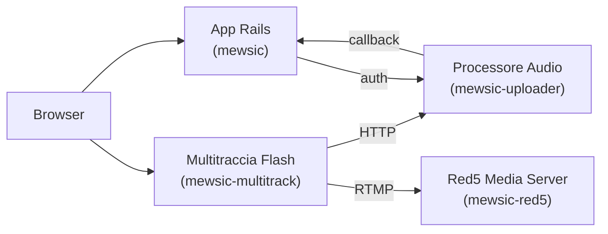
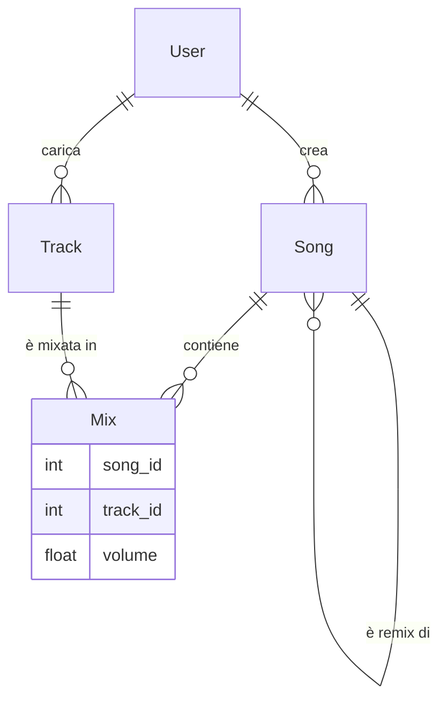


Per il quadro generale — perché Myousica era in anticipo sui tempi e chi lo fa oggi — vedi la [retrospettiva del 2026](/it/posts/2026-04-11-myousica-eighteen-years-later/).



Oggi rilasciamo il codice sorgente di Myousica — la piattaforma collaborativa per il remixaggio musicale che stiamo costruendo dalla fine del 2007. Abbiamo [lanciato a settembre 2008](/it/posts/2008-09-11-myousica-com-was-born-today/) dopo 9 mesi di sviluppo, l'abbiamo tenuta in piedi per circa 5 mesi, e abbiamo messo il sito in pausa a febbraio 2009. Il progetto è stato ribattezzato [Mewsic](https://github.com/mewsic) lungo il percorso, ma l'idea è la stessa. Piuttosto che lasciare il codice a marcire su un server privato, lo mettiamo tutto su GitHub. Cronologia completa, difetti inclusi.

Questo è il primo di tre post che esplorano il codice. Questo copre l'applicazione Rails principale — la piattaforma vera e propria. I prossimi due copriranno l'[editor multitraccia Flash](/it/posts/2010-10-16-myousica-multitrack-audio-mixing-in-the-browser/) e la [pipeline di elaborazione audio](/it/posts/2010-10-18-myousica-from-microphone-to-mp3/).

## L'idea

Il pitch è semplice: io carico una traccia di basso di *Let It Be*, tu carichi la tua voce, qualcun altro aggiunge chitarra e batteria. Attraverso Myousica, c'è un editor multitraccia che gira nel browser dove puoi mixare tutto insieme, regolare i volumi e pubblicare il risultato. Altre persone possono poi prendere il tuo remix, aggiungere le proprie tracce e remixare il remix.

Creazione musicale collaborativa, interamente nel browser. Nessun software da installare, nessun file da mandare via email. Ti iscrivi, prendi il tuo strumento, registri, e stai suonando con gente dall'altra parte del mondo.

La piattaforma supporta 35 strumenti divisi in categorie — dalla chitarra elettrica e il basso alla voce, batteria, tastiere, archi, ottoni e strumenti più esotici. Ogni traccia è taggata con il suo strumento, così puoi cercare "una linea di basso in Mi minore a 120 BPM" e trovare qualcosa da remixare. L'idea è che la piattaforma costruisca una libreria di parti musicali riutilizzabili che chiunque può ricombinare.

Tre anni di sviluppo, ~1.700 commit solo sull'app principale. Il giorno più intenso ha visto [43 commit](https://github.com/mewsic/mewsic/commits/master/?since=2008-05-16&until=2008-05-17) in un solo giorno. Il file `style.css` è stato toccato 254 volte. È stata dura.

## L'architettura

Myousica non è un'applicazione singola — sono quattro servizi che lavorano insieme:



- **[mewsic](https://github.com/mewsic/mewsic)** — l'applicazione Rails 2.2 principale. Account utente, canzoni, tracce, funzionalità social, ricerca. 36 modelli, 26 controller, ~1.700 commit.
- **[mewsic-multitrack](https://github.com/mewsic/mewsic-multitrack)** — un editor audio multitraccia in Flash/Flex. Riproduzione sincronizzata di 16 tracce, registrazione in tempo reale, visualizzazione delle forme d'onda.
- **[mewsic-red5](https://github.com/mewsic/mewsic-red5)** — un'istanza [Red5](http://www.intechgrity.com/media-server/red5/) che gestisce lo streaming RTMP per la registrazione dal microfono.
- **[mewsic-uploader](https://github.com/mewsic/mewsic-uploader)** — un servizio Rails headless che gestisce upload audio, conversione di formato, normalizzazione, encoding MP3 e generazione delle forme d'onda.

I servizi comunicano tramite callback HTTP e uno schema di autorizzazione basato su token. L'editor multitraccia parla con Rails per i metadati e con l'uploader per i file audio. Red5 cattura l'input del microfono via RTMP e scrive gli stream grezzi su disco. L'uploader li prende, codifica in MP3 e notifica Rails quando il lavoro è finito.

## Il data model

Al cuore di Myousica c'è la relazione tra canzoni e tracce. Una Song è un contenitore — un remix. Una Track è una registrazione di un singolo strumento. Sono collegati attraverso un modello di join Mix che memorizza anche il livello di volume per ogni traccia:



La parte ingegnosa è l'albero dei remix. Le Song usano `acts_as_nested_set` — ogni canzone può essere il remix di un'altra canzone, formando un albero. Quando remixi una canzone pubblicata, Myousica clona la lista delle tracce in una nuova canzone privata e la imposta come figlia dell'originale:

```ruby
def create_remix_by(user)
  remix = self.clone
  remix.tracks = self.tracks
  remix.user = user
  remix.status = :private
  remix.save!
  remix.move_to_child_of self
  return remix
end
```

Ecco come appare l'albero dei remix nella UI — lo [screenshot originale di Vaclav](https://dribbble.com/shots/192454-Myousica-remix) che mostra come le canzoni si collegano attraverso i remix:


Questo significa che le tracce fluiscono attraverso il sistema. La mia traccia di basso può finire in dozzine di remix. Il metodo `find_most_collaborated` trova le canzoni che condividono tracce con il maggior numero di altre canzoni — il materiale più remixato nel sistema:

```ruby
def self.find_most_collaborated(options = {})
  collaboration_count = options[:minimum] || 2
  songs = find_by_sql(["
    SELECT s.*, COUNT(DISTINCT m.song_id) -1 AS collaboration_count,
      GROUP_CONCAT(DISTINCT m.song_id ORDER BY m.song_id) AS signature
    FROM mixes m LEFT OUTER JOIN mixes t ON m.track_id = t.track_id
    LEFT OUTER JOIN songs s ON t.song_id = s.id
    LEFT OUTER JOIN songs x ON m.song_id = x.id
    WHERE s.status = :published AND x.status = :published AND m.deleted = 0
    GROUP BY s.id
    HAVING collaboration_count >= :minimum
    ORDER BY collaboration_count DESC, s.rating_avg DESC
  ", {:published => statuses.public, :minimum => collaboration_count}])

  # Deduplica per firma delle tracce
  signatures = []
  songs.select { |song|
    next if signatures.include? song.signature
    signatures.push song.signature
  }
end
```

Solo MySQL, senza scuse. Il trucco della signature con `GROUP_CONCAT` deduplica le canzoni che condividono lo stesso identico set di tracce. Non è elegante, ma funziona.

## Il sistema di stati

Sia le canzoni che le tracce hanno un ciclo di vita gestito da un modulo custom `MultipleStatuses`. Quattro stati: `:temporary` (creato quando si entra nel multitraccia), `:private` (salvato ma non pubblicato), `:public` (visibile a tutti) e `:deleted` (cancellato logicamente, invisibile).

```ruby
class Song < ActiveRecord::Base
  has_multiple_statuses :public => 1, :private => 2, :deleted => -1, :temporary => -2
end
```

Il modulo definisce metodi di interrogazione (`song.public?`, `song.temporary?`), un accessor simbolico (`song.status #=> :public`) e un accessor per il database (`song.status(:db) #=> 1`). Le validazioni scattano solo quando una canzone viene pubblicata — puoi salvare una canzone temporanea incompleta senza titolo, ma nel momento in cui provi a renderla pubblica, parte l'intera suite di validazione:

```ruby
validates_presence_of :title, :author,      :if => :published?
validates_associated :user,                 :if => :published?
validates_length_of :tracks, :minimum => 1, :if => :published?
```

È un pattern di cui sono piuttosto soddisfatto. Le canzoni temporanee sono blocchetti usa e getta. Il multitraccia ne crea una nel momento in cui entri nell'editor, così c'è sempre qualcosa contro cui salvare le tracce. Un cron job settimanale pulisce le canzoni temporanee più vecchie di una settimana.

Il modulo `MultipleStatuses` completo è [nel repo](https://github.com/mewsic/mewsic/blob/master/lib/statuses.rb) — sono ~60 righe di metaprogrammazione che usano `define_method` per generare i metodi di interrogazione e `write_inheritable_attribute` per memorizzare la mappatura degli stati sulla classe. L'ho rilasciato sotto licenza MIT e ho usato variazioni di questo pattern in ogni progetto Rails da allora.

## Il modulo Playable

Ogni Song e Track ha uno stream MP3 associato e un PNG con la forma d'onda. Il modulo `Playable` gestisce il ciclo di vita dei file — nomi, percorsi, pulizia alla distruzione:

```ruby
module Playable
  module InstanceMethods
    def public_filename(kind = :stream)
      [APPLICATION[:audio_url], filename_of(kind)].join('/') rescue nil
    end

    def absolute_filename(kind = :stream)
      File.join APPLICATION[:media_path], filename_of(kind) rescue nil
    end

    private
      def filename_of(kind)
        case kind
        when :stream   then self.filename
        when :waveform then self.filename.sub /\.mp3$/, '.png'
        end
      end
  end
end
```

La convenzione è semplice: per ogni `track_42.mp3` c'è un `track_42.png` con l'immagine della forma d'onda. La waveform viene generata lato server dal servizio uploader usando [wav2png](http://github.com/beschulz/wav2png) e caricata dall'editor multitraccia Flash per mostrare una rappresentazione visiva dell'audio. La larghezza è proporzionale alla durata della traccia — circa 10 pixel al secondo — quindi una traccia di 3 minuti produce una waveform larga ~1800px.

Far funzionare la pipeline di encoding audio ha richiesto un po' di iterazione. La cronologia git dell'uploader di maggio 2008 ha una catena di commit che recitano "whoops.", "whoops. [2]", "whoops²" — il tipo di debugging compulsivo che fai quando ffmpeg e sox non si comportano come ti aspetti.

## La ricerca


Myousica usa [Sphinx](http://sphinxsearch.com/) tramite il plugin [thinking-sphinx](https://github.com/pat/thinking-sphinx) per la ricerca full-text. L'editor multitraccia consuma l'API di ricerca via XML per permetterti di trovare tracce da aggiungere al tuo mix — filtrate per strumento, genere, BPM, tonalità, paese o semplicemente testo libero:

```ruby
# Parametri di ricerca XML per il SWF multitraccia
# GET /search.xml?q=query&instrument=5&genre=3&country=italy&bpm=120&key=C#
```

Gli indici di ricerca sono definiti direttamente nei modelli:

```ruby
class Track < ActiveRecord::Base
  define_index do
    has :instrument_id
    indexes :title, :description
    indexes user.country, :as => :country
    indexes instrument.description, :as => :instrument
    where "status = #{statuses.public}"
  end
end
```

Solo il contenuto pubblico viene indicizzato. Sphinx gestisce il ranking full-text mentre le condizioni di ActiveRecord gestiscono i filtri strutturati.

## L'integrazione multitraccia

L'editor multitraccia è un SWF Flash. Quando un utente loggato ci entra, il controller genera un token sicuro e crea una canzone temporanea:

```ruby
def index
  if logged_in?
    load_user_stuff
    current_user.enter_multitrack!
    @song = current_user.songs.create_temporary!
  else
    flash.now[:notice] = 'Non sei loggato. Salvataggio e registrazione saranno disabilitati.'
    @song = Song.new
  end
end
```

Il client Flash recupera la sua configurazione da `/multitrack.xml`, che include tutti gli URL dei servizi e il token di autenticazione:

```xml
<config>
  <host>http://mewsic.com</host>
  <fms>rtmp://upload.mewsic.com/</fms>
  <media>http://upload.mewsic.com</media>
  <current_user>42</current_user>
  <url_request>
    <media>
      <upload method="post">/upload?id=42&amp;token=a1b2c3...</upload>
    </media>
  </url_request>
</config>
```

Il servizio di upload è stateless — valida ogni richiesta chiedendo all'app principale se il token è valido:

```ruby
def authorize
  @user = User.find_by_id_and_multitrack_token(params[:user_id], params[:token])
  head(@user ? :ok : :forbidden)
end
```

Quando l'encoding finisce, l'uploader chiama la callback per aggiornare la canzone o la traccia con il filename finale e la durata. Il tutto è asincrono — l'utente non aspetta il completamento dell'encoding.

Far parlare tutti e quattro i servizi tra loro non è stato banale. Il git log del giorno in cui la registrazione [ha finalmente funzionato end to end](https://github.com/mewsic/mewsic-multitrack/commit/cce23f8) recita: *"Holy cow! Recording actually works!"* — seguito il giorno dopo da *"Holy crap! Upload works! :D"*. Quei due commit rappresentano mesi di lavoro.

## Funzionalità social


Oltre alla funzionalità musicale di base, Myousica è una piattaforma social completa. Il codebase ha 36 modelli e 82 migration — c'è parecchia roba.

**Le amicizie** seguono il pattern ammiratore/amico: l'utente A chiede, l'utente B accetta. Se B rompe l'amicizia, A torna allo stato di "ammiratore" anziché perdere del tutto la connessione. Se A la rompe, viene distrutta completamente. Il metodo di classe `create_or_accept` gestisce entrambi i casi in una singola chiamata:

```ruby
def self.create_or_accept(user, friend)
  friendship = Friendship.find_by_user_id_and_friend_id(friend.id, user.id)
  if friendship
    returning(friendship) do |f|
      f.established = true
      f.update_attribute(:accepted_at, Time.now)
    end
  else
    user.request_friendship_with(friend)
  end
end
```

**Le M-Band** sono band virtuali — gruppi di utenti che suonano insieme. Ogni M-Band ha un leader che invia inviti basati su token. La band ha il suo profilo, avatar e canzoni. Lo stato online della band aggrega gli stati dei suoi membri — se qualcuno sta registrando, la band appare come "in registrazione":

```ruby
def status
  statuses = members.map(&:status).uniq
  if statuses.include? 'rec'
    'rec'
  elsif statuses.include? 'on'
    'on'
  else
    'off'
  end
end
```

Le M-Band possono pubblicare canzoni sotto il nome della band, valutate separatamente dai singoli membri. Una M-Band è ricercabile e visibile solo quando ha più di un membro — una band di una sola persona non ha molto senso per una piattaforma collaborativa.

Ci sono anche la messaggistica privata, le valutazioni a 5 stelle (via [acts_as_rated](https://github.com/mewsic/mewsic/tree/master/vendor/plugins/medlar_acts_as_rated)), i commenti polimorfici su canzoni/tracce/risposte/band, la segnalazione contenuti per la moderazione, le liste di strumenti degli utenti, le influenze musicali e tutti gli orpelli Web 2.0 del caso.

Il modello User ha campi per l'URL di MySpace e MSN Messenger — lo stack social completo.

## Il team

La storia di git racconta tutto:

| Chi | Commit | Cosa |
|-----|--------|------|
| [Marcello Barnaba](https://github.com/vjt) | 1.196 | Piattaforma core, backend, infrastruttura |
| [Andrea Franz](https://github.com/pilu) | 346 | Sviluppo iniziale, servizio upload |
| Giovanni Intini | 64 | Setup iniziale Rails, fondamenta |
| Aleksandr Kreynin | 40 | Feature work (2009) |
| Fabio Grande | 21 | UI e frontend |

Lo sviluppo è iniziato il 25 ottobre 2007 (migrato da Subversion — si vedono ancora i marker `git-svn-id` nei commit più vecchi) e l'ultimo commit funzionale è stato a giugno 2009. I commit di ottobre 2010 sono solo pulizia per questo rilascio open-source.

L'editor multitraccia ha zero revert su 129 commit — l'architettura di Vaclav ha retto. L'app principale ne ha 7. Il repo dell'uploader ha un discreto numero di commit alle 3 di notte, incluso uno alle 4:14 che recita *"Memory handling fixes, still lots of leaks present :("*. Ecco com'era costruire una piattaforma audio.

## Cosa viene dopo

Il codice è là fuori. Il README ha le istruzioni per farlo girare — servono Ruby 1.8, Rails 2.2.2, MySQL, Sphinx, ffmpeg, sox e un'istanza Red5. Oppure si può semplicemente leggere il sorgente.

Prossimamente: l'[editor multitraccia](/it/posts/2010-10-16-myousica-multitrack-audio-mixing-in-the-browser/) — come Vaclav Vancura ha costruito un mixer audio a 16 tracce in Flash, e come lo abbiamo collegato al backend. È lì che vive la vera magia ingegneristica.

**Repository:**
- [mewsic/mewsic](https://github.com/mewsic/mewsic) — applicazione Rails principale
- [mewsic/mewsic-multitrack](https://github.com/mewsic/mewsic-multitrack) — editor multitraccia Flash
- [mewsic/mewsic-uploader](https://github.com/mewsic/mewsic-uploader) — servizio di elaborazione audio
- [mewsic/mewsic-red5](https://github.com/mewsic/mewsic-red5) — istanza Red5 media server


---

**Myousica nel tempo:** [Annuncio lancio](/it/posts/2008-09-11-myousica-com-was-born-today/) (2008) • **Open-source dell'app Rails (2010)** • [Editor multitraccia](/it/posts/2010-10-16-myousica-multitrack-audio-mixing-in-the-browser/) (2010) • [Pipeline audio](/it/posts/2010-10-18-myousica-from-microphone-to-mp3/) (2010) • [Diciotto anni dopo](/it/posts/2026-04-11-myousica-eighteen-years-later/) (2026)
