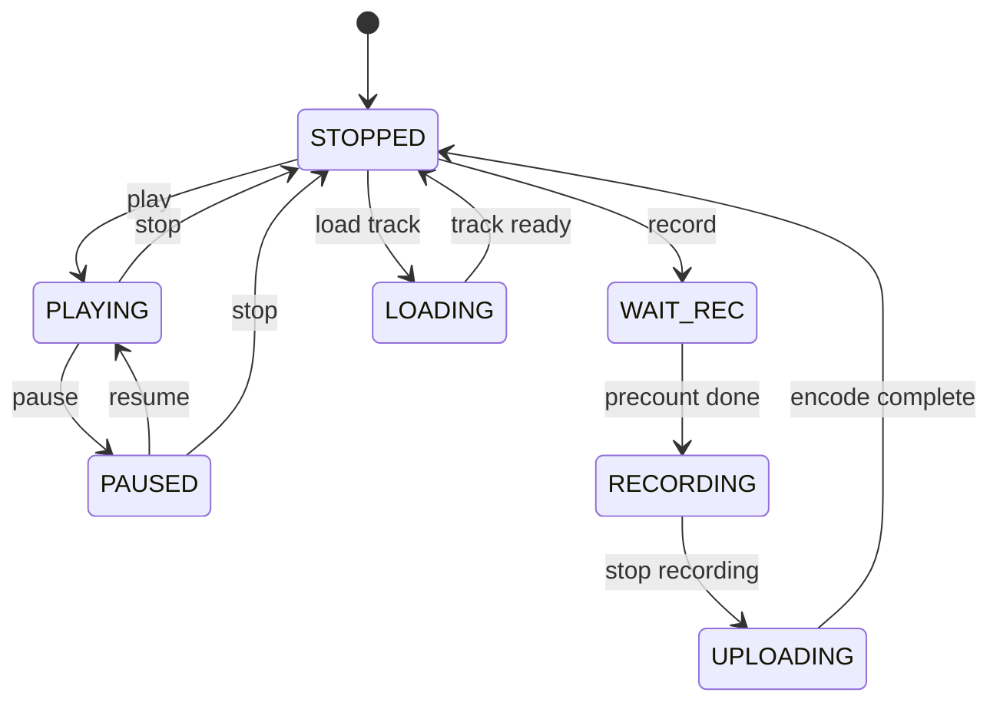
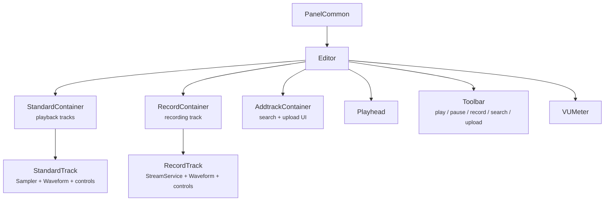

This is the second post in the [Myousica series](/posts/2010-10-14-myousica-collaborative-music-remixing-platform/). The [first one](/posts/2010-10-14-myousica-collaborative-music-remixing-platform/) covered the Rails platform. This one dives into the multitrack editor — the Flash/Flex component where users actually mix music in the browser.

The multitrack was initially developed by [Vaclav Vancura](https://vancura.design/), who built the original architecture, the UI component library, and the audio playback engine. I then took over and rewired it heavily — integrating recording, upload, the backend services, and the state machine that holds it all together. 81 ActionScript files, ~7,300 lines of code, [129 commits](https://github.com/mewsic/mewsic-multitrack).

## What it does

The editor loads in the browser as a Flash SWF. You can:

- Load up to 16 audio tracks simultaneously
- Play them all in sync with a single transport
- Adjust per-track volume and balance
- Record your own track from the microphone, synchronized to the playback
- See waveforms for every track
- Search for tracks to add to your mix (via the Rails API)
- Save and publish the result

All of this happens client-side in Flash Player 9, with the heavy lifting (encoding, storage) offloaded to the backend services.

## The dimensions

Everything is pixel-precise. The editor runs in a 690px wide stage with fixed proportions:

```actionscript
public static const STAGE_WIDTH:uint = 690;
public static const WAVEFORM_WIDTH:uint = 432;
public static const TRACKCONTROLS_WIDTH:uint = 250;
public static const TRACK_HEIGHT:uint = 65;
public static const MAX_TRACKS:uint = 16;
public static const IGNORE_FMS_CALLS:Boolean = false; // :D
```

Each track is 65 pixels tall with 250px of controls on the left (instrument icon, volume knob, track name) and 432px of waveform display on the right. The playhead sweeps across the waveform area. With 16 tracks loaded, the editor can get quite tall, so the stage height is dynamic — it grows and shrinks with smooth Tweener animations as tracks are added or removed.

## The state machine

The editor has 7 states, defined as bit flags:

```actionscript
private static const _STATE_STOPPED:uint     = 0x01;
private static const _STATE_PLAYING:uint     = 0x02;
private static const _STATE_PAUSED:uint      = 0x04;
private static const _STATE_WAIT_REC:uint    = 0x08;
private static const _STATE_RECORDING:uint   = 0x10;
private static const _STATE_UPLOADING:uint   = 0x20;
private static const _STATE_LOADING:uint     = 0x40;
```

The state determines which toolbar buttons are enabled, whether the playhead moves, whether the VU meter is active, and which operations are legal. You can't record while uploading. You can't play while loading. You can't upload while recording. The state machine enforces all of this.



The `WAIT_REC` state is where the beat-synced precount happens — four beats before recording actually starts, so the performer can hear the rhythm and come in on time.

## The Sampler

Every loaded track gets its own `Sampler` instance — a wrapper around Flash's `Sound` and `SoundChannel` that handles loading, playback, pause, resume, seeking, volume, balance, and mute:

```actionscript
public function play():void {
    _sampleChannel = _sampleSound.play(_pausedSamplePos);
    _sampleChannel.soundTransform = _currentSoundTransform;
    _isSamplePlaying = true;
    _isSamplePaused = false;
    _sampleChannel.addEventListener(Event.SOUND_COMPLETE, _onSoundComplete);
    _refreshSoundTransform();
}

public function seek(position:uint):void {
    if(position > _milliseconds) return;

    if(_isSamplePlaying) {
        if(_isSamplePaused) {
            _pausedSamplePos = position;
        } else {
            _sampleChannel.stop();
            _sampleChannel = _sampleSound.play(position);
            _sampleChannel.addEventListener(Event.SOUND_COMPLETE, _onSoundComplete);
            _refreshSoundTransform();
        }
    } else {
        _pausedSamplePos = position;
    }
}
```

The key challenge is synchronized multi-track playback. When the user hits play, the editor iterates over all loaded tracks and calls `play()` on each Sampler. When seeking, it calls `seek()` on all of them atomically. The `position` getter returns `_sampleChannel.position` if playing, or `_pausedSamplePos` if paused — this keeps all tracks in sync even when some are paused and others are not.

There's also a "still seek" mechanism: when the user scrolls the viewport, the editor seeks all tracks to the new position, but with a 300ms debounce interval so it doesn't thrash the audio engine by restarting playback on every pixel of scrolling.

## Recording via RTMP

Recording uses Flash's `Microphone` API to capture audio input and streams it to the [Red5 media server](https://github.com/mewsic/mewsic-red5) via RTMP using the `StreamService`:

```actionscript
public function prepare():void {
    _microphone = Microphone.getMicrophone(-1);
    _microphone.rate = 44;
    _microphone.setSilenceLevel(0);
    _microphone.addEventListener(StatusEvent.STATUS, _onUserPermissionToUseMic);
    _stream.attachAudio(_microphone); // triggers the Flash security dialog
}

public function record():void {
    _filename = sprintf('%s_%u_%u',
        App.connection.coreUserData.userNickname,
        uint(new Date()),
        Rnd.integer(1000, 9999));
    _stream.publish(_filename, 'record');
}
```

The `prepare()` method requests microphone access — Flash shows its security dialog, and the user must explicitly allow it. Once granted, the `record()` method starts publishing audio to the media server under a unique filename. The filename convention is `{username}_{timestamp}_{random}`, which avoids collisions even if two users record at the same time.

The recording is synchronized: during `WAIT_REC`, the precount plays four ticks at the current BPM (default 60), then transitions to `RECORDING` and starts both the RTMP publish and the playback of all existing tracks. The performer hears the existing mix while recording their part on top of it.

The `recordLevel` getter exposes the microphone's `activityLevel` — this feeds the VU meter during recording so the user can see their input levels.

## Waveforms

Each track displays its audio as a waveform image. These are pre-rendered PNGs generated server-side by the [uploader service](/posts/2010-10-18-mewsic-from-microphone-to-mp3/) — the width is proportional to the track duration (~10px per second). The Flash client loads them via `BulkLoader` and displays them in a scrollable masked area.

The waveform component handles:
- Loading the PNG bitmap from the server
- Scaling it to fit the viewport width (432px visible at a time)
- Smooth rescale transitions (fade out, redraw at new scale, fade in) when the total song duration changes
- Mask-based clipping so the waveform doesn't overflow its track lane

The playhead is a separate sprite that sits on top of all tracks and moves at a rate determined by the total song duration — the longest loaded track determines the "song length."

## Component architecture

Vaclav designed a clean component hierarchy:



Each track type extends `TrackCommon`, which provides the shared UI: instrument thumbnail, volume knob, kill button, waveform display. `StandardTrack` adds the `Sampler` for audio playback. `RecordTrack` adds the `StreamService` for RTMP recording.

The containers manage track lifecycle — adding, removing, and reordering. When a track is removed, its `destroy()` method is called explicitly to clean up event listeners and release audio resources. Memory management in Flash is manual work — the garbage collector doesn't always cooperate, especially with audio objects. The git log at 4am on April 2, 2009 confirms this: *"Memory handling fixes, still lots of leaks present :("*

## The service layer

The multitrack communicates with the backend through a set of service classes that implement a common `IService` interface:

- **ConfigService** — fetches the XML configuration from `/multitrack.xml` on startup
- **StreamService** — manages the RTMP connection to Red5 for recording
- **TrackFetchService** / **SongFetchService** — loads track and song metadata from the Rails API
- **TrackCreateService** — creates new tracks on the server (needed before uploading)
- **TrackEncodeService** — triggers encoding on the [uploader service](/posts/2010-10-18-mewsic-from-microphone-to-mp3/) and polls for completion

The encode polling is worth noting: after uploading a recorded track, the client polls `/upload/status/{worker_key}` every 3 seconds (configurable via `Settings.WORKER_INTERVAL`) until the server reports the encoding is done. Only then does the waveform load and the track become playable.

## The tools

The codebase uses several third-party ActionScript libraries:

- **[Tweener](https://github.com/zeh/tweener)** (caurina.transitions) — animation engine for UI transitions
- **[BulkLoader](https://github.com/nickyp/bulk-loader)** — concurrent asset loading with ID-based management
- **[Thunderbolt](https://github.com/nickyp/thunderbolt)** — logging to Firebug console (yes, Firebug)
- **[sprintf](http://www.sephiroth.it/weblog/archives/2007/01/sprintf_for_actionscript_20.php)** (popforge) — C-style string formatting for AS3
- Vaclav's own `org.vancura` graphics and utility library

The project was built with FDT (FlashDevelop Tools) and Flex SDK 3.2, targeting Flash Player 9.0.28+.

## The timeline

The git history shows two distinct phases:

**Vaclav's foundation (September – November 2008)**: [initial commit](https://github.com/mewsic/mewsic-multitrack/commit/fd6ac90) with the full component architecture, controls library, search UI, and basic playback. 22 commits of careful, deliberate work, ending with [keyboard shortcuts](https://github.com/mewsic/mewsic-multitrack/commit/e095a32).

**The integration sprint ([March](https://github.com/mewsic/mewsic-multitrack/commits/master/?since=2009-03-06&until=2009-04-03) 2009)**: I came in and rewired the internals over two intense weeks. 96 commits. Ripped out the old search and song services, rebuilt the state machine, added recording and upload integration, fixed the playback synchronization, and polished the UI. The busiest day was [March 21](https://github.com/mewsic/mewsic-multitrack/commits/master/?since=2009-03-21&until=2009-03-22) with 14 commits. The [recording breakthrough](https://github.com/mewsic/mewsic-multitrack/commit/cce23f8) happened on March 28, [upload](https://github.com/mewsic/mewsic-multitrack/commit/e401ac2) the day after, and by [April 2](https://github.com/mewsic/mewsic-multitrack/commits/master/?since=2009-04-02&until=2009-04-03) I was polishing the UI and fighting memory leaks at 5am.

Zero reverts across the entire repo. Vaclav's architecture was solid enough that I could rewrite the internals without breaking the structure.

## What's next

The [third and final post](/posts/2010-10-18-mewsic-from-microphone-to-mp3/) covers the audio processing pipeline — how audio gets from the user's microphone to a playable MP3 with a waveform, through Red5, ffmpeg, and sox.

**Repository:** [mewsic/mewsic-multitrack](https://github.com/mewsic/mewsic-multitrack)
