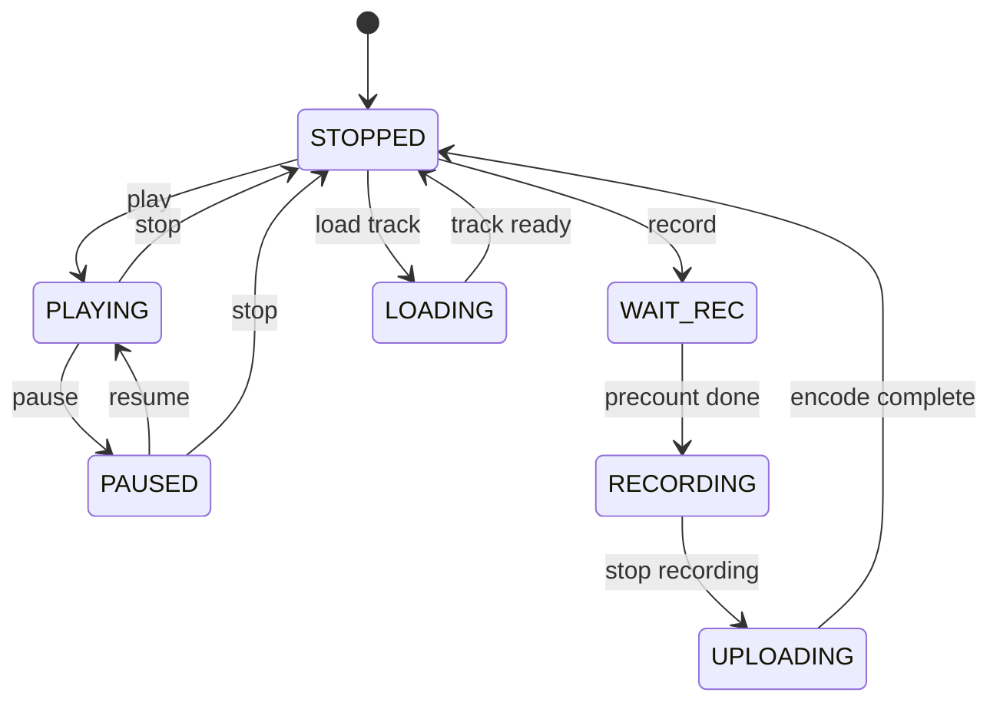

Questo è il secondo post della [serie Myousica](/it/posts/2010-10-14-myousica-collaborative-music-remixing-platform/). Il [primo](/it/posts/2010-10-14-myousica-collaborative-music-remixing-platform/) copriva la piattaforma Rails. Questo si immerge nell'editor multitraccia — il componente Flash/Flex dove gli utenti mixano effettivamente la musica nel browser.

Il multitraccia è stato inizialmente sviluppato da [Vaclav Vancura](http://vaclav.vancura.org), che ha costruito l'architettura originale, la libreria di componenti UI e il motore di riproduzione audio. Poi ho preso in mano io e l'ho ricablato pesantemente — integrando la registrazione, l'upload, i servizi backend e la macchina a stati che tiene tutto insieme. 81 file ActionScript, ~7.300 righe di codice, [129 commit](https://github.com/mewsic/mewsic-multitrack).

## Cosa fa

L'editor si carica nel browser come SWF Flash. Si può:

- Caricare fino a 16 tracce audio simultaneamente
- Riprodurle tutte in sincrono con un unico controllo di trasporto
- Regolare volume e bilanciamento per ogni singola traccia
- Registrare la propria traccia dal microfono, sincronizzata con la riproduzione
- Vedere le forme d'onda di ogni traccia
- Cercare tracce da aggiungere al mix (via API Rails)
- Salvare e pubblicare il risultato

Tutto questo avviene lato client in Flash Player 9, con il lavoro pesante (encoding, storage) delegato ai servizi backend.

## Le dimensioni

Tutto è preciso al pixel. L'editor gira in uno stage largo 690px con proporzioni fisse:

```actionscript
public static const STAGE_WIDTH:uint = 690;
public static const WAVEFORM_WIDTH:uint = 432;
public static const TRACKCONTROLS_WIDTH:uint = 250;
public static const TRACK_HEIGHT:uint = 65;
public static const MAX_TRACKS:uint = 16;
public static const IGNORE_FMS_CALLS:Boolean = false; // :D
```

Ogni traccia è alta 65 pixel con 250px di controlli a sinistra (icona strumento, knob del volume, nome della traccia) e 432px di visualizzazione della forma d'onda a destra. Il playhead scorre sull'area della waveform. Con 16 tracce caricate, l'editor può diventare piuttosto alto, quindi l'altezza dello stage è dinamica — cresce e si riduce con animazioni Tweener fluide quando le tracce vengono aggiunte o rimosse.

## La macchina a stati

L'editor ha 7 stati, definiti come bit flag:

```actionscript
private static const _STATE_STOPPED:uint     = 0x01;
private static const _STATE_PLAYING:uint     = 0x02;
private static const _STATE_PAUSED:uint      = 0x04;
private static const _STATE_WAIT_REC:uint    = 0x08;
private static const _STATE_RECORDING:uint   = 0x10;
private static const _STATE_UPLOADING:uint   = 0x20;
private static const _STATE_LOADING:uint     = 0x40;
```

Lo stato determina quali pulsanti della toolbar sono abilitati, se il playhead si muove, se il VU meter è attivo e quali operazioni sono legali. Non si può registrare mentre si sta caricando. Non si può riprodurre mentre si sta caricando. Non si può caricare mentre si registra. La macchina a stati impone tutto questo.



Lo stato `WAIT_REC` è dove avviene il precount sincronizzato al beat — quattro battute prima che la registrazione inizi effettivamente, così il musicista può sentire il ritmo ed entrare a tempo.

## Il Sampler

Ogni traccia caricata ha la sua istanza `Sampler` — un wrapper attorno a `Sound` e `SoundChannel` di Flash che gestisce caricamento, riproduzione, pausa, ripresa, seeking, volume, bilanciamento e mute:

```actionscript
public function play():void {
    _sampleChannel = _sampleSound.play(_pausedSamplePos);
    _sampleChannel.soundTransform = _currentSoundTransform;
    _isSamplePlaying = true;
    _isSamplePaused = false;
    _sampleChannel.addEventListener(Event.SOUND_COMPLETE, _onSoundComplete);
    _refreshSoundTransform();
}

public function seek(position:uint):void {
    if(position > _milliseconds) return;

    if(_isSamplePlaying) {
        if(_isSamplePaused) {
            _pausedSamplePos = position;
        } else {
            _sampleChannel.stop();
            _sampleChannel = _sampleSound.play(position);
            _sampleChannel.addEventListener(Event.SOUND_COMPLETE, _onSoundComplete);
            _refreshSoundTransform();
        }
    } else {
        _pausedSamplePos = position;
    }
}
```

La sfida principale è la riproduzione multi-traccia sincronizzata. Quando l'utente preme play, l'editor itera su tutte le tracce caricate e chiama `play()` su ogni Sampler. Durante il seeking, chiama `seek()` su tutti atomicamente. Il getter `position` restituisce `_sampleChannel.position` se in riproduzione, o `_pausedSamplePos` se in pausa — questo mantiene tutte le tracce sincronizzate anche quando alcune sono in pausa e altre no.

C'è anche un meccanismo di "still seek": quando l'utente scrolla il viewport, l'editor fa seek di tutte le tracce alla nuova posizione, ma con un intervallo di debounce di 300ms per non stressare il motore audio riavviando la riproduzione ad ogni pixel di scrolling.

## Registrazione via RTMP

La registrazione usa l'API `Microphone` di Flash per catturare l'input audio e lo trasmette al [media server Red5](https://github.com/mewsic/mewsic-red5) via RTMP usando il `StreamService`:

```actionscript
public function prepare():void {
    _microphone = Microphone.getMicrophone(-1);
    _microphone.rate = 44;
    _microphone.setSilenceLevel(0);
    _microphone.addEventListener(StatusEvent.STATUS, _onUserPermissionToUseMic);
    _stream.attachAudio(_microphone); // attiva il dialog di sicurezza Flash
}

public function record():void {
    _filename = sprintf('%s_%u_%u',
        App.connection.coreUserData.userNickname,
        uint(new Date()),
        Rnd.integer(1000, 9999));
    _stream.publish(_filename, 'record');
}
```

Il metodo `prepare()` richiede l'accesso al microfono — Flash mostra il suo dialog di sicurezza e l'utente deve consentirlo esplicitamente. Una volta concesso, il metodo `record()` inizia a pubblicare audio al media server con un filename univoco. La convenzione del filename è `{username}_{timestamp}_{random}`, che evita collisioni anche se due utenti registrano contemporaneamente.

La registrazione è sincronizzata: durante `WAIT_REC`, il precount riproduce quattro tick al BPM corrente (default 60), poi passa a `RECORDING` e avvia sia il publish RTMP che la riproduzione di tutte le tracce esistenti. Il musicista sente il mix esistente mentre registra la propria parte sopra.

Il getter `recordLevel` espone l'`activityLevel` del microfono — questo alimenta il VU meter durante la registrazione così l'utente può vedere i livelli di input.

## Le forme d'onda

Ogni traccia visualizza il suo audio come immagine della forma d'onda. Sono PNG pre-renderizzati generati lato server dal [servizio uploader](/it/posts/2010-10-18-mewsic-from-microphone-to-mp3/) — la larghezza è proporzionale alla durata della traccia (~10px al secondo). Il client Flash li carica via `BulkLoader` e li visualizza in un'area mascherata scrollabile.

Il componente waveform gestisce:
- Caricamento del bitmap PNG dal server
- Ridimensionamento per adattarsi alla larghezza del viewport (432px visibili alla volta)
- Transizioni di rescale fluide (fade out, ridisegno alla nuova scala, fade in) quando la durata totale della canzone cambia
- Clipping basato su maschera così la waveform non sfora dalla sua corsia

Il playhead è uno sprite separato che si posiziona sopra tutte le tracce e si muove a una velocità determinata dalla durata totale della canzone — la traccia più lunga caricata determina la "lunghezza del brano."

## Architettura dei componenti

Vaclav ha progettato una gerarchia di componenti pulita:

```
PanelCommon (classe base)
└── Editor
    ├── StandardContainer (contiene le tracce di riproduzione)
    │   └── StandardTrack → Sampler + Waveform + controlli
    ├── RecordContainer (contiene la traccia di registrazione)
    │   └── RecordTrack → StreamService + Waveform + controlli
    ├── AddtrackContainer (UI ricerca + upload)
    ├── Playhead
    ├── Toolbar (pulsanti play/pausa/registra/cerca/carica)
    └── VUMeter
```

Ogni tipo di traccia estende `TrackCommon`, che fornisce l'UI condivisa: miniatura dello strumento, knob del volume, pulsante elimina, visualizzazione della waveform. `StandardTrack` aggiunge il `Sampler` per la riproduzione audio. `RecordTrack` aggiunge il `StreamService` per la registrazione RTMP.

I container gestiscono il ciclo di vita delle tracce — aggiunta, rimozione e riordinamento. Quando una traccia viene rimossa, il suo metodo `destroy()` viene chiamato esplicitamente per ripulire gli event listener e rilasciare le risorse audio. La gestione della memoria in Flash è lavoro manuale — il garbage collector non sempre collabora, specialmente con gli oggetti audio. Il git log delle 4 di mattina del 2 aprile 2009 lo conferma: *"Memory handling fixes, still lots of leaks present :("*

## Il layer dei servizi

Il multitraccia comunica con il backend attraverso un set di classi service che implementano un'interfaccia comune `IService`:

- **ConfigService** — recupera la configurazione XML da `/multitrack.xml` all'avvio
- **StreamService** — gestisce la connessione RTMP a Red5 per la registrazione
- **TrackFetchService** / **SongFetchService** — carica i metadati di tracce e canzoni dalla API Rails
- **TrackCreateService** — crea nuove tracce sul server (necessario prima dell'upload)
- **TrackEncodeService** — attiva l'encoding sul [servizio uploader](/it/posts/2010-10-18-mewsic-from-microphone-to-mp3/) e fa polling per il completamento

Il polling dell'encoding merita una nota: dopo aver caricato una traccia registrata, il client fa polling su `/upload/status/{worker_key}` ogni 3 secondi (configurabile via `Settings.WORKER_INTERVAL`) finché il server non riporta che l'encoding è completo. Solo allora la waveform si carica e la traccia diventa riproducibile.

## Gli strumenti

Il codebase usa diverse librerie dell'era Flash:

- **[Tweener](https://github.com/zeh/tweener)** (caurina.transitions) — motore di animazione per le transizioni UI
- **[BulkLoader](https://github.com/nickyp/bulk-loader)** — caricamento concorrente di asset con gestione basata su ID
- **[Thunderbolt](https://github.com/nickyp/thunderbolt)** — logging nella console Firebug (sì, Firebug)
- **[sprintf](http://www.sephiroth.it/weblog/archives/2007/01/sprintf_for_actionscript_20.php)** (popforge) — formattazione stringa in stile C per AS3
- La libreria grafica e utility `org.vancura` di Vaclav

Il progetto è stato costruito con FDT (FlashDevelop Tools) e Flex SDK 3.2, con target Flash Player 9.0.28+.

## La cronologia

La storia di git mostra due fasi distinte:

**Le fondamenta di Vaclav (settembre – novembre 2008)**: commit iniziale con l'intera architettura dei componenti, la libreria dei controlli, l'UI di ricerca e la riproduzione base. 22 commit di lavoro attento e deliberato.

**Lo sprint di integrazione (marzo – aprile 2009)**: sono entrato io e ho ricablato gli internals in due settimane intense. 96 commit. Rimossi i vecchi servizi di ricerca e canzoni, ricostruita la macchina a stati, aggiunta l'integrazione di registrazione e upload, corretta la sincronizzazione della riproduzione e rifinita l'UI. Il giorno più intenso è stato il 21 marzo con 14 commit. La [svolta della registrazione](https://github.com/mewsic/mewsic-multitrack/commit/cce23f8) è avvenuta il 28 marzo.

Zero revert in tutto il repo. L'architettura di Vaclav era abbastanza solida da permettermi di riscrivere gli internals senza rompere la struttura.

## Cosa viene dopo

Il [terzo e ultimo post](/it/posts/2010-10-18-mewsic-from-microphone-to-mp3/) copre la pipeline di elaborazione audio — come l'audio arriva dal microfono dell'utente a un MP3 riproducibile con forma d'onda, passando attraverso Red5, ffmpeg e sox.

**Repository:** [mewsic/mewsic-multitrack](https://github.com/mewsic/mewsic-multitrack)
