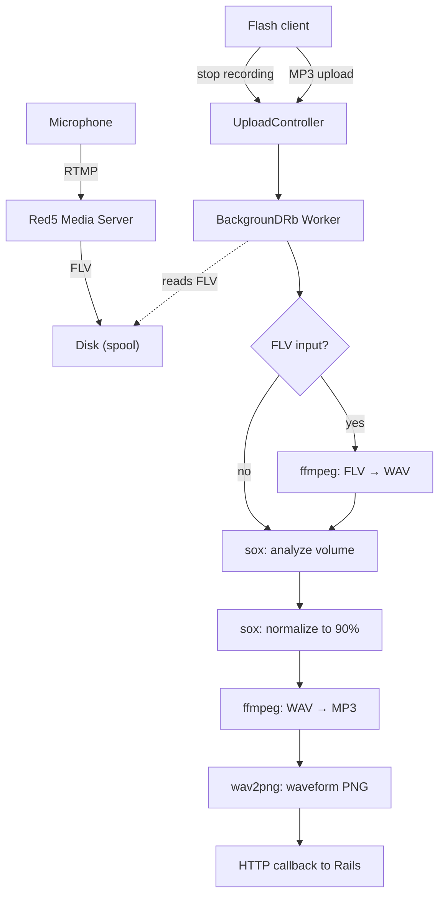


For the big picture — why Myousica was ahead of its time and who does it today — see the [2026 retrospective](/posts/2026-04-11-myousica-eighteen-years-later/).


This is the third and final post in the [Myousica series](/posts/2010-10-14-myousica-collaborative-music-remixing-platform/). The [first](/posts/2010-10-14-myousica-collaborative-music-remixing-platform/) covered the Rails platform, the [second](/posts/2010-10-16-myousica-multitrack-audio-mixing-in-the-browser/) the Flash multitrack editor. This one covers how audio actually gets from the user's microphone to a playable MP3 — the pipeline that connects all the services together.

The uploader is a separate Rails 2.2 application — headless, no database, no ActiveRecord. Just controllers, background workers, and audio processing tools. [Andrea Franz](https://github.com/pilu) built the initial version in April 2008, I took over from May 2008 onwards. [120 commits](https://github.com/mewsic/mewsic-uploader), originally called `multitrack_server` before being renamed to `mewsic-uploader` in [March 2009](https://github.com/mewsic/mewsic-uploader/commits/master/?since=2009-03-06&until=2009-03-07).

## The full pipeline

Here's the complete flow from microphone to playable track:



Two entry points: the user can upload an MP3 file directly, or record via microphone (which produces an FLV stream through Red5). Both end up as an MP3 with a waveform PNG.

## Stateless authentication

The uploader has no user sessions — `session :off` in the `ApplicationController`. Every request is authenticated by asking the main Myousica app whether the token is valid:

```ruby
class ApplicationController < ActionController::Base
  before_filter :check_auth
  session :off

  def check_auth
    unless params[:id] && params[:token]
      redirect_to '/' and return
    end

    url = URI.parse "#{AUTH_SERVICE}/#{params[:id]}?token=#{params[:token]}"
    unless Net::HTTP.start(url.host, url.port) { |http|
      http.post(url.path, url.query)
    }.is_a?(Net::HTTPSuccess)
      redirect_to '/' and return
    end
  end
end
```

Every upload, every encode request, every mix request — they all carry `?id=USER_ID&token=TOKEN` in the query string. The uploader POSTs to the main app's `/multitrack/_/:id` endpoint and checks for HTTP 200. This is necessary because Flash uploads can't carry cookie sessions — the token is the only way to authenticate.

## The upload controller

When a file arrives, the controller copies it to a spool directory and dispatches a background worker:

```ruby
class UploadController < ApplicationController
  def index
    @worker_key = random_md5

    input = input_file(random_md5) << '.mp3'
    FileUtils.cp params[:Filedata].path, input

    MiddleMan.worker(:ffmpeg_worker).async_run(
      :arg => {
        :key => @worker_key,
        :input => input,
        :output => random_output_file,
        :track_id => params[:track_id],
        :user_id => params[:id]
      })

    render_worker_status
  end
end
```

The response is immediate — an XML status document with a worker key. The Flash client polls `/upload/status/:worker_key` until the encoding is done. No long-running HTTP connections, no websockets. Just polling.

The `random_md5` generates unique filenames from `MD5.md5(rand.to_s)`. Collision-free enough for a music platform.

## The encoding pipeline

The `FfmpegWorker` is a [BackgrounDRb](https://github.com/gnufied/backgroundrb) worker with a pool size of 3 — at most 3 tracks can be encoded simultaneously. The `encode_to_mp3` method runs through four stages:

```ruby
def encode_to_mp3(options)
  key, input, output = options[:key], options[:input], options[:output]
  update_status key, :running, output, 0

  # 1. Format conversion (FLV → WAV if needed)
  if input =~ /\.flv$/
    tempfile = Tempfile.new 'wavepass'
    Wavepass.new(input, tempfile.path).run
    input = tempfile.path
  end

  # 2. Volume analysis
  process = SoxAnalyzer.new(input, format).run
  optimum = process.optimum_volume

  # 3. Normalization
  tempfile = Tempfile.new 'normalizer'
  SoxNormalizer.new(input, tempfile.path, optimum, format).run
  input = tempfile.path

  # 4. MP3 encoding
  FFmpeg.new(input, output).run

  # 5. Waveform
  length = Mp3Info.new(output).length
  Adelao::Waveform.generate(input, output.sub('.mp3', '.png'), :width => length * 10)

  # 6. Callback
  update_mixable :path => TRACK_SERVICE, :filename => File.basename(output),
    :length => length, :track_id => options[:track_id], :user_id => options[:user_id]

  update_status key, :finished, output, length
ensure
  File.unlink input
  GC.start
end
```

Each stage shells out to an external tool via the `Executable` base class — a minimal wrapper around `fork` + `exec`:

```ruby
class Executable
  def run
    unless @status
      Process.wait(fork { exec(self.to_cmd) })
      @status = $?.exitstatus
    end
    return self
  end

  def success?
    @status.zero?
  end
end
```

Simple. Fork a child process, exec the command, wait for it, check the exit code. No pipes, no shell interpretation, no surprises.

## Audio analysis and normalization

The volume normalization is the most interesting part of the pipeline. Before encoding, sox analyzes the audio to find the optimal volume level:

```ruby
class SoxAnalyzer < StdOutputter
  def to_cmd
    "sox -t %s %s -n stat -v" % [@format, @input]
  end

  def optimum_volume
    @output.to_f * 90 / 100
  end
end
```

The `sox ... -n stat -v` command outputs a single number: the volume multiplier that would bring the audio to maximum level without clipping. The `SoxAnalyzer` captures that number from stdout (via the `StdOutputter` subclass of `Executable`) and scales it to 90% — leaving 10% headroom to avoid distortion when tracks are mixed together.

Then the normalizer applies the computed volume:

```ruby
class SoxNormalizer < Executable
  def to_cmd
    "sox -v %f -t %s %s -t wav %s" % [@volume, @format, @input, @output]
  end
end
```

This means every track in Myousica is volume-normalized before it's made available. When you add someone's guitar track to your mix, it's at a consistent level — you don't get one track blasting your ears while another is barely audible.

## Multi-track mixing

The `SoxWorker` handles the final mixdown — taking multiple tracks and combining them into a single MP3. Each track can have a per-track volume adjustment (set by the user in the multitrack editor):

```ruby
def mix_tracklist(options)
  tracks = []
  options[:tracks].each do |track|
    next if track.volume.zero?  # skip muted tracks

    if SoxEffect.needed?(track)
      file = Tempfile.new 'effect'
      SoxEffect.new(track, file.path).run
      tracks << SoxMixer::Track.new(file, 'wav')
    else
      file = File.open track.filename, 'r'
      tracks << SoxMixer::Track.new(file, 'mp3')
    end
  end

  temp = Tempfile.new 'mixer'
  SoxMixer.new(tracks, temp.path).run
  FFmpeg.new(temp.path, output).run
  # ... waveform, callback, cleanup
end
```

The mixer command itself is straightforward — `sox -m` (mix mode) combines all input files into one output:

```ruby
class SoxMixer < Executable
  def to_cmd
    mix = '-m' if @tracklist.size > 1
    "sox #{mix} " << @tracklist.map { |track|
      "-t #{track.format} -v 1.0 #{track.file.path}"
    }.join(' ') << " -t wav #@output"
  end
end
```

## The FFmpeg wrapper

The MP3 encoding settings are configured globally:

```ruby
class FFmpeg < Executable
  def to_cmd
    "ffmpeg -i #@input -ar #{MP3_FREQ} -ac #{MP3_CHANNELS} #@quality #@overwrite -f #@format #@output"
  end
end
```

Default settings: 44.1 kHz sample rate, stereo, 128 kbps CBR with optional VBR at quality 5. The `Wavepass` subclass reuses the same FFmpeg wrapper but outputs WAV instead of MP3 — used to convert FLV recordings from Red5 to a format that sox can work with.

## Red5: the RTMP bridge

The [Red5 instance](https://github.com/mewsic/mewsic-red5) is the simplest piece of the puzzle — a standard Red5 deployment configured for RTMP on port 1935 with 16-64 threads. When the Flash client records from the microphone, the audio streams via `NetStream.publish()` to Red5, which writes it to disk as an FLV file. The uploader then picks it up, converts to WAV, and runs it through the same analyze → normalize → encode pipeline.

Red5 is completely stateless — it doesn't know about users, tracks, or songs. It just records audio streams to files. All the coordination happens between the Flash client and the Rails apps.

## The waveform

Every encoded track gets a companion waveform PNG, generated by [wav2png](http://github.com/beschulz/wav2png):

```ruby
Adelao::Waveform.generate(input, output.sub('.mp3', '.png'), :width => length * 10)
```

Width is `length * 10` — roughly 10 pixels per second of audio. A 3-minute track gets a ~1800px wide waveform. The Flash multitrack editor loads these PNGs and displays them behind the playhead, giving users a visual map of the audio.

## Deployment

The uploader runs on the same server as the main app, deployed via [Capistrano](https://github.com/mewsic/mewsic-uploader/blob/master/config/deploy.rb). The BackgrounDRb daemon starts via `nohup script/backgroundrb start` and listens on `127.0.0.1:22222`. The audio spool directory is symlinked from `shared/audio` into the Rails public path.

## The git story

The [uploader repo](https://github.com/mewsic/mewsic-uploader) has [120 commits](https://github.com/mewsic/mewsic-uploader/commits/master/) from April 2008 to October 2010. Andrea Franz built the [initial skeleton](https://github.com/mewsic/mewsic-uploader/commit/1c7389f) — the controller structure, Capistrano deployment, basic BackgrounDRb integration. I came in a month later and built the encoding pipeline, the sox integration, the normalization logic, and the service callbacks.

The busiest day was [June 30, 2008](https://github.com/mewsic/mewsic-uploader/commits/master/?since=2008-06-30&until=2008-07-01) with 17 commits — that was the day the mixing pipeline came together. The [whoops chain](https://github.com/mewsic/mewsic-uploader/commits/master/?since=2008-05-27&until=2008-05-28) from May 27 ("whoops.", "whoops. [2]") was me debugging the first working upload. And the [Flash upload hack](https://github.com/mewsic/mewsic-uploader/commit/12f3734) from July 22 deserves a special mention — Flash uploads in Internet Explorer require an HTML response, not XML, so the controller had to detect the browser and switch formats. Good times.

---

That's the complete Myousica stack — from the [Rails platform](/posts/2010-10-14-myousica-collaborative-music-remixing-platform/) to the [Flash multitrack](/posts/2010-10-16-myousica-multitrack-audio-mixing-in-the-browser/) to this audio pipeline. Three years of work, four services, ~2,000 commits across five people. The code is all on [GitHub](https://github.com/mewsic).

**Repositories:**
- [mewsic/mewsic-uploader](https://github.com/mewsic/mewsic-uploader) — audio processing service
- [mewsic/mewsic-red5](https://github.com/mewsic/mewsic-red5) — Red5 media server instance
