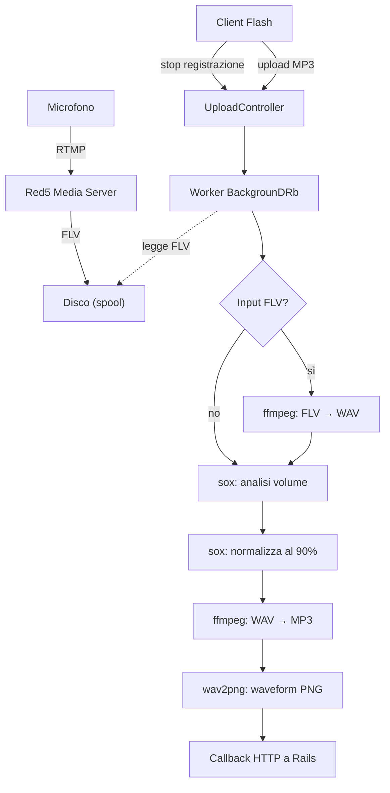


Per il quadro generale — perché Myousica era in anticipo sui tempi e chi lo fa oggi — vedi la [retrospettiva del 2026](/it/posts/2026-04-11-myousica-eighteen-years-later/).


Questo è il terzo e ultimo post della [serie Myousica](/it/posts/2010-10-14-myousica-collaborative-music-remixing-platform/). Il [primo](/it/posts/2010-10-14-myousica-collaborative-music-remixing-platform/) copriva la piattaforma Rails, il [secondo](/it/posts/2010-10-16-myousica-multitrack-audio-mixing-in-the-browser/) l'editor multitraccia Flash. Questo copre come l'audio arriva effettivamente dal microfono dell'utente a un MP3 riproducibile — la pipeline che collega tutti i servizi insieme.

L'uploader è un'applicazione Rails 2.2 separata — headless, niente database, niente ActiveRecord. Solo controller, worker in background e strumenti di elaborazione audio. [Andrea Franz](https://github.com/pilu) ha costruito la versione iniziale ad aprile 2008, io ho preso in mano da maggio 2008 in poi. [120 commit](https://github.com/mewsic/mewsic-uploader), originariamente chiamato `multitrack_server` prima di essere rinominato in `mewsic-uploader` a [marzo 2009](https://github.com/mewsic/mewsic-uploader/commits/master/?since=2009-03-06&until=2009-03-07).

## La pipeline completa

Ecco il flusso completo dal microfono alla traccia riproducibile:



Due punti di ingresso: l'utente può caricare un file MP3 direttamente, oppure registrare via microfono (che produce uno stream FLV attraverso Red5). Entrambi finiscono come un MP3 con un PNG della forma d'onda.

## Autenticazione stateless

L'uploader non ha sessioni utente — `session :off` nell'`ApplicationController`. Ogni richiesta viene autenticata chiedendo all'app principale Myousica se il token è valido:

```ruby
class ApplicationController < ActionController::Base
  before_filter :check_auth
  session :off

  def check_auth
    unless params[:id] && params[:token]
      redirect_to '/' and return
    end

    url = URI.parse "#{AUTH_SERVICE}/#{params[:id]}?token=#{params[:token]}"
    unless Net::HTTP.start(url.host, url.port) { |http|
      http.post(url.path, url.query)
    }.is_a?(Net::HTTPSuccess)
      redirect_to '/' and return
    end
  end
end
```

Ogni upload, ogni richiesta di encoding, ogni richiesta di mix — portano tutti `?id=USER_ID&token=TOKEN` nella query string. L'uploader fa POST all'endpoint `/multitrack/_/:id` dell'app principale e verifica l'HTTP 200. Questo è necessario perché gli upload Flash non possono portare sessioni cookie — il token è l'unico modo per autenticarsi.

## Il controller di upload

Quando arriva un file, il controller lo copia in una directory di spool e avvia un worker in background:

```ruby
class UploadController < ApplicationController
  def index
    @worker_key = random_md5

    input = input_file(random_md5) << '.mp3'
    FileUtils.cp params[:Filedata].path, input

    MiddleMan.worker(:ffmpeg_worker).async_run(
      :arg => {
        :key => @worker_key,
        :input => input,
        :output => random_output_file,
        :track_id => params[:track_id],
        :user_id => params[:id]
      })

    render_worker_status
  end
end
```

La risposta è immediata — un documento di stato XML con una chiave del worker. Il client Flash fa polling su `/upload/status/:worker_key` finché l'encoding non è completato. Niente connessioni HTTP long-running, niente websocket. Solo polling.

Il `random_md5` genera nomi file univoci da `MD5.md5(rand.to_s)`. Sufficientemente libero da collisioni per una piattaforma musicale.

## La pipeline di encoding

Il `FfmpegWorker` è un worker [BackgrounDRb](https://github.com/gnufied/backgroundrb) con pool size 3 — al massimo 3 tracce possono essere encodate simultaneamente. Il metodo `encode_to_mp3` passa attraverso quattro fasi:

```ruby
def encode_to_mp3(options)
  key, input, output = options[:key], options[:input], options[:output]
  update_status key, :running, output, 0

  # 1. Conversione formato (FLV → WAV se necessario)
  if input =~ /\.flv$/
    tempfile = Tempfile.new 'wavepass'
    Wavepass.new(input, tempfile.path).run
    input = tempfile.path
  end

  # 2. Analisi volume
  process = SoxAnalyzer.new(input, format).run
  optimum = process.optimum_volume

  # 3. Normalizzazione
  tempfile = Tempfile.new 'normalizer'
  SoxNormalizer.new(input, tempfile.path, optimum, format).run
  input = tempfile.path

  # 4. Encoding MP3
  FFmpeg.new(input, output).run

  # 5. Waveform
  length = Mp3Info.new(output).length
  Adelao::Waveform.generate(input, output.sub('.mp3', '.png'), :width => length * 10)

  # 6. Callback
  update_mixable :path => TRACK_SERVICE, :filename => File.basename(output),
    :length => length, :track_id => options[:track_id], :user_id => options[:user_id]

  update_status key, :finished, output, length
ensure
  File.unlink input
  GC.start
end
```

Ogni fase invoca uno strumento esterno via la classe base `Executable` — un wrapper minimale attorno a `fork` + `exec`:

```ruby
class Executable
  def run
    unless @status
      Process.wait(fork { exec(self.to_cmd) })
      @status = $?.exitstatus
    end
    return self
  end

  def success?
    @status.zero?
  end
end
```

Semplice. Fork di un processo figlio, exec del comando, attesa, controllo dell'exit code. Niente pipe, niente interpretazione shell, niente sorprese.

## Analisi audio e normalizzazione

La normalizzazione del volume è la parte più interessante della pipeline. Prima dell'encoding, sox analizza l'audio per trovare il livello di volume ottimale:

```ruby
class SoxAnalyzer < StdOutputter
  def to_cmd
    "sox -t %s %s -n stat -v" % [@format, @input]
  end

  def optimum_volume
    @output.to_f * 90 / 100
  end
end
```

Il comando `sox ... -n stat -v` produce un singolo numero: il moltiplicatore di volume che porterebbe l'audio al livello massimo senza clipping. Il `SoxAnalyzer` cattura quel numero dallo stdout (via la sottoclasse `StdOutputter` di `Executable`) e lo scala al 90% — lasciando un 10% di margine per evitare distorsione quando le tracce vengono mixate insieme.

Poi il normalizzatore applica il volume calcolato:

```ruby
class SoxNormalizer < Executable
  def to_cmd
    "sox -v %f -t %s %s -t wav %s" % [@volume, @format, @input, @output]
  end
end
```

Questo significa che ogni traccia in Myousica è normalizzata nel volume prima di essere resa disponibile. Quando aggiungi la traccia di chitarra di qualcuno al tuo mix, è a un livello consistente — non hai una traccia che ti esplode nelle orecchie mentre un'altra si sente appena.

## Mix multi-traccia

Il `SoxWorker` gestisce il mixdown finale — prende più tracce e le combina in un singolo MP3. Ogni traccia può avere una regolazione del volume individuale (impostata dall'utente nell'editor multitraccia):

```ruby
def mix_tracklist(options)
  tracks = []
  options[:tracks].each do |track|
    next if track.volume.zero?  # salta le tracce mutate

    if SoxEffect.needed?(track)
      file = Tempfile.new 'effect'
      SoxEffect.new(track, file.path).run
      tracks << SoxMixer::Track.new(file, 'wav')
    else
      file = File.open track.filename, 'r'
      tracks << SoxMixer::Track.new(file, 'mp3')
    end
  end

  temp = Tempfile.new 'mixer'
  SoxMixer.new(tracks, temp.path).run
  FFmpeg.new(temp.path, output).run
  # ... waveform, callback, cleanup
end
```

Il comando del mixer è diretto — `sox -m` (modalità mix) combina tutti i file di input in un unico output:

```ruby
class SoxMixer < Executable
  def to_cmd
    mix = '-m' if @tracklist.size > 1
    "sox #{mix} " << @tracklist.map { |track|
      "-t #{track.format} -v 1.0 #{track.file.path}"
    }.join(' ') << " -t wav #@output"
  end
end
```

## Il wrapper FFmpeg

Le impostazioni di encoding MP3 sono configurate globalmente:

```ruby
class FFmpeg < Executable
  def to_cmd
    "ffmpeg -i #@input -ar #{MP3_FREQ} -ac #{MP3_CHANNELS} #@quality #@overwrite -f #@format #@output"
  end
end
```

Impostazioni predefinite: 44.1 kHz di frequenza di campionamento, stereo, 128 kbps CBR con VBR opzionale a qualità 5. La sottoclasse `Wavepass` riusa lo stesso wrapper FFmpeg ma produce WAV invece di MP3 — usato per convertire le registrazioni FLV da Red5 in un formato che sox sa gestire.

## Red5: il ponte RTMP

L'[istanza Red5](https://github.com/mewsic/mewsic-red5) è il pezzo più semplice del puzzle — un deployment Red5 standard configurato per RTMP sulla porta 1935 con 16-64 thread. Quando il client Flash registra dal microfono, l'audio viene trasmesso via `NetStream.publish()` a Red5, che lo scrive su disco come file FLV. L'uploader poi lo prende, converte in WAV e lo fa passare nella stessa pipeline analisi → normalizzazione → encoding.

Red5 è completamente stateless — non sa nulla di utenti, tracce o canzoni. Registra solo stream audio su file. Tutta la coordinazione avviene tra il client Flash e le app Rails.

## La waveform

Ogni traccia encodata riceve una waveform PNG di accompagnamento, generata da [wav2png](http://github.com/beschulz/wav2png):

```ruby
Adelao::Waveform.generate(input, output.sub('.mp3', '.png'), :width => length * 10)
```

La larghezza è `length * 10` — circa 10 pixel al secondo di audio. Una traccia di 3 minuti produce una waveform larga ~1800px. L'editor multitraccia Flash carica questi PNG e li visualizza dietro il playhead, dando agli utenti una mappa visiva dell'audio.

## Deployment

L'uploader gira sullo stesso server dell'app principale, deployato via [Capistrano](https://github.com/mewsic/mewsic-uploader/blob/master/config/deploy.rb). Il daemon BackgrounDRb parte via `nohup script/backgroundrb start` e ascolta su `127.0.0.1:22222`. La directory di spool audio è symlinkata da `shared/audio` nel path public di Rails.

## La storia di git

Il [repo dell'uploader](https://github.com/mewsic/mewsic-uploader) ha [120 commit](https://github.com/mewsic/mewsic-uploader/commits/master/) da aprile 2008 a ottobre 2010. Andrea Franz ha costruito lo [scheletro iniziale](https://github.com/mewsic/mewsic-uploader/commit/1c7389f) — la struttura dei controller, il deployment Capistrano, l'integrazione base con BackgrounDRb. Sono entrato un mese dopo e ho costruito la pipeline di encoding, l'integrazione con sox, la logica di normalizzazione e le callback ai servizi.

Il giorno più intenso è stato il [30 giugno 2008](https://github.com/mewsic/mewsic-uploader/commits/master/?since=2008-06-30&until=2008-07-01) con 17 commit — quel giorno la pipeline di mixing ha preso forma. La [catena di whoops](https://github.com/mewsic/mewsic-uploader/commits/master/?since=2008-05-27&until=2008-05-28) del 27 maggio ("whoops.", "whoops. [2]") ero io che debuggavo il primo upload funzionante. E l'[hack per Flash upload](https://github.com/mewsic/mewsic-uploader/commit/12f3734) del 22 luglio merita una menzione speciale — gli upload Flash su Internet Explorer richiedono una risposta HTML, non XML, quindi il controller doveva rilevare il browser e cambiare formato. Bei tempi.

---

Questo è lo stack Myousica completo — dalla [piattaforma Rails](/it/posts/2010-10-14-myousica-collaborative-music-remixing-platform/) al [multitraccia Flash](/it/posts/2010-10-16-myousica-multitrack-audio-mixing-in-the-browser/) a questa pipeline audio. Tre anni di lavoro, quattro servizi, ~2.000 commit tra cinque persone. Il codice è tutto su [GitHub](https://github.com/mewsic).

**Repository:**
- [mewsic/mewsic-uploader](https://github.com/mewsic/mewsic-uploader) — servizio di elaborazione audio
- [mewsic/mewsic-red5](https://github.com/mewsic/mewsic-red5) — istanza Red5 media server


---

**Myousica nel tempo:** [Annuncio lancio](/it/posts/2008-09-11-myousica-com-was-born-today/) (2008) • [Open-source dell'app Rails](/it/posts/2010-10-14-myousica-collaborative-music-remixing-platform/) (2010) • [Editor multitraccia](/it/posts/2010-10-16-myousica-multitrack-audio-mixing-in-the-browser/) (2010) • **Pipeline audio (2010)** • [Diciotto anni dopo](/it/posts/2026-04-11-myousica-eighteen-years-later/) (2026)
