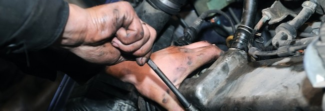

Il vero sistemista e’ un po’ come il meccanico di una volta, quello che se gli
portavi la macchina per rifare la convergenza e quando arrivavi sentiva che il
minimo non andava bene, ti faceva la convergenza, e giustamente la pagavi, ma
poi ti sistemava anche il minimo e non ti chiedeva nulla, lo faceva perche’ non
sopportava di sentire una macchina che non era a punto come si deve.

Era quello che da ogni minimo e impercettibile rumore indovinava subito
qualsiasi problema, anche quello di cui il cliente non si era ancora accorto.

Era quello che dopo cena a casa con la famiglia, tornava in officina, dove
potevi vedere le luci accese fino a notte tarda, perche’ stava lavorando al
“suo” gioiello, una qualche macchina semi d’epoca recuperata chissa’ dove che
con passione piano piano sistemava fino a farla tornare nuova.

Ecco, il sistemista e’ come quel meccanico, e le sue auto sono i server.

Fonte: [Veteran Unix
Admins](https://www.facebook.com/groups/VeteranUnixAdmins/permalink/662178223838934/?comment_id=662349183821838&offset=100&total_comments=178)
