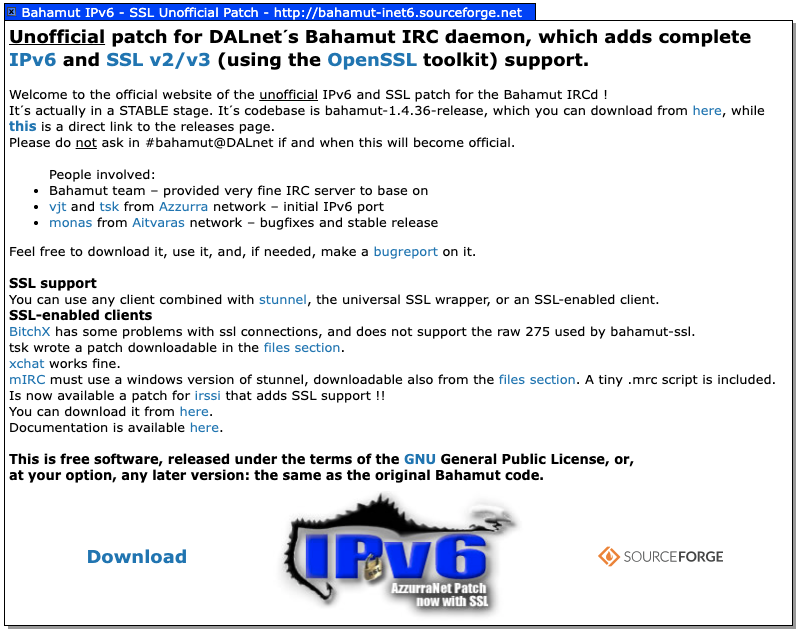
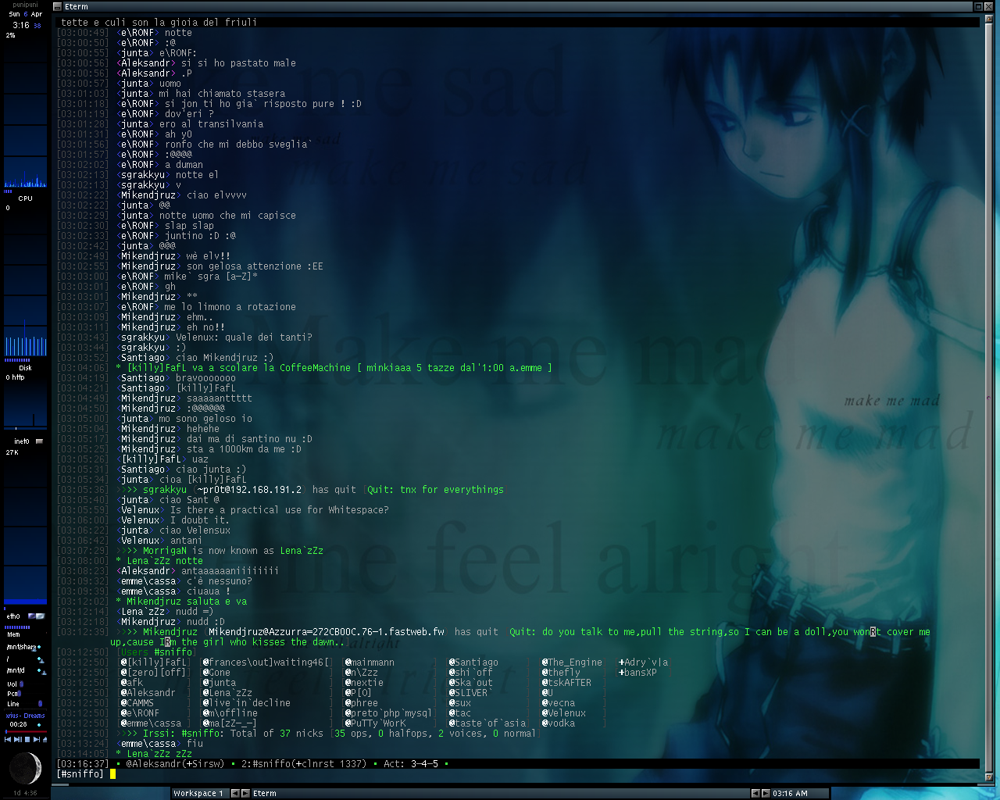

This is the prequel to [Sux Services: Multithreaded, SQL-Backed IRC Services from Scratch, 2002](/posts/2026-04-14-suxserv-multithreaded-sql-irc-services/). Before I started writing IRC services from scratch, I spent the better part of a year doing something arguably crazier: forking an IRC server to add IPv6 and SSL (now known as TLS). I was twenty-one.

The project lived in a CVS repository on SourceForge — it's [still there](https://bahamut-inet6.sf.net/), a digital fossil. Claude converted it to Git — [171 commits](https://github.com/vjt/bahamut-inet6/commits/master/), three authors, continuous history from February 2002 to January 2006. I wrote it — a fork of [Bahamut](https://en.wikipedia.org/wiki/Bahamut_(IRCd)), the IRC daemon that powered [DALnet](https://en.wikipedia.org/wiki/DALnet), one of the largest IRC networks of its era. Let me tell you about it.

<!--more-->

## How I got here

I discovered IRC the same way I discovered Linux — through [linux&c](https://it.wikipedia.org/wiki/Linux_%26_C.), an Italian magazine (there are [scanned copies on Archive.org](https://archive.org/search?query=subject%3A%22Linux+%26+C.+%28rivista%29%22), including [issue #0](https://archive.org/details/LinuxC00) that I bought) that was one of the few entry points to the open-source world for Italian teenagers in the late '90s. An article mentioned [Azzurra](https://azzurra.chat) ([history](https://web.archive.org/web/20200814231133/https://www.azzurra.org/?mod=history)), the Italian IRC network. I connected, founded a channel with friends — [#sniffo](https://sniffo.org) (inline skating and funny faces, nothing pharmaceutical) — and a Monopoli/Milan/Bologna axis of *smanettoni* was born.


*Ska from Milan, me in Bari, and Alk from Bologna, circa 2001. Three smanettoni who met on IRC and converged physically to do nerd things together.*

Eventually I got in touch with the people developing the network's infrastructure, and from there the path was inevitable: from user to contributor to IRCop and services coder.

## ConferenceRoom, and why we had to leave

Azzurra was running [ConferenceRoom](https://en.wikipedia.org/wiki/ConferenceRoom) — a commercial IRC server whose main selling point was a Java applet for web chat. In 2001, a Java applet was cutting-edge technology for getting non-technical users onto IRC without installing a client. The problem was that CR couldn't handle the load, and it didn't have the features we needed.

But we couldn't just drop the Java applet — it was how a significant chunk of users connected. So we did what any self-respecting group of teenagers with too much free time would do: we reverse-engineered the protocol handshake.

The "protection" was laughably simple. The Java applet sent a [`GUEST` command](https://github.com/azzurra/bahamut/blob/master/src/s_user.c#L4812) on connect and expected specific [IRC numerics](https://modern.ircdocs.horse/#rplwelcome-001) in response. So we taught Bahamut to [fake being ConferenceRoom](https://github.com/azzurra/bahamut/blob/master/src/s_user.c#L952) when it detected the applet:

```c
if (IsJava(sptr))
{
    sendto_one(sptr,
        ":%s 002 %s :Your host is %s, "
        "running version 1.8.4-SEC",
        me.name, nick, me.name);
    // ...
    sendto_one(sptr,
        ":%s 004 %s %s CR1.8.4-SEC oiwsabjgrchytxkmnpeAEGFSLMRTX",
        me.name, nick, me.name);
    sendto_one(sptr,
        ":%s 005 %s WATCH=128 SAFELIST TUNL FLG=s,5 "
        ":ConferenceRoom by WebMaster",
        me.name, nick);
}
```

`CR1.8.4-SEC`. `ConferenceRoom by WebMaster`. The Java applet saw the version strings it expected and happily connected to what was actually a completely different server. We even had a custom [RPL_WHOISJAVA (339)](https://github.com/azzurra/bahamut/blob/master/include/numeric.h#L254) numeric so operators could tell who was using the web chat.


## Why Bahamut

There were several open-source IRC daemons in 2002. [UnrealIRCd](https://www.unrealircd.org/) was the most feature-rich — and that was exactly the problem. It was bloated, it was what every small network used, and we were not a small network. Azzurra was *the* Italian IRC network, aiming for tens of thousands of concurrent users. We needed something built for scale.

[DALnet](https://en.wikipedia.org/wiki/DALnet) was the largest IRC network at the time — before the [massive DDoS attacks of 2002-2003](https://web.archive.org/web/20110723073250/http://zine.dal.net/previousissues/issue22/situation.php) that nearly took it offline for months. Their IRCd was [Bahamut](https://en.wikipedia.org/wiki/Bahamut_(IRCd)): a fork of [Hybrid](https://ircd-hybrid.org/), stripped down, optimized for heavy loads, battle-tested at a scale no other server could match. If it could handle DALnet's hundreds of thousands of users, it could handle ours.

We forked it and started adding what we needed: IP cloaking to protect our users, and then the main technical mission — IPv6 support and SSL encryption for the IRC protocol.

## Mode +x: why IP cloaking was existential

The first thing we added — before IPv6, before SSL, before anything else — was [IP cloaking](https://github.com/azzurra/bahamut/blob/master/src/cloak.c). Mode `+x`.

To understand why, you need to understand what the internet was like in 2002. Most Italian users were on Windows 98 or ME. [WinNuke](https://en.wikipedia.org/wiki/WinNuke) could crash their computer by sending a single out-of-band packet. [Ping of death](https://en.wikipedia.org/wiki/Ping_of_death) was still a thing. And if someone knew your IP address, they could browse your `C$` administrative share and read your documents — because nobody had a firewall and Windows file sharing was on by default.

On IRC, typing `/whois nickname` showed you information about any user — including their hostname, which resolved to their IP address. (If the `/` prefix for commands feels familiar — Slack, Discord, and even Claude's interface all inherited it from IRC.) This is what it looked like:

```
vjt is vjt@host175-211.pool80118.interbusiness.it
 * Marcello
vjt on #sniffo #azzurra #help
vjt using irc.azzurra.chat Azzurra IRC Network
vjt has been idle 0 hours 7 mins 23 secs
```

That `host175-211.pool80118.interbusiness.it` hostname resolved to a real public IP address — and in 2002, that meant anyone on IRC could WinNuke you, ping-flood you, or browse your Windows shares.

IRC channels — chatrooms, in today's parlance — were run by operators who could eject troublemakers with `/kick` and prevent them from rejoining with `/ban`. A `/kb` (kick-ban combo) was what you earned after one too many annoyances, and you deserved it. Bans matched `user@host` patterns — `*@host175-211.pool80118.interbusiness.it` and you were out.


The problem was simple: everyone could see your real IP and attack you. But bans also needed stable hostnames to work — and IP cloaking had to solve both. It replaced the visible portion of your hostname with a keyed hash.

### The hash trick

But why a hash and not a random string? Because the hash was deterministic — the same IP always produced the same cloaked hostname. If we'd used random strings, users could just reconnect to get a new identity and dodge every ban. With a hash, as long as your IP stayed the same, your cloaked hostname stayed the same, and the ban held. Of course, dialup users could still disconnect and redial their modem to get a new IP and a new hash... but that was a limitation of 2002 internet, not the cloaking system.

The implementation used [SHA1 + FNV hashing](https://github.com/azzurra/bahamut/blob/master/src/cloak.c#L145) with a server-side key, producing hostnames like `Azzurra-1A2B3C4D.example.com` for FQDNs or `192.168.Azzurra-1A2B3C4D` for IPv4 addresses. The separator was `-` for positive checksums and `=` for negative ones:

```c
#define CLOAK_HOST "Azzurra"

snprintf(virt, HOSTLEN, "%s%c%X.%s",
         cloak_host,
         (csum < 0 ? '=' : '-'),
         (csum < 0 ? -csum : csum), p + 1);
```

### How secure was it?

Secure enough — as long as the key stays secret. The hash feeds both the hostname *and* a secret key into SHA1 before running FNV on the output:

```c
SHA1Update(&digest, (unsigned char *) s, size);
SHA1Update(&digest, (unsigned char *) cloak_key, cloak_key_len);
```

Without the key, you can't precompute anything. But *with* the key — say, from a compromised server — the entire IPv4 address space is just 2^32 inputs. Alk, reading this post in 2026, promptly demonstrated the point with his RTX 5090:

```
ipv4-hash-build: [gpu] done — rows 4294967296 / 4294967296  124.20 Mrows/s  34.6s elapsed
ipv4-hash-build: done — wrote table.raw
```

34 seconds. Every possible cloaked IPv4 hostname, enumerated. In 2002, his Celeron 300 would have taken maybe 14 minutes — not exactly a deterrent either. The secret key was always the real protection, not the computational cost.

IPv6 cloaking came [much later](https://github.com/azzurra/bahamut/commit/ba211d5), courtesy of morph — whose commit message reads *"IPv6 host cloaking (ugly, but works)"* and whose code contains the comment `/* FFFFFFFUUUUUUUU */`. With 2^128 addresses, at least the rainbow table is a harder sell.

## Italian in the codebase

And yes, there are Italian comments buried in the code. In the [FQDN handling logic](https://github.com/azzurra/bahamut/blob/master/src/cloak.c#L218) of the cloaking code:

```c
/* controllare i return value non sarebbe una cattiva idea... */
```

*"Checking return values wouldn't be a bad idea..."* — we knew. And in [`s_bsd.c`](https://github.com/vjt/bahamut-inet6/blob/1618b3a/src/s_bsd.c#L1232), next to the IP source routing check that gets disabled for IPv6:

```c
#if defined(IP_OPTIONS) && defined(IPPROTO_IP) && !defined(INET6) /* controlla STRONZONE */
```

*"Check this, you big piece of..."* — Italian augmentative of a word I'll let you look up.

## The Fastweb problem

This one deserves a section because it's peak early-2000s Italian internet infrastructure.

[Fastweb](https://en.wikipedia.org/wiki/Fastweb) was — and still is — an Italian ISP, but in 2002 they were genuinely ahead of their time. They were the first in Italy to deploy fiber-to-the-home, installing Cisco Catalysts in building basements in Milan and hooking residential users to fiber when the rest of the country was on ADSL. Impressive, except for one architectural detail: their entire Metropolitan Area Network was behind carrier-grade NAT. Thousands of users sharing the same public IP addresses.

On IRC, this was a disaster. You couldn't distinguish Fastweb users from each other — they all appeared to come from the same address. As [this Usenet thread from September 2002](https://groups.google.com/g/it.tlc.gestori.fastweb/c/p1V7Uj0Y9ys) documents, Fastweb users were getting K-lined (banned) from IRC networks left and right — not because of anything they did, but because spammers on the same shared IPs had triggered network-wide bans that affected every Fastweb subscriber. Users were furious, some considering switching from Fastweb's fiber to slower ADSL just to get a public IP.

Our solution was creative: [nextime](https://nexlab.it/) had a server *inside* the Fastweb network that could see the internal IPs. Fastweb users connected to Azzurra through that server, which relayed their internal addresses to the rest of the network. We explicitly blocked connections from Fastweb's residential NAT egress nodes to our other servers — if you were on Fastweb, you *had* to connect through the internal server.

The [`FASTWEB` compile-time flag](https://github.com/azzurra/bahamut/blob/master/src/s_user.c#L425) was a dedicated build for these servers. It did quite a few things:

```c
#ifdef FASTWEB /* AZZURRA */
    /* workaround for fastweb`s MAN`s lame addressing :D */
    sscanf(sptr->user->host, "%d.%d.%d.%d", &ip[0], &ip[1], &ip[2], &ip[3]);
    ircsprintf(sptr->user->host, "%d-%d.%d-%d.%s", ip[3], ip[2], ip[1], ip[0], FAST_RES);
```

The server took Fastweb's internal IPs (which had no reverse DNS) and [synthesized a hostname](https://github.com/azzurra/bahamut/blob/master/src/s_user.c#L825) by reversing the octets under the `fastweb.fw` pseudo-TLD — so `10.1.2.3` became `3-2.1-10.fastweb.fw`. It hid the pseudo-TLD from the user's own [`RPL_WELCOME`](https://github.com/azzurra/bahamut/blob/master/src/s_user.c#L971), showing their real IP instead so their client wouldn't get confused. The "server full" error page was swapped for a [dedicated Fastweb page](https://github.com/azzurra/bahamut/blob/master/src/s_user.c#L514), and [I-line passwords](https://github.com/azzurra/bahamut/blob/master/src/s_conf.c#L1602) in the config were prefixed with `fastweb.` to tag a port as Fastweb-only.

The [2005 server list](azzurra-help.pdf) shows four entries labeled "Azzurra Fastweb, Rete Interna." The `:D` in the comment says it all.


*Alk's workstation. Two CRT monitors, two keyboards, eight boxes in this corner alone — there were more in the other corner.*

## The open-source release

The cloaking code, the ConferenceRoom emulation, and the Fastweb support were Azzurra's competitive advantage — they stayed private. But the IPv6 and SSL work was different. That was infrastructure code, useful to anyone running Bahamut, and I pushed hard to release it as open source. This wasn't universally popular. But eventually, a stripped-down version went out on SourceForge as [bahamut-inet6](https://bahamut-inet6.sf.net/) (the [project page](https://sourceforge.net/projects/bahamut-inet6/) is still alive), and the code now lives in a [Git repository](https://github.com/vjt/bahamut-inet6) converted from the original CVS. Everything below comes from that release.



## IPv6: because IPv4 was "about to be deprecated"

Yes. In 2002 we genuinely believed IPv4 was on its way out. [RFC 2460](https://www.rfc-editor.org/rfc/rfc2460) had been published in 1998, the hype was real, and we were going to be ready. Twenty-three years later, I'm typing this on a network that still runs on IPv4. But the code was solid and the exercise was formative — and looking at it now, the engineering problems were legitimately interesting.

### The colon problem

Bahamut's configuration file used `:` as a field delimiter. This is a tradition going back to the [original IRC server](https://www.rfc-editor.org/rfc/rfc1459):

```
C:192.168.1.1:password:server.name:7325:10
```

IPv6 addresses contain colons. `2001:db8::1` in a colon-delimited config line is chaos.

The [solution](https://github.com/vjt/bahamut-inet6/blob/cc081d0/config#L356) was a configurable delimiter character. If you compiled with `INET6`, the [`./config` script](https://github.com/vjt/bahamut-inet6/blob/1618b3a/config#L356) forced you to pick something other than `:` — defaulting to `%`:

```sh
if [ -n "$INET6" ] ; then
    if [ "$IRCDCONF_DELIMITER" = ":" ] ; then
        IRCDCONF_DELIMITER='%';
    fi
    # ...
    echo "':' is not allowed as a delimiter in an ipv6 server."
```

Simple. Ugly. I still hate it to this day. It worked.

### Socket abstraction

The core of the IPv6 support was a set of [compile-time macros](https://github.com/vjt/bahamut-inet6/blob/1618b3a/include/struct.h#L563) that abstracted the socket structures:

```c
#ifdef INET6
# define AFINET       AF_INET6
# define SOCKADDR_IN  sockaddr_in6
# define SIN_FAMILY   sin6_family
# define SIN_PORT     sin6_port
# define SIN_ADDR     sin6_addr
# define S_ADDR       s6_addr
# define IN_ADDR      in6_addr
#else
# define AFINET       AF_INET
# define SOCKADDR_IN  sockaddr_in
# define SIN_FAMILY   sin_family
# define SIN_PORT     sin_port
# define SIN_ADDR     sin_addr
# define S_ADDR       s_addr
# define IN_ADDR      in_addr
#endif
```

This was the approach in 2002: not a runtime abstraction, not a compatibility layer — just `#define`. The entire codebase used `AFINET` and `SOCKADDR_IN` instead of the native types, and the preprocessor did the rest. It's crude by modern standards, but it meant zero runtime overhead and the changes touched as few lines as possible. You `#define INET6`, recompile, and your IRC server speaks IPv6.

### IPv4-mapped addresses

But you can't just flip a switch. The [real problem](https://github.com/vjt/bahamut-inet6/commit/170830e) was backward compatibility. An IPv6 server needs to talk to IPv4 servers, and the only way to do that in 2002 was [IPv4-mapped IPv6 addresses](https://en.wikipedia.org/wiki/IPv6#IPv4-mapped_IPv6_addresses) — encoding `192.168.1.1` as `::ffff:192.168.1.1`.

From the [commit message](https://github.com/vjt/bahamut-inet6/commit/170830e):

> made /connect work: now s_auth.c skips the auth check when connecting to servers whose addresses are ipv4 mapped in ipv6 structures. to specify an outbound connection, you must type ::ffff:i.p.v.4 into the host part of the C/N lines.

[`ip6_expand()`](https://github.com/vjt/bahamut-inet6/commit/3b5f598) was needed to handle addresses starting with `::`, because the parser treated `:` as a delimiter (yes, that problem again).

### Portability

IPv6 support in 2002 was wildly inconsistent across operating systems. The commits tell the story:

- [`added file va_copy.h`](https://github.com/vjt/bahamut-inet6/commit/1f31678) — PPC (Mac) needed `va_copy` hooks in variadic functions
- [`added MacOSX support !`](https://github.com/vjt/bahamut-inet6/commit/9bd60ec) — macOS didn't have `inet_pton`, so I [borrowed it from FreeBSD's libc](https://github.com/vjt/bahamut-inet6/blob/1618b3a/src/inet_pton.c)
- [`fixed the solaris u_int32_t problem`](https://github.com/vjt/bahamut-inet6/commit/d3351f5) — Solaris used different type names
- [`removed some openbsd (leet) warnings`](https://github.com/vjt/bahamut-inet6/commit/e83e83c) — tsk's contribution, OpenBSD was strict about warnings

Version 0.9.1 was [tagged for release](https://github.com/vjt/bahamut-inet6/commit/4ae2489) on February 17, 2002 — sixteen days after the initial import. By May, we were at [inet6 1.0a](https://github.com/vjt/bahamut-inet6/commit/a24a1ba).


*Two workstations, circa 2001: a PowerMac 7200 running Yellow Dog Linux and a PowerMac 7300 running NetBSD, two CRTs. Italian recycling signs on the wall. This is where the IPv6 patches were written.*

## SSL in three days

On [March 10, 2002](https://github.com/vjt/bahamut-inet6/commit/d44dca9), I added SSL support. By [March 13](https://github.com/vjt/bahamut-inet6/commit/6492043), it was done: *"fixed all the SSL-related problems. ready for release."*

Three days. The entire [`ssl.c`](https://github.com/vjt/bahamut-inet6/blob/1618b3a/src/ssl.c) is 291 lines. Copyright `Barnaba Marcello <vjt@azzurra.org>`. It's the most complete file I wrote for this project — initialization, shutdown, non-blocking read/write wrappers, error handling, and certificate reload.

Naturally, I was using [irssi](https://irssi.org/) as my IRC client, and irssi didn't have SSL support either — so I [contributed that too](https://github.com/irssi/irssi/commit/1539cf81f3642c5afd1267b3adc4fc2d46308ceb). It shipped in [irssi 0.8.6](https://irssi.org/NEWS/#news-v0-8-6) and was subsequently rewritten from scratch, of course.


*Aleksandr's irssi with the "sux" theme. Yes, the theme was named after the [services](/posts/2026-04-14-suxserv-multithreaded-sql-irc-services/).*

### The integration trick

The clever part wasn't `ssl.c` itself — it was how the SSL calls got wired into the existing I/O path. Bahamut used `send()` and `recv()` everywhere. Rather than hunting down every call site, I added macros that the [config script generated](https://github.com/vjt/bahamut-inet6/blob/1618b3a/config#L1341) into `options.h`:

```c
#define RECV_CHECK_SSL(from, buf, len) (IsSSL(from) && from->ssl) ? \
                                       safe_SSL_read(from, buf, len) : \
                                       RECV(from->fd, buf, len)
#define SEND_CHECK_SSL(to, buf, len) (IsSSL(to) && to->ssl) ? \
                                       safe_SSL_write(to, buf, len) : \
                                       SEND(to->fd, buf, len)
```

If the client has SSL, use `safe_SSL_read()`/`safe_SSL_write()`. Otherwise, fall through to regular `recv()`/`send()`. When you read the I/O code, you see `RECV_CHECK_SSL` and `SEND_CHECK_SSL` — the preprocessor directives ensure the right code path is compiled in, with zero runtime dispatch overhead. The macros lived in the *generated* `options.h`, not in any header file — because the [`./config` script](https://github.com/vjt/bahamut-inet6/blob/1618b3a/config) was a 1400-line shell script that `echo`'d C preprocessor directives. This was a relic inherited from [Jarkko Oikarinen](https://en.wikipedia.org/wiki/Jarkko_Oikarinen)'s original IRC server codebase — every IRCd fork carried it forward even though `autoconf`/`automake` had been the standard for years. It was old even by 2002 standards.

When a new SSL client connected, the [acceptance code](https://github.com/vjt/bahamut-inet6/blob/1618b3a/src/s_bsd.c#L1481) created a new `SSL` object and attached it to the client structure:

```c
#ifdef USE_SSL /*AZZURRANET*/
    if (IsSSL(cptr))
    {
        extern SSL_CTX *ircdssl_ctx;

        acptr->ssl = NULL;
        
        /*SSL client init.*/
        if((acptr->ssl = SSL_new(ircdssl_ctx)) == NULL)
        {
            sendto_realops_lev(DEBUG_LEV, "SSL creation of "
                "new SSL object failed [client %s]",
                acptr->sockhost);
```

Every SSL-related addition is marked with `/*AZZURRANET*/` — scattered throughout the codebase like a tag: [struct.h](https://github.com/vjt/bahamut-inet6/blob/1618b3a/include/struct.h#L822), [s_bsd.c](https://github.com/vjt/bahamut-inet6/blob/1618b3a/src/s_bsd.c#L429), [config.h](https://github.com/vjt/bahamut-inet6/blob/1618b3a/include/config.h#L233). Twenty-one-year-old me, putting his flag on every line.


### The error handler

The [`fatal_ssl_error()`](https://github.com/vjt/bahamut-inet6/blob/1618b3a/src/ssl.c#L218) function is where you can see I was learning as I went. It's thorough — every SSL error code gets a human-readable string, the error is both sent to opers and syslogged — but there's a comment that reveals the fundamental tension:

```c
/* if we reply() something here, we might just trigger another
 * fatal_ssl_error() call and loop until a stack overflow... 
 * the client won`t get the ERROR : ... string, but this is
 * the only way to do it.
 * IRC protocol wasn`t SSL enabled .. --vjt
 */
```

*"IRC protocol wasn't SSL enabled."* I was bolting encryption onto a protocol designed in 1988. The protocol had no concept of a TLS handshake, no way to signal that a connection was encrypted. You just... connected to a different port and hoped.

And in the default error handler:

```c
default:
    ssl_func = "undefined SSL func [this is a bug] report to vjt@azzurra.org";
```

My email address, hardcoded into the binary, telling the world who to blame.

### The bugs

SSL ghosts were the first real problem — clients that disconnected during the SSL handshake but whose connection wasn't properly cleaned up, leaving phantom entries in the user list. [Fixed April 6, 2002](https://github.com/vjt/bahamut-inet6/commit/ddbdf7b): *"fixed the ghosts problem with ssl [sorry]."* The `[sorry]` is doing a lot of work there.

Same day: [SEGV when rehashing SSL P:lines](https://github.com/vjt/bahamut-inet6/commit/3debac2). When you changed the SSL listening port configuration and sent `SIGHUP` to reload, the server crashed. Because of course it did.

December 2002 brought [`/rehash ssl`](https://github.com/vjt/bahamut-inet6/commit/299f321) — the ability to reload SSL certificates without restarting the server. Along with a proper [certificate generation script](https://github.com/vjt/bahamut-inet6/blob/1618b3a/tools/ssl-cert.sh) and a [separate SSL detection script](https://github.com/vjt/bahamut-inet6/blob/1618b3a/tools/ssl-search.sh) for the build system. The `openssl req` and `openssl x509` commands in that script are essentially the same ones we still use today — twenty-three years later, the OpenSSL CLI hasn't changed.

## The security fix you write at twenty-one

Buried in the commit history, February 21, 2002:

[`format string exploit patch [syslog(DEBUG_LEV, debugbuf)]`](https://github.com/vjt/bahamut-inet6/commit/510ad12)

The diff is one line:

```diff
-    syslog(LOG_ERR, debugbuf);
+    syslog(LOG_ERR, "%s", debugbuf);
```

If `debugbuf` contained format specifiers — `%s`, `%x`, `%n` — `syslog()` would interpret them, potentially allowing arbitrary code execution. This was a [classic format string vulnerability](https://owasp.org/www-community/attacks/Format_string_attack), the kind that gave remote root shells in the early 2000s. The fix is trivial. Finding it is the hard part.


## December 2002: the big rework

My [last burst of commits](https://github.com/vjt/bahamut-inet6/commits/master/?after=bab2033fd309bc2f7a74c9f580dd62480af12a65+0) came in December 2002 — a massive rework over four days. The [opening commit](https://github.com/vjt/bahamut-inet6/commit/d7782b3) rewrote the protocol numerics, added new user modes, updated the TS (timestamp) protocol version, removed `&` local channels, and touched almost every header file. In one commit.

What followed:

- A complete [userban framework](https://github.com/vjt/bahamut-inet6/blob/1618b3a/src/userban.c) rewrite, replacing the old kline/akill/zline system with CIDR support and a [hash table](https://github.com/vjt/bahamut-inet6/blob/1618b3a/src/userban.c#L34) for fast lookups
- [Regex bans](https://github.com/vjt/bahamut-inet6/commit/4a19ee5) — POSIX regular expressions for ban matching
- A [loadable drone detection module](https://github.com/vjt/bahamut-inet6/blob/1618b3a/src/drone.c) — `drone.so` loaded via `dlopen()` at runtime, reloadable with `/rehash drones`. The interface was [three function pointers](https://github.com/vjt/bahamut-inet6/blob/1618b3a/src/drone.c#L55): init, rehash, and is_a_drone. A plugin system before we called things plugin systems.
- The ["infamous crashing bug"](https://github.com/vjt/bahamut-inet6/commit/a2e0925), fixed thanks to `nix@suhs.nu`

And of course, [tsk's immortal commit message](https://github.com/vjt/bahamut-inet6/commit/a928032) from early in the project:

> Fixed some s_bsd.c shits. (s_misc.c line 726 sux) --tsk


*Me and tsk (Fabrizio Lanotte), exchanging data via a parallel cable between two laptops. Shirtless, because it was summer in Southern Italy and air conditioning was for rich people.*

## monas and the Aitvaras Lithuanian network

The open-source release was already bearing fruit. From the very first months, [Aidas Kasparas](https://github.com/vjt/bahamut-inet6/commit/5c8c1d4) — monas — was contributing. He was running the [Aitvaras](https://en.wikipedia.org/wiki/Aitvaras) IRC network in Lithuania and had adopted bahamut-inet6. In February 2002, a flurry of commits credit him: [*"fixed hash_ip bug. thanx to monas"*](https://github.com/vjt/bahamut-inet6/commit/d5638af), [*"restored original in6_is_loopback [...] thx monas ! :)"*](https://github.com/vjt/bahamut-inet6/commit/96c0777), [*"fixed (un)*[kz]line problem with '%'. thx monas"*](https://github.com/vjt/bahamut-inet6/commit/a5f2479), [*"typo in NICKIP. thanx monas."*](https://github.com/vjt/bahamut-inet6/commit/56541dc)

That [hash_ip bug](https://github.com/vjt/bahamut-inet6/commit/d5638af) deserves its own story. It was found by an IRCop at `irc.vub.lt` — the Vilnius University dormitories server. They had a situation similar to [Fastweb](#the-fastweb-problem): all dorm users were NAT'd behind a single IP on a `10.0.building.user` schema, which meant `hash_ip()` put them all in the same hash slot. Every operation on that slot degenerated into a linear search through a linked list of all connected dorm users. Their server crawled while monas's server at Kaunas University — with more users but public IPs — ran fine. They `gdb`'d the live server and found the problem.

After my [last commit](https://github.com/vjt/bahamut-inet6/commit/bab2033) on December 5, 2002, the repository went silent for three years. I had moved on to [writing services](/posts/2026-04-14-suxserv-multithreaded-sql-irc-services/), then life happened — work, the slow drift away from the network.

Then in December 2005, monas came back with twelve commits that [synchronized the codebase with Bahamut 1.4.36](https://github.com/vjt/bahamut-inet6/commit/5c8c1d4), [unbundled the ancient zlib copy](https://github.com/vjt/bahamut-inet6/commit/56fe43e), [implemented proper IPv6 IP-banning](https://github.com/vjt/bahamut-inet6/commit/17787bc) (before, you could only ban by hostname — if the reverse DNS failed, the IPv6 user was unbanned), fixed [AKILL race conditions](https://github.com/vjt/bahamut-inet6/commit/ddfb89b), and [prepared a release](https://github.com/vjt/bahamut-inet6/commit/1618b3a).

This is the part of open-sourcing that justified pushing for it. Someone in a different country, running a different network, took the code, used it, and gave back improvements that made it better for everyone. The private cloaking code, CR emulation, and Fastweb hacks? They stayed useful only to us. The open IPv6 and SSL code? It helped someone in Lithuania run a better IRC network. That's the deal.

By 2005, Azzurra had [peaked at over 10,000 concurrent users](https://netsplit.de/networks/statistics.php?net=Azzurra) — not bad for a network run by volunteers who'd started as teenagers on IRC.

## Today


The network is still running — [four servers, about a hundred users](https://liveinfo.azzurra.chat/servers). Quiet, but alive.

After monas's contributions, the codebase passed through several hands. [Matteo Panella](https://github.com/azzurra/bahamut/commits?author=rfc1459) (morph) carried it from 2008 to 2012 with 104 commits — the heaviest contributor after the original authors. He did the [SVN-to-Hg migration](https://github.com/azzurra/bahamut/commit/aa0a200), implemented [CryptoPAn host cloaking](https://github.com/azzurra/bahamut/commit/f6846ba) and [IPv6 cloaking](https://github.com/azzurra/bahamut/commit/ba211d5), added [HAProxy PROXY protocol](https://github.com/azzurra/bahamut/commit/7a5b07e) support, [cleaned up years of `#ifdef AZZURRA` cruft](https://github.com/azzurra/bahamut/commit/aa1d128a580f), and started fixing the 64-bit assumptions that were baked into the original code. Then the repo went dormant for eight years.

In 2020, a revival: [Paolo Iannelli](https://github.com/azzurra/bahamut/commits?author=piannelli) [modernized SSL for Debian 10](https://github.com/azzurra/bahamut/commit/23cd829), [Alessio Bonforti](https://github.com/azzurra/bahamut/commits?author=abonforti) [fixed the certificate chain handling](https://github.com/azzurra/bahamut/commit/1c2645b), and [Michele "Sonic" Vacca](https://github.com/azzurra/bahamut/commits?author=Essency) [updated OpenSSL support past 1.1](https://github.com/azzurra/bahamut/commit/03874ac). Then in March 2026 — weeks before I started writing this post — Sonic pushed a burst of commits to [get the codebase compiling natively in 64-bit mode](https://github.com/azzurra/bahamut/commit/c9ded13) on GCC 13 and [OpenSSL 3.x](https://github.com/azzurra/bahamut/commit/86c68b7). The `-m32` flag is finally gone.

They're also building modern infrastructure around the old daemon: a [live server API](https://liveinfo.azzurra.chat/servers), a Telegram-to-IRC bridge. The codebase itself, as Hypnotize told me today, "should be rebuilt from scratch" — and honestly, looking at the code in 2026, it's hard to disagree. Oper passwords are stored in cleartext by default (`#undef CRYPT_OPER_PASSWORD`), failed `/oper` attempts broadcast the typed password to the security channel, and NickServ identification sends your password as a `PRIVMSG` across server links. A product of its era. But the network is alive, the lights are on, and someone still cares enough to keep them on. That counts for something.

## This bahamut has Super Cow Powers

The [version info](https://github.com/vjt/bahamut-inet6/blob/1618b3a/src/version.c.SH#L119) that you got when you typed `/info` on a server compiled with INET6 or SSL:

```c
#ifdef INET6
     "INET6 code: vjt <vjt@azzurra.org> & tsk <azzurra.org>",
     "Thanks: Aidas Kasparas <monas@users.sourceforge.net>",
     "Thanks: awgn, you will rock forever",
     "",
#endif
#ifdef USE_SSL
     "SSL code: vjt <vjt@azzurra.org>",
     "SSL testing: C|ty_Hunter, Intel, PaDrino, Progeny, tsk [thanks !]",
     "This server uses the OpenSSL library (http://www.openssl.org)",
     "",
#endif
#if defined( INET6 ) || defined( USE_SSL )
     " ___________________________________ ",
     "< This bahamut has Super Cow Powers >",
     " ----------------------------------- ",
     "        \\\\   ^__^",
     "         \\\\  (oo)\\\\_______",
     "            (__)\\\\       )\\\\/\\\\",
     "                ||----w |",
     "                ||     ||",
     "",
#endif
```

[awgn](https://github.com/awgn) — Nicola Bonelli — was a top-notch hacker who taught me a *ton* about C, networking, and systems programming. The *"you will rock forever"* was not hyperbole.

When someone typed `/info` on a bahamut-inet6 server, this is what they actually saw:

```
INET6 code: vjt <vjt@azzurra.org> & tsk <azzurra.org>
Thanks: Aidas Kasparas <monas@users.sourceforge.net>
Thanks: awgn, you will rock forever

SSL code: vjt <vjt@azzurra.org>
SSL testing: C|ty_Hunter, Intel, PaDrino, Progeny, tsk [thanks !]
This server uses the OpenSSL library (http://www.openssl.org)

 ___________________________________
< This bahamut has Super Cow Powers >
 -----------------------------------
        \   ^__^
         \  (oo)\_______
            (__)\       )\/\
                ||----w |
                ||     ||
```

A parody of [`apt-get moo`](https://wiki.debian.org/Aptitude#Easter_Eggs)'s *"This APT has Super Cow Powers"* — because when you're twenty-one and you've just added IPv6 and SSL to a production IRC server, you put an ASCII cow in the credits.

The version string itself was a thing of beauty. From [`patchlevel.h`](https://github.com/vjt/bahamut-inet6/blob/1618b3a/include/patchlevel.h):

```c
#define BASENAME "bahamut"
#define MAJOR 1
#define MINOR 4
#define PATCH 36
#ifndef INET6
#define PATCH1 ""
#else
#define PATCH1 "+inet6(1.1)"
#endif
#ifndef USE_SSL
#define PATCH2 ""
#else
#define PATCH2 "+ssl(1.1hr)"
#endif
```

`bahamut(RELEASE)-1.4.36+inet6(1.1)+ssl(1.1hr)`. That version string connected to real IRC networks and served real users.

## Non si accettano carote


One last thing. While working on this post, I got back in touch with some of the old crew. We found ourselves on `#it-opers` past midnight, recollecting old memories, and this came out.

Azzurra was born from a fight. A violent argument on [`#roxybar`](https://web.archive.org/web/19980705193028/http://www.roxybar.it:80/download/chat.html) — a channel on [IRCnet](https://en.wikipedia.org/wiki/IRCnet), the main European IRC network — that got the future founders kicked out. They didn't just leave the channel. They left the network entirely and started their own. But the early server MOTDs carried a grudge: *"non si accettano carote"* — "no carrots accepted."

I remembered seeing that line in the MOTD, in orange mIRC letters. I never understood it. I thought it was just random Italian IRC humor. Twenty-six years later, the explanation: the carrots were a dig at [Red Ronnie](https://en.wikipedia.org/wiki/Red_Ronnie) — the Italian TV host with the red hair, who was involved in the `#roxybar` drama. The same Red Ronnie who had introduced many Italian teenagers to IRC in the first place — his show [Roxy Bar](https://it.wikipedia.org/wiki/Roxy_Bar) on [Telemontecarlo](https://en.wikipedia.org/wiki/LA7) was [one of the first Italian TV programs to integrate IRC](https://web.archive.org/web/19980705193028/http://www.roxybar.it:80/download/chat.html), showing a server address and channel name on screen overlay, inviting viewers: *"if you have a computer, come join us on IRC."*

Some of those teenagers had 1200 bps modems and couldn't do much else online anyway. They became good friends of mine.

The founding myth of Italy's largest IRC network, immortalized as a vegetable joke in the login banner. Some things you only learn by staying connected long enough.

---

The fork was shipping. Time to build something from scratch. That's the [next story](/posts/2026-04-14-suxserv-multithreaded-sql-irc-services/) — 954 commits, a multithreaded C daemon, and the project I never finished. Read on.
