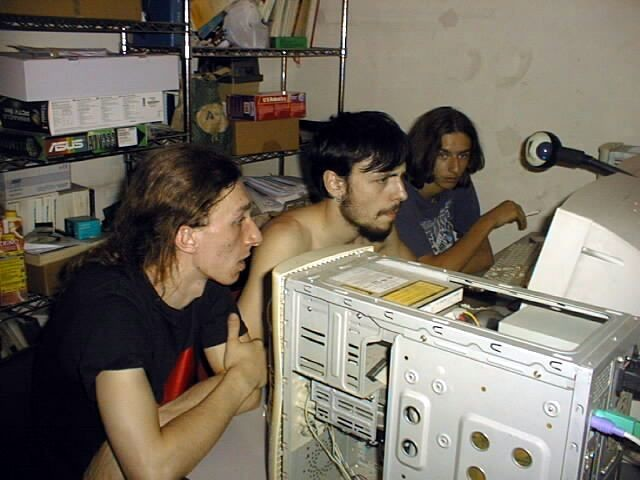
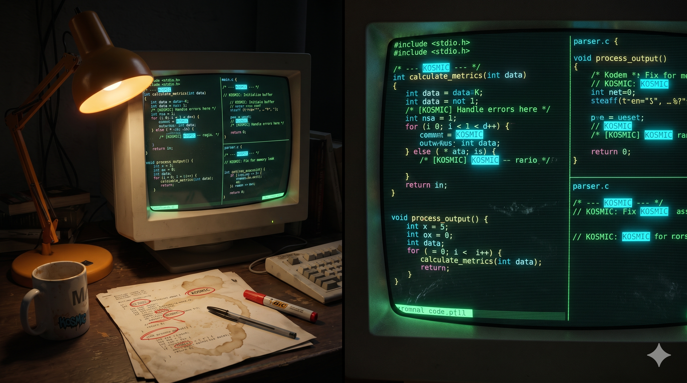

Questo è il prequel di [Sux Services: IRC Services Multithreaded e SQL-Backed da Zero, 2002](/it/posts/2026-04-14-suxserv-multithreaded-sql-irc-services/). Prima di iniziare a scrivere IRC services da zero, ho passato la parte migliore di un anno a fare qualcosa di probabilmente ancora più folle: forkare un server IRC per aggiungere IPv6 e SSL (oggi noto come TLS). Avevo ventun anni.

Il progetto viveva in un repository CVS su SourceForge — è [ancora lì](https://bahamut-inet6.sf.net/), un fossile digitale. Claude l'ha convertito in Git — [171 commit](https://github.com/vjt/bahamut-inet6/commits/master/), tre autori, storia continua da febbraio 2002 a gennaio 2006. L'ho scritto io. Ve lo racconto. Un fork di [Bahamut](https://en.wikipedia.org/wiki/Bahamut_(IRCd)), il demone IRC che faceva girare [DALnet](https://en.wikipedia.org/wiki/DALnet), una delle più grandi reti IRC della sua era.

## Come ci sono arrivato

Ho scoperto IRC nello stesso modo in cui ho scoperto Linux — attraverso [linux&c](https://it.wikipedia.org/wiki/Linux_%26_C.), una rivista italiana (ci sono [copie scansionate su Archive.org](https://archive.org/search?query=subject%3A%22Linux+%26+C.+%28rivista%29%22), compreso il [numero #0](https://archive.org/details/LinuxC00) che comprai) che era uno dei pochi punti d'ingresso al mondo open-source per gli adolescenti italiani alla fine degli anni '90. Un articolo menzionava [Azzurra](https://azzurra.chat) ([storia](https://web.archive.org/web/20200814231133/https://www.azzurra.org/?mod=history)), la rete IRC italiana. Mi sono connesso, ho fondato un canale con gli amici — [#sniffo](https://sniffo.org) (pattinaggio in linea e facce buffe, niente di farmaceutico) — e un asse Monopoli/Milano/Bologna di *smanettoni* era nato.


*Ska da Milano, io a Bari, e Alk da Bologna, circa 2001. Tre smanettoni che si sono conosciuti su IRC e convergevano fisicamente per fare cose nerd insieme.*

Alla fine sono entrato in contatto con le persone che sviluppavano l'infrastruttura della rete, e da lì il percorso era inevitabile: da utente a contributore a IRCop e coder dei services.

## ConferenceRoom, e perché dovevamo andarcene

Azzurra girava su [ConferenceRoom](https://en.wikipedia.org/wiki/ConferenceRoom) — un server IRC commerciale il cui punto di forza era un'applet Java per la web chat. Nel 2001, un'applet Java era tecnologia all'avanguardia per far entrare su IRC utenti non tecnici senza installare un client. Il problema era che CR non reggeva il carico e non aveva le funzionalità di cui avevamo bisogno.

Ma non potevamo semplicemente mollare l'applet Java — era il modo in cui una fetta significativa di utenti si connetteva. Quindi abbiamo fatto quello che qualsiasi gruppo di adolescenti con troppo tempo libero che si rispetti farebbe: abbiamo fatto reverse engineering del protocollo di handshake.

La "protezione" era ridicolmente semplice. L'applet Java mandava un [comando `GUEST`](https://github.com/azzurra/bahamut/blob/master/src/s_user.c#L4812) alla connessione e si aspettava specifici [IRC numerics](https://modern.ircdocs.horse/#rplwelcome-001) in risposta. Quindi abbiamo insegnato a Bahamut a [fingere di essere ConferenceRoom](https://github.com/azzurra/bahamut/blob/master/src/s_user.c#L952) quando rilevava l'applet:

```c
if (IsJava(sptr))
{
    sendto_one(sptr,
        ":%s 002 %s :Your host is %s, "
        "running version 1.8.4-SEC",
        me.name, nick, me.name);
    // ...
    sendto_one(sptr,
        ":%s 004 %s %s CR1.8.4-SEC oiwsabjgrchytxkmnpeAEGFSLMRTX",
        me.name, nick, me.name);
    sendto_one(sptr,
        ":%s 005 %s WATCH=128 SAFELIST TUNL FLG=s,5 "
        ":ConferenceRoom by WebMaster",
        me.name, nick);
}
```

`CR1.8.4-SEC`. `ConferenceRoom by WebMaster`. L'applet Java vedeva le stringhe di versione che si aspettava e si connetteva felicemente a quello che in realtà era un server completamente diverso. Avevamo perfino un numeric custom [RPL_WHOISJAVA (339)](https://github.com/azzurra/bahamut/blob/master/include/numeric.h#L254) così gli operatori potevano capire chi stava usando la web chat.


## Perché Bahamut

C'erano diversi demoni IRC open-source nel 2002. [UnrealIRCd](https://www.unrealircd.org/) era il più ricco di funzionalità — e quello era esattamente il problema. Era gonfio, era quello che ogni piccola rete usava, e noi non eravamo una piccola rete. Azzurra era *la* rete IRC italiana, con l'obiettivo di decine di migliaia di utenti simultanei. Ci serviva qualcosa costruito per scalare.

[DALnet](https://en.wikipedia.org/wiki/DALnet) era la più grande rete IRC dell'epoca — prima dei [massicci attacchi DDoS del 2002-2003](https://web.archive.org/web/20110723073250/http://zine.dal.net/previousissues/issue22/situation.php) che la misero quasi offline per mesi. Il loro IRCd era [Bahamut](https://en.wikipedia.org/wiki/Bahamut_(IRCd)): un fork di [Hybrid](https://ircd-hybrid.org/), snellito, ottimizzato per carichi pesanti, testato in battaglia a una scala che nessun altro server poteva eguagliare. Se poteva reggere le centinaia di migliaia di utenti di DALnet, poteva reggere i nostri.

L'abbiamo forkato e abbiamo iniziato ad aggiungere quello che ci serviva: IP cloaking per proteggere i nostri utenti, e poi la missione tecnica principale — supporto IPv6 e cifratura SSL per il protocollo IRC.

## Mode +x: perché l'IP cloaking era esistenziale

La prima cosa che abbiamo aggiunto — prima dell'IPv6, prima dell'SSL, prima di tutto il resto — è stata l'[IP cloaking](https://github.com/azzurra/bahamut/blob/master/src/cloak.c). Il mode `+x`.

Per capire perché, bisogna capire com'era internet nel 2002. La maggior parte degli utenti italiani era su Windows 98 o ME. [WinNuke](https://en.wikipedia.org/wiki/WinNuke) poteva crashare il loro computer mandando un singolo pacchetto out-of-band. Il [Ping of death](https://en.wikipedia.org/wiki/Ping_of_death) era ancora una cosa reale. E se qualcuno conosceva il tuo indirizzo IP, poteva sfogliare la tua share amministrativa `C$` e leggere i tuoi documenti — perché nessuno aveva un firewall e la condivisione file di Windows era attiva di default.

Su IRC, digitando `/whois nickname` si vedevano le informazioni su qualsiasi utente — compreso il suo hostname, che risolveva al suo indirizzo IP. Ecco come appariva:

```
vjt is vjt@host175-211.pool80118.interbusiness.it
 * Marcello
vjt on #sniffo #azzurra #help
vjt using irc.azzurra.chat Azzurra IRC Network
vjt has been idle 0 hours 7 mins 23 secs
```

Quell'hostname `host175-211.pool80118.interbusiness.it` risolveva a un vero indirizzo IP pubblico — e nel 2002, questo significava che chiunque su IRC poteva fare WinNuke, ping-flood, o sfogliare le tue share di Windows.

I canali IRC — le chatroom, nel linguaggio di oggi — erano gestiti da operatori che potevano espellere i disturbatori con `/kick` e impedirgli di rientrare con `/ban`. Un `/kb` (combo kick-ban) era quello che ti guadagnavi dopo una scocciatura di troppo, e te lo meritavi. (Se il prefisso `/` per i comandi vi suona familiare — Slack, Discord, e perfino l'interfaccia di Claude l'hanno tutti ereditato dritto dritto dai client IRC.) I ban matchavano pattern `user@host` — `*@host175-211.pool80118.interbusiness.it` e eri fuori.


Avevamo quindi due problemi: tutti potevano vedere il tuo IP reale e attaccarti, e i ban avevano bisogno degli hostname per funzionare. L'IP cloaking risolveva il primo sostituendo la porzione visibile dell'hostname con un hash con chiave. Ma perché un hash e non una stringa casuale? Perché l'hash era deterministico — lo stesso IP produceva sempre lo stesso hostname mascherato. Se avessimo usato stringhe casuali, gli utenti avrebbero potuto riconnettersi per ottenere una nuova identità e schivare ogni ban. Con un hash, finché il tuo IP restava lo stesso, il tuo hostname mascherato restava lo stesso, e il ban reggeva. Certo, gli utenti dial-up potevano sempre staccare e rifare il numero per ottenere un nuovo IP e un nuovo hash... ma quello era un limite di internet nel 2002, non del sistema di cloaking.

L'implementazione usava [SHA1 + FNV hashing](https://github.com/azzurra/bahamut/blob/master/src/cloak.c#L145) con una chiave lato server, producendo hostname come `Azzurra-1A2B3C4D.example.com` per gli FQDN o `192.168.Azzurra-1A2B3C4D` per gli indirizzi IPv4. Il separatore era `-` per i checksum positivi e `=` per quelli negativi:

```c
#define CLOAK_HOST "Azzurra"

snprintf(virt, HOSTLEN, "%s%c%X.%s",
         cloak_host,
         (csum < 0 ? '=' : '-'),
         (csum < 0 ? -csum : csum), p + 1);
```

E sì, ci sono commenti in italiano sepolti nella codebase. Nella [logica di gestione degli FQDN](https://github.com/azzurra/bahamut/blob/master/src/cloak.c#L218):

```c
/* controllare i return value non sarebbe una cattiva idea... */
```

*"Controllare i return value non sarebbe una cattiva idea..."* — lo sapevamo. E in [`s_bsd.c`](https://github.com/vjt/bahamut-inet6/blob/1618b3a/src/s_bsd.c#L1232), accanto al check del source routing IP che viene disabilitato per IPv6:

```c
#if defined(IP_OPTIONS) && defined(IPPROTO_IP) && !defined(INET6) /* controlla STRONZONE */
```

Nessuna traduzione necessaria.

## Il problema Fastweb

Questo merita una sezione a sé perché è il picco dell'infrastruttura internet italiana dei primi anni 2000.

[Fastweb](https://en.wikipedia.org/wiki/Fastweb) era — ed è tuttora — un ISP italiano, ma nel 2002 erano genuinamente avanti coi tempi. Furono i primi in Italia a fare fiber-to-the-home, installando Cisco Catalyst nei seminterrati dei palazzi a Milano e collegando utenti residenziali alla fibra quando il resto del paese era su ADSL. Impressionante, se non fosse per un dettaglio architetturale: l'intera Metropolitan Area Network era dietro carrier-grade NAT. Migliaia di utenti che condividevano gli stessi indirizzi IP pubblici.

Su IRC, era un disastro. Non si poteva distinguere un utente Fastweb dall'altro — apparivano tutti come provenienti dallo stesso indirizzo. Come documenta [questo thread su Usenet del settembre 2002](https://groups.google.com/g/it.tlc.gestori.fastweb/c/p1V7Uj0Y9ys), gli utenti Fastweb venivano K-linati (bannati) dalle reti IRC a destra e a manca — non per qualcosa che avevano fatto, ma perché spammer sugli stessi IP condivisi avevano fatto scattare ban a livello di rete che colpivano ogni abbonato Fastweb. Gli utenti erano furiosi, alcuni valutavano di passare dalla fibra Fastweb a un'ADSL più lenta pur di avere un IP pubblico.

La nostra soluzione fu creativa: [nextime](https://nexlab.it/) aveva un server *dentro* la rete Fastweb che poteva vedere gli IP interni. Gli utenti Fastweb si connettevano ad Azzurra tramite quel server, che rilanciava i loro indirizzi interni al resto della rete. Bloccavamo esplicitamente le connessioni dai nodi di uscita NAT residenziali di Fastweb ai nostri altri server — se eri su Fastweb, *dovevi* passare dal server interno.

Il [flag di compilazione `FASTWEB`](https://github.com/azzurra/bahamut/blob/master/src/s_user.c#L425) era una build dedicata per questi server. Faceva parecchie cose:

```c
#ifdef FASTWEB /* AZZURRA */
    /* workaround for fastweb`s MAN`s lame addressing :D */
    sscanf(sptr->user->host, "%d.%d.%d.%d", &ip[0], &ip[1], &ip[2], &ip[3]);
    ircsprintf(sptr->user->host, "%d-%d.%d-%d.%s", ip[3], ip[2], ip[1], ip[0], FAST_RES);
```

Il server prendeva gli IP interni di Fastweb (che non avevano reverse DNS) e [sintetizzava un hostname](https://github.com/azzurra/bahamut/blob/master/src/s_user.c#L825) invertendo gli ottetti sotto lo pseudo-TLD `fastweb.fw` — quindi `10.1.2.3` diventava `3-2.1-10.fastweb.fw`. Nascondeva lo pseudo-TLD dal [`RPL_WELCOME`](https://github.com/azzurra/bahamut/blob/master/src/s_user.c#L971) dell'utente (mostrando il suo IP reale, così il client non si confondeva), cambiava la pagina di errore "server pieno" in una [pagina dedicata Fastweb](https://github.com/azzurra/bahamut/blob/master/src/s_user.c#L514), e le [password delle I-line](https://github.com/azzurra/bahamut/blob/master/src/s_conf.c#L1602) nella configurazione erano prefissate con `fastweb.` per marcare una porta come Fastweb-only.

La [lista server del 2005](azzurra-help.pdf) mostra quattro voci etichettate "Azzurra Fastweb, Rete Interna." Il `:D` nel commento dice tutto.


*La postazione di Alk. Due monitor CRT, due tastiere, otto macchine in questo angolo — ce n'erano altre nell'angolo opposto.*

## Il rilascio open-source

Il codice del cloaking, l'emulazione di ConferenceRoom, e il supporto Fastweb erano il vantaggio competitivo di Azzurra — restavano privati. Ma il lavoro su IPv6 e SSL era diverso. Quello era codice infrastrutturale, utile a chiunque facesse girare Bahamut, e ho spinto molto per rilasciarlo come open source. Non è stato universalmente popolare. Ma alla fine, una versione ripulita è uscita su SourceForge come [bahamut-inet6](https://bahamut-inet6.sf.net/) (la [pagina del progetto](https://sourceforge.net/projects/bahamut-inet6/) è ancora viva), e il codice ora vive in un [repository Git](https://github.com/vjt/bahamut-inet6) convertito dal CVS originale. Tutto quello che segue viene da quel rilascio.


## IPv6: perché IPv4 "stava per essere deprecato"

Sì. Nel 2002 credevamo genuinamente che IPv4 fosse in via d'uscita. L'[RFC 2460](https://www.rfc-editor.org/rfc/rfc2460) era stato pubblicato nel 1998, l'hype era reale, e noi saremmo stati pronti. Ventitré anni dopo, sto scrivendo questo su una rete che gira ancora su IPv4. Ma il codice era solido e l'esercizio formativo — e guardandolo adesso, i problemi ingegneristici erano genuinamente interessanti.

### Il problema dei due punti

Il file di configurazione di Bahamut usava `:` come delimitatore di campo. Una tradizione che risale al [server IRC originale](https://www.rfc-editor.org/rfc/rfc1459):

```
C:192.168.1.1:password:server.name:7325:10
```

Gli indirizzi IPv6 contengono i due punti. `2001:db8::1` in una riga di configurazione delimitata dai due punti è il caos.

La [soluzione](https://github.com/vjt/bahamut-inet6/blob/cc081d0/config#L356) era un carattere delimitatore configurabile. Se compilavi con `INET6`, lo [script `./config`](https://github.com/vjt/bahamut-inet6/blob/1618b3a/config#L356) ti obbligava a sceglierne uno diverso da `:` — di default `%`:

```sh
if [ -n "$INET6" ] ; then
    if [ "$IRCDCONF_DELIMITER" = ":" ] ; then
        IRCDCONF_DELIMITER='%';
    fi
    # ...
    echo "':' is not allowed as a delimiter in an ipv6 server."
```

Semplice. Brutto. Lo odio ancora oggi. Funzionava.

### Astrazione dei socket

Il cuore del supporto IPv6 era un insieme di [macro di compilazione](https://github.com/vjt/bahamut-inet6/blob/1618b3a/include/struct.h#L563) che astraevano le strutture socket:

```c
#ifdef INET6
# define AFINET       AF_INET6
# define SOCKADDR_IN  sockaddr_in6
# define SIN_FAMILY   sin6_family
# define SIN_PORT     sin6_port
# define SIN_ADDR     sin6_addr
# define S_ADDR       s6_addr
# define IN_ADDR      in6_addr
#else
# define AFINET       AF_INET
# define SOCKADDR_IN  sockaddr_in
# define SIN_FAMILY   sin_family
# define SIN_PORT     sin_port
# define SIN_ADDR     sin_addr
# define S_ADDR       s_addr
# define IN_ADDR      in_addr
#endif
```

Questo era l'approccio nel 2002: non un'astrazione a runtime, non un layer di compatibilità — solo `#define`. L'intera codebase usava `AFINET` e `SOCKADDR_IN` invece dei tipi nativi, e il preprocessore faceva il resto. È grezzo per gli standard moderni, ma significava zero overhead a runtime e le modifiche toccavano il minor numero di righe possibile. Fai `#define INET6`, ricompili, e il tuo server IRC parla IPv6.

### Indirizzi IPv4-mapped

Ma non si può semplicemente girare un interruttore. Il [vero problema](https://github.com/vjt/bahamut-inet6/commit/170830e) era la retrocompatibilità. Un server IPv6 deve parlare con server IPv4, e l'unico modo per farlo nel 2002 erano gli [indirizzi IPv6 IPv4-mapped](https://en.wikipedia.org/wiki/IPv6#IPv4-mapped_IPv6_addresses) — codificare `192.168.1.1` come `::ffff:192.168.1.1`.

Dal [commit message](https://github.com/vjt/bahamut-inet6/commit/170830e):

> made /connect work: now s_auth.c skips the auth check when connecting to servers whose addresses are ipv4 mapped in ipv6 structures. to specify an outbound connection, you must type ::ffff:i.p.v.4 into the host part of the C/N lines.

[`ip6_expand()`](https://github.com/vjt/bahamut-inet6/commit/3b5f598) serviva per gestire gli indirizzi che iniziavano con `::`, perché il parser trattava `:` come delimitatore (sì, sempre quel problema).

### Portabilità

Il supporto IPv6 nel 2002 era selvaggiamente inconsistente tra sistemi operativi. I commit raccontano la storia:

- [`added file va_copy.h`](https://github.com/vjt/bahamut-inet6/commit/1f31678) — PPC (Mac) aveva bisogno di hook `va_copy` nelle funzioni variadiche
- [`added MacOSX support !`](https://github.com/vjt/bahamut-inet6/commit/9bd60ec) — macOS non aveva `inet_pton`, quindi l'ho [presa dalla libc di FreeBSD](https://github.com/vjt/bahamut-inet6/blob/1618b3a/src/inet_pton.c)
- [`fixed the solaris u_int32_t problem`](https://github.com/vjt/bahamut-inet6/commit/d3351f5) — Solaris usava nomi di tipo diversi
- [`removed some openbsd (leet) warnings`](https://github.com/vjt/bahamut-inet6/commit/e83e83c) — contributo di tsk, OpenBSD era severo con i warning

La versione 0.9.1 è stata [taggata per il rilascio](https://github.com/vjt/bahamut-inet6/commit/4ae2489) il 17 febbraio 2002 — sedici giorni dopo l'import iniziale. A maggio, eravamo a [inet6 1.0a](https://github.com/vjt/bahamut-inet6/commit/a24a1ba).


*Due postazioni, circa 2001: un PowerMac 7200 con Yellow Dog Linux e un PowerMac 7300 con NetBSD, due CRT. Cartelli della raccolta differenziata sul muro. Qui sono state scritte le patch IPv6.*

## SSL in tre giorni

Il [10 marzo 2002](https://github.com/vjt/bahamut-inet6/commit/d44dca9), ho aggiunto il supporto SSL. Il [13 marzo](https://github.com/vjt/bahamut-inet6/commit/6492043), era fatto: *"fixed all the SSL-related problems. ready for release."*

Tre giorni. L'intero [`ssl.c`](https://github.com/vjt/bahamut-inet6/blob/1618b3a/src/ssl.c) è 291 righe. Copyright `Barnaba Marcello <vjt@azzurra.org>`. È il file più completo che ho scritto per questo progetto — inizializzazione, shutdown, wrapper non-bloccanti per read/write, gestione errori, e reload dei certificati.

Naturalmente, usavo [irssi](https://irssi.org/) come client IRC, e neanche irssi aveva il supporto SSL — quindi l'ho [contribuito anch'io](https://github.com/irssi/irssi/commit/1539cf81f3642c5afd1267b3adc4fc2d46308ceb). È uscito in [irssi 0.8.6](https://irssi.org/NEWS/#news-v0-8-6) ed è stato successivamente riscritto da zero, naturalmente.

### Il trucco dell'integrazione

La parte furba non era `ssl.c` in sé — era come le chiamate SSL venivano innestate nel percorso I/O esistente. Bahamut usava `send()` e `recv()` ovunque. Invece di andare a caccia di ogni call site, ho aggiunto delle macro che lo [script config generava](https://github.com/vjt/bahamut-inet6/blob/1618b3a/config#L1341) in `options.h`:

```c
#define RECV_CHECK_SSL(from, buf, len) (IsSSL(from) && from->ssl) ? \
                                       safe_SSL_read(from, buf, len) : \
                                       RECV(from->fd, buf, len)
#define SEND_CHECK_SSL(to, buf, len) (IsSSL(to) && to->ssl) ? \
                                       safe_SSL_write(to, buf, len) : \
                                       SEND(to->fd, buf, len)
```

Se il client ha SSL, usa `safe_SSL_read()`/`safe_SSL_write()`. Altrimenti, cade sulle normali `recv()`/`send()`. Quando leggi il codice I/O, vedi `RECV_CHECK_SSL` e `SEND_CHECK_SSL` — le direttive del preprocessore assicurano che il percorso giusto venga compilato, con zero overhead di dispatch a runtime. Le macro vivevano nel file `options.h` *generato*, non in un header file — perché lo [script `./config`](https://github.com/vjt/bahamut-inet6/blob/1618b3a/config) era uno shell script di 1400 righe che faceva `echo` di direttive del preprocessore C. Questo era un relitto ereditato dal codebase del server IRC originale di [Jarkko Oikarinen](https://en.wikipedia.org/wiki/Jarkko_Oikarinen) — ogni fork di IRCd se lo portava dietro anche se `autoconf`/`automake` erano lo standard da anni. Era vecchio già per gli standard del 2002.

Quando un nuovo client SSL si connetteva, il [codice di accettazione](https://github.com/vjt/bahamut-inet6/blob/1618b3a/src/s_bsd.c#L1481) creava un nuovo oggetto `SSL` e lo allegava alla struttura del client:

```c
#ifdef USE_SSL /*AZZURRANET*/
    if (IsSSL(cptr))
    {
        extern SSL_CTX *ircdssl_ctx;

        acptr->ssl = NULL;
        
        /*SSL client init.*/
        if((acptr->ssl = SSL_new(ircdssl_ctx)) == NULL)
        {
            sendto_realops_lev(DEBUG_LEV, "SSL creation of "
                "new SSL object failed [client %s]",
                acptr->sockhost);
```

Ogni aggiunta legata a SSL è marcata con `/*AZZURRANET*/` — sparso per tutta la codebase come un tag: [struct.h](https://github.com/vjt/bahamut-inet6/blob/1618b3a/include/struct.h#L822), [s_bsd.c](https://github.com/vjt/bahamut-inet6/blob/1618b3a/src/s_bsd.c#L429), [config.h](https://github.com/vjt/bahamut-inet6/blob/1618b3a/include/config.h#L233). Il me ventunenne, che pianta la sua bandiera su ogni riga.



### L'error handler

La funzione [`fatal_ssl_error()`](https://github.com/vjt/bahamut-inet6/blob/1618b3a/src/ssl.c#L218) è dove si vede che stavo imparando strada facendo. È accurata — ogni codice di errore SSL ha una stringa leggibile, l'errore viene sia mandato agli oper che sysloggato — ma c'è un commento che rivela la tensione fondamentale:

```c
/* if we reply() something here, we might just trigger another
 * fatal_ssl_error() call and loop until a stack overflow... 
 * the client won`t get the ERROR : ... string, but this is
 * the only way to do it.
 * IRC protocol wasn`t SSL enabled .. --vjt
 */
```

*"IRC protocol wasn't SSL enabled."* Stavo imbullonando la cifratura su un protocollo progettato nel 1988. Il protocollo non aveva il concetto di handshake TLS, nessun modo di segnalare che una connessione era cifrata. Ti connettevi su una porta diversa e speravi.

E nell'error handler di default:

```c
default:
    ssl_func = "undefined SSL func [this is a bug] report to vjt@azzurra.org";
```

Il mio indirizzo email, hardcodato nel binario, che dice al mondo a chi dare la colpa.

### I bug

I ghost SSL sono stati il primo vero problema — client che si disconnettevano durante l'handshake SSL ma la cui connessione non veniva pulita correttamente, lasciando voci fantasma nella lista utenti. [Fixato il 6 aprile 2002](https://github.com/vjt/bahamut-inet6/commit/ddbdf7b): *"fixed the ghosts problem with ssl [sorry]."* Quel `[sorry]` porta un bel peso sulle spalle.

Stesso giorno: [SEGV al rehash delle P:line SSL](https://github.com/vjt/bahamut-inet6/commit/3debac2). Quando cambiavi la configurazione della porta SSL e mandavi `SIGHUP` per ricaricare, il server crashava. Naturalmente.

Dicembre 2002 ha portato [`/rehash ssl`](https://github.com/vjt/bahamut-inet6/commit/299f321) — la possibilità di ricaricare i certificati SSL senza riavviare il server. Insieme a un vero [script di generazione certificati](https://github.com/vjt/bahamut-inet6/blob/1618b3a/tools/ssl-cert.sh) e uno [script separato per la detection di SSL](https://github.com/vjt/bahamut-inet6/blob/1618b3a/tools/ssl-search.sh) per il sistema di build. I comandi `openssl req` e `openssl x509` in quello script sono essenzialmente gli stessi che usiamo ancora oggi — ventitré anni dopo, la CLI di OpenSSL non è cambiata.

## La fix di sicurezza che scrivi a ventun anni

Sepolta nella storia dei commit, 21 febbraio 2002:

[`format string exploit patch [syslog(DEBUG_LEV, debugbuf)]`](https://github.com/vjt/bahamut-inet6/commit/510ad12)

Il diff è una riga:

```diff
-    syslog(LOG_ERR, debugbuf);
+    syslog(LOG_ERR, "%s", debugbuf);
```

Se `debugbuf` conteneva specificatori di formato — `%s`, `%x`, `%n` — `syslog()` li interpretava, potenzialmente permettendo l'esecuzione di codice arbitrario. Questa era una [vulnerabilità format string classica](https://owasp.org/www-community/attacks/Format_string_attack), il tipo che dava shell root remote nei primi anni 2000. La fix è banale. Trovarla è la parte difficile.


## Dicembre 2002: la grande riscrittura

La mia [ultima raffica di commit](https://github.com/vjt/bahamut-inet6/commits/master/?after=bab2033fd309bc2f7a74c9f580dd62480af12a65+0) arrivò a dicembre 2002 — una riscrittura massiccia nell'arco di quattro giorni. Il [commit di apertura](https://github.com/vjt/bahamut-inet6/commit/d7782b3) riscrisse i numeric del protocollo, aggiunse nuovi mode utente, aggiornò la versione del protocollo TS (timestamp), rimosse i canali `&` locali, e toccò quasi ogni header file. In un commit.

Quello che seguì:

- Una riscrittura completa del [framework userban](https://github.com/vjt/bahamut-inet6/blob/1618b3a/src/userban.c), sostituendo il vecchio sistema kline/akill/zline con supporto CIDR e una [hash table](https://github.com/vjt/bahamut-inet6/blob/1618b3a/src/userban.c#L34) per lookup veloci
- [Ban regex](https://github.com/vjt/bahamut-inet6/commit/4a19ee5) — espressioni regolari POSIX per il matching dei ban
- Un [modulo di drone detection caricabile](https://github.com/vjt/bahamut-inet6/blob/1618b3a/src/drone.c) — `drone.so` caricato via `dlopen()` a runtime, ricaricabile con `/rehash drones`. L'interfaccia erano [tre function pointer](https://github.com/vjt/bahamut-inet6/blob/1618b3a/src/drone.c#L55): init, rehash, e is_a_drone. Un sistema a plugin prima che le cose si chiamassero sistemi a plugin.
- Il ["famigerato bug di crash"](https://github.com/vjt/bahamut-inet6/commit/a2e0925), fixato grazie a `nix@suhs.nu`

E naturalmente, l'[immortale commit message di tsk](https://github.com/vjt/bahamut-inet6/commit/a928032) dall'inizio del progetto:

> Fixed some s_bsd.c shits. (s_misc.c line 726 sux) --tsk


*Io e tsk (Fabrizio Lanotte), ci scambiamo dati via cavo parallelo tra due portatili. A petto nudo, perché era estate nel Sud Italia e l'aria condizionata era per i ricchi.*

## monas e la rete lituana Aitvaras

Il rilascio open-source stava già dando frutti. Fin dai primissimi mesi, [Aidas Kasparas](https://github.com/vjt/bahamut-inet6/commit/5c8c1d4) — monas — contribuiva. Faceva girare la rete IRC [Aitvaras](https://en.wikipedia.org/wiki/Aitvaras) in Lituania e aveva adottato bahamut-inet6. A febbraio 2002, una raffica di commit lo creditava: [*"fixed hash_ip bug. thanx to monas"*](https://github.com/vjt/bahamut-inet6/commit/d5638af), [*"restored original in6_is_loopback [...] thx monas ! :)"*](https://github.com/vjt/bahamut-inet6/commit/96c0777), [*"fixed (un)*[kz]line problem with '%'. thx monas"*](https://github.com/vjt/bahamut-inet6/commit/a5f2479), [*"typo in NICKIP. thanx monas."*](https://github.com/vjt/bahamut-inet6/commit/56541dc)

Quel [bug di hash_ip](https://github.com/vjt/bahamut-inet6/commit/d5638af) merita la sua storia. Fu trovato da un IRCop a `irc.vub.lt` — il server dei dormitori dell'Università di Vilnius. Avevano una situazione simile a [Fastweb](#il-problema-fastweb): tutti gli utenti del dormitorio erano dietro NAT con un singolo IP su uno schema `10.0.edificio.utente`, il che significava che `hash_ip()` li metteva tutti nello stesso slot della hash. Ogni operazione su quello slot degenerava in una ricerca lineare attraverso una linked list di tutti gli utenti connessi dal dormitorio. Il loro server arrancava mentre il server di monas all'Università di Kaunas — con più utenti ma IP pubblici — girava liscio. Fecero `gdb` sul server live e trovarono il problema.

Dopo il mio [ultimo commit](https://github.com/vjt/bahamut-inet6/commit/bab2033) del 5 dicembre 2002, il repository rimase silenzioso per tre anni. Io ero passato a [scrivere services](/it/posts/2026-04-14-suxserv-multithreaded-sql-irc-services/), poi la vita è successa — il lavoro, la lenta deriva dalla rete.

Poi a dicembre 2005, monas è tornato con dodici commit che hanno [sincronizzato la codebase con Bahamut 1.4.36](https://github.com/vjt/bahamut-inet6/commit/5c8c1d4), [sganciato la copia antica di zlib](https://github.com/vjt/bahamut-inet6/commit/56fe43e), [implementato un vero ban IPv6 per IP](https://github.com/vjt/bahamut-inet6/commit/17787bc) (prima, si poteva bannare solo per hostname — se il reverse DNS falliva, l'utente IPv6 era senza ban), fixato [race condition sugli AKILL](https://github.com/vjt/bahamut-inet6/commit/ddfb89b), e [preparato un rilascio](https://github.com/vjt/bahamut-inet6/commit/1618b3a).

Questa è la parte dell'open-sourcing che giustificava averlo fatto. Qualcuno in un paese diverso, su una rete diversa, ha preso il codice, l'ha usato, e ha restituito miglioramenti che l'hanno reso migliore per tutti. Il codice privato del cloaking, l'emulazione CR, e gli hack Fastweb? Sono rimasti utili solo a noi. Il codice aperto IPv6 e SSL? Ha aiutato qualcuno in Lituania a far girare una rete IRC migliore. Questo è il patto.

Nel 2005, Azzurra aveva [raggiunto il picco di oltre 10.000 utenti simultanei](https://netsplit.de/networks/statistics.php?net=Azzurra) — niente male per una rete gestita da volontari che erano partiti come adolescenti su IRC.

## Oggi


La rete è ancora attiva — [quattro server, circa un centinaio di utenti](https://liveinfo.azzurra.chat/servers). Silenziosa, ma viva.

Dopo i contributi di monas, la codebase è passata per diverse mani. [Matteo Panella](https://github.com/azzurra/bahamut/commits?author=rfc1459) (morpheus) l'ha portata avanti dal 2008 al 2012 con 104 commit — il contributore più pesante dopo gli autori originali. Ha fatto la [migrazione SVN-to-Hg](https://github.com/azzurra/bahamut/commit/aa0a200), implementato il [CryptoPAn host cloaking](https://github.com/azzurra/bahamut/commit/f6846ba) e il [cloaking IPv6](https://github.com/azzurra/bahamut/commit/ba211d5), aggiunto il supporto [HAProxy PROXY protocol](https://github.com/azzurra/bahamut/commit/7a5b07e), [ripulito anni di `#ifdef AZZURRA`](https://github.com/azzurra/bahamut/commit/aa1d128a580f), e iniziato a fixare le assunzioni 64-bit che erano incrostate nel codice originale. Poi il repo è rimasto dormiente per otto anni.

Nel 2020, una rinascita: [Paolo Iannelli](https://github.com/azzurra/bahamut/commits?author=piannelli) ha [modernizzato SSL per Debian 10](https://github.com/azzurra/bahamut/commit/23cd829), [Alessio Bonforti](https://github.com/azzurra/bahamut/commits?author=abonforti) ha [fixato la gestione della catena dei certificati](https://github.com/azzurra/bahamut/commit/1c2645b), e [Michele "Sonic" Vacca](https://github.com/azzurra/bahamut/commits?author=Essency) ha [aggiornato il supporto OpenSSL oltre la 1.1](https://github.com/azzurra/bahamut/commit/03874ac). Poi a marzo 2026 — settimane prima che iniziassi a scrivere questo post — Sonic ha pushato una raffica di commit per [far compilare la codebase nativamente in modalità 64-bit](https://github.com/azzurra/bahamut/commit/c9ded13) su GCC 13 e [OpenSSL 3.x](https://github.com/azzurra/bahamut/commit/86c68b7). Il flag `-m32` è finalmente sparito.

Stanno anche costruendo infrastruttura moderna intorno al vecchio demone: una [API server live](https://liveinfo.azzurra.chat/servers), un bridge Telegram-IRC. La codebase stessa, come mi ha detto Hypnotize oggi, "andrebbe ricostruita da zero" — e onestamente, guardando il codice nel 2026, è difficile non essere d'accordo. Le password degli oper sono salvate in chiaro di default (`#undef CRYPT_OPER_PASSWORD`), i tentativi falliti di `/oper` broadcastano la password digitata al canale di sicurezza, e l'identificazione a NickServ manda la tua password come `PRIVMSG` attraverso i link tra server. Un prodotto della sua epoca. Ma la rete è viva, le luci sono accese, e qualcuno ci tiene ancora abbastanza da tenerle accese. Conta qualcosa.

## Questo bahamut ha i Super Cow Powers

Le [informazioni di versione](https://github.com/vjt/bahamut-inet6/blob/1618b3a/src/version.c.SH#L119) che apparivano quando digitavi `/info` su un server compilato con INET6 o SSL:

```c
#ifdef INET6
     "INET6 code: vjt <vjt@azzurra.org> & tsk <azzurra.org>",
     "Thanks: Aidas Kasparas <monas@users.sourceforge.net>",
     "Thanks: awgn, you will rock forever",
     "",
#endif
#ifdef USE_SSL
     "SSL code: vjt <vjt@azzurra.org>",
     "SSL testing: C|ty_Hunter, Intel, PaDrino, Progeny, tsk [thanks !]",
     "This server uses the OpenSSL library (http://www.openssl.org)",
     "",
#endif
#if defined( INET6 ) || defined( USE_SSL )
     " ___________________________________ ",
     "< This bahamut has Super Cow Powers >",
     " ----------------------------------- ",
     "        \\\\   ^__^",
     "         \\\\  (oo)\\\\_______",
     "            (__)\\\\       )\\\\/\\\\",
     "                ||----w |",
     "                ||     ||",
     "",
#endif
```

[awgn](https://github.com/awgn) — Nicola Bonelli — era un hacker di primissimo livello che mi ha insegnato un *sacco* di cose sul C, il networking, e la programmazione di sistema. Quel *"you will rock forever"* non era un'iperbole.

Quando qualcuno digitava `/info` su un server bahamut-inet6, questo è quello che vedeva:

```
INET6 code: vjt <vjt@azzurra.org> & tsk <azzurra.org>
Thanks: Aidas Kasparas <monas@users.sourceforge.net>
Thanks: awgn, you will rock forever

SSL code: vjt <vjt@azzurra.org>
SSL testing: C|ty_Hunter, Intel, PaDrino, Progeny, tsk [thanks !]
This server uses the OpenSSL library (http://www.openssl.org)

 ___________________________________
< This bahamut has Super Cow Powers >
 -----------------------------------
        \   ^__^
         \  (oo)\_______
            (__)\       )\/\
                ||----w |
                ||     ||
```

Una parodia di [`apt-get moo`](https://wiki.debian.org/Aptitude#Easter_Eggs) e il suo *"This APT has Super Cow Powers"* — perché quando hai ventun anni e hai appena aggiunto IPv6 e SSL a un server IRC di produzione, metti una mucca ASCII nei crediti.

La stringa di versione stessa era una cosa bella. Da [`patchlevel.h`](https://github.com/vjt/bahamut-inet6/blob/1618b3a/include/patchlevel.h):

```c
#define BASENAME "bahamut"
#define MAJOR 1
#define MINOR 4
#define PATCH 36
#ifndef INET6
#define PATCH1 ""
#else
#define PATCH1 "+inet6(1.1)"
#endif
#ifndef USE_SSL
#define PATCH2 ""
#else
#define PATCH2 "+ssl(1.1hr)"
#endif
```

`bahamut(RELEASE)-1.4.36+inet6(1.1)+ssl(1.1hr)`. Quella stringa di versione si connetteva a reti IRC reali e serviva utenti reali.

## Non si accettano carote


Un'ultima cosa. Mentre lavoravo a questo post, mi sono rimesso in contatto con un po' della vecchia crew. Ci siamo ritrovati su `#it-opers` dopo mezzanotte a ricordare vecchie storie, e questa è saltata fuori.

Azzurra è nata da un litigio. Uno scazzo violento su `#roxybar` — un canale IRC italiano — che portò all'espulsione dei futuri fondatori. Se ne andarono, fondarono la loro rete, e il resto è storia. Ma i primi MOTD dei server portavano il rancore: *"non si accettano carote."*

Me lo ricordavo, quel messaggio nel MOTD, in lettere arancioni su mIRC. Non l'avevo mai capito. Pensavo fosse umorismo IRC italiano a caso. Ventisei anni dopo, la spiegazione: le carote erano una presa in giro per [Red Ronnie](https://it.wikipedia.org/wiki/Red_Ronnie) — il conduttore televisivo coi capelli rossi, coinvolto nel dramma di `#roxybar`. Lo stesso Red Ronnie che aveva fatto scoprire IRC a tanti adolescenti italiani, mostrando in sovraimpressione indirizzo del server e nome del canale durante il suo programma su [Telemontecarlo](https://it.wikipedia.org/wiki/LA7): *"se avete un computer, venite qui su IRC."* Alcuni di quegli adolescenti avevano un modem a 1200 bps, non potevano fare molto altro online, e sono diventati buoni amici miei.

Il mito fondativo della più grande rete IRC italiana, immortalato come una battuta sulle verdure nel banner di login. Certe cose le capisci solo se resti connesso abbastanza a lungo.

---

Ma forkare e estendere il server IRC di qualcun altro non bastava. Ho anche iniziato a costruire IRC services da zero. Quella è la [prossima storia](/it/posts/2026-04-14-suxserv-multithreaded-sql-irc-services/) — 954 commit, un demone C multithreaded, e il progetto che non ho mai finito. Continuate a leggere.
