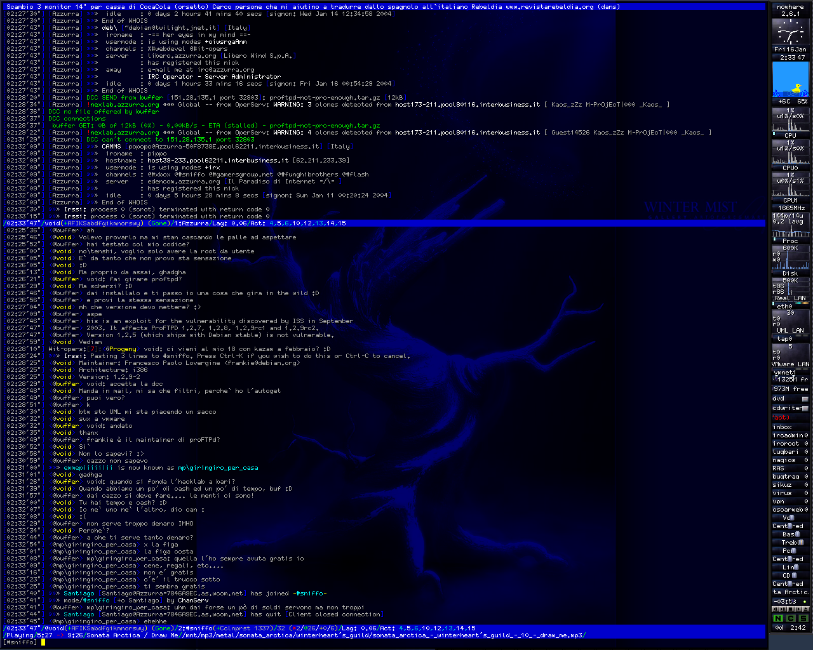

One of the things I'm enjoying most about working with [Claude](/tags/ai-generated/) is digital archaeology. I've spent twenty years accumulating old projects on backup disks, SourceForge, forgotten servers — code I wrote and never looked at again. Now I can just point Claude at a tarball and say "convert this to git" or "explain what 21-year-old me was thinking here" and get an actual conversation going with my own past.

Today's dig: I went to SourceForge and downloaded the CVS repository for [a project of mine from 2003](/posts/2003-03-16-suxserv-wip/) — **Sux Services**, my attempt at writing IRC services from scratch, in C, for the [Azzurra IRC Network](https://www.azzurra.org/). I said "Claude, convert this CVS repo to git" and a few minutes later I had a clean [Git repository](https://github.com/vjt/suxserv) with 954 commits, three authors, and a continuous history from September 2002 to November 2005.

I never finished this project. I left the network before it was ready for production. A Latvian developer picked it up, wrote 192 commits, and then the trail goes cold.

I [wrote about it at the time](/posts/2003-03-16-suxserv-wip/) — a WIP post from March 2003, when NickServ and ChanServ were working and I was stress testing with 100 bots.

Looking at this code now is — I don't know the right word. Moving, maybe. There's something about reading your own commit messages from twenty years ago, seeing the excitement and the frustration, recognizing the patterns you'd use for the next two decades but couldn't name yet. It's like hearing your own voice on a recording from when you were young — familiar and alien at the same time.

## What IRC services are

If you've never used IRC, here's the quick version: [IRC](https://en.wikipedia.org/wiki/Internet_Relay_Chat) (Internet Relay Chat) was the real-time chat protocol of the internet before Slack, Discord, and everything else. Networks of servers, channels you could join, nicknames you could claim. At its peak around 2005, [roughly a million people](https://netsplit.de/networks/top10.php?year=2005) were connected simultaneously across all networks.



Services are the pseudo-users that handle the bureaucracy of an IRC network: **NickServ** registers and protects nicknames, **ChanServ** manages channel ownership and access lists, **MemoServ** delivers offline messages, **OperServ** gives network operators administrative tools, and **RootServ** handles the god-mode stuff.

They're not part of the IRC server itself. They connect to the network as a special server, speaking the server-to-server protocol, and present themselves as virtual users. When you type `/msg NickServ IDENTIFY mypassword`, you're talking to a service — a separate process, with its own database, its own protocol parser, its own state machine tracking every user and channel on the network.

In 2002, the main options were [Anope](https://www.anope.org/), [Epona](https://sourceforge.net/projects/epona/), and the venerable [IRCServices](http://www.ircservices.za.net/) by Andrew Church. They worked. They were also sprawling C codebases with their own flat-file databases, limited extensibility, and tight coupling to specific IRCd versions. I thought I could do better.

I was 21 and an IRCop on Azzurra, Italy's largest IRC network. Of course I thought I could do better.

## The context: Azzurra, 2002

Azzurra was the Italian IRC network. At its peak it had tens of thousands of concurrent users — Italians chatting, flirting, fighting, trading MP3s, running trivia bots, and doing all the things people did online before social media ate the world. I had joined as a user, become an IRCop, and eventually found myself deep in the infrastructure.

The network was migrating from [ConferenceRoom](https://en.wikipedia.org/wiki/ConferenceRoom) — a commercial IRC server — to [Bahamut](https://sourceforge.net/projects/bahamut-inet6/), an open-source IRCd. Not vanilla Bahamut, but a fork with IPv6 and SSL support that we maintained. I was part of the team making that transition happen: patching the server, adding hostname cloaking, wiring up SSL. That migration is a story for [another post](/posts/2026-04-13-bahamut-inet6-patching-ircd/).

Once the server side was sorted, I turned my attention to services. The existing ones weren't cutting it. I wanted something modular, threaded, with a real database backend. So I started writing.

## 0.1: the prototype

The [first commit](https://github.com/vjt/suxserv/commit/eb8087d) landed on September 30, 2002. The commit messages tell the story better than I could:

- [realloc() stuff is BROKEN, fix it :\\](https://github.com/vjt/suxserv/commit/f3c7e25)
- [going mad with those dbufs ...](https://github.com/vjt/suxserv/commit/7043666)
- [debug ...](https://github.com/vjt/suxserv/commit/9ad6773)
- [pff ... O3 ..](https://github.com/vjt/suxserv/commit/87b4362)
- [i will be happy when all this debug shit will be gone.](https://github.com/vjt/suxserv/commit/ca7df24)
- [services are now multithreaded](https://github.com/vjt/suxserv/commit/12c4438)
- [we are now 0.1 =)](https://github.com/vjt/suxserv/commit/80116c5)

243 commits in three months, all mine. A raw prototype — a multithreaded IRC services daemon built on [GLib 2.x](https://docs.gtk.org/glib/), connecting to a Bahamut server and tracking users and channels. No database, no actual services logic — just the protocol parser, the hash tables, and the threading infrastructure.

The code was messy. I was learning C systems programming in real-time, making every classic mistake: broken realloc patterns, forgotten mutex unlocks, buffer overflows I'd discover at 3am. But the architecture was taking shape.

By January 2003, I had a working skeleton: server-to-server protocol negotiation, SJOIN parsing, user/channel tracking, basic PING/PONG handling, and a multithreaded core with a network thread, a parser thread, and a signal handler thread.

## 0.2: the real thing

[let\`s go 0.2](https://github.com/vjt/suxserv/commit/76d1351) — January 5, 2003. Same codebase, but I restructured the core and started building the actual services on top. Over the next year and a half, this grew into a proper IRC services implementation:

- **Five service agents**: NickServ, ChanServ, MemoServ, OperServ, RootServ
- **Pluggable SQL backend**: MySQL first, PostgreSQL added later
- **Dynamic module loading**: Services compiled as shared objects, loaded at runtime via GLib's `GModule`
- **Multiple IRCd support**: Bahamut and UnrealIRCd 3.2
- **The whole nine yards**: nick registration, channel access lists, memos, AKILLs, vhosts, nick linking, channel modes, kill protection

Let me show you the interesting parts.

## The code tour

### Perfect hashing with gperf

The most elegant piece of the architecture was the command dispatch. Instead of chains of `if/else` or `strcmp` calls, every command table was generated by [gperf](https://www.gnu.org/software/gperf/) — the GNU perfect hash function generator.

Here's the IRC protocol command table ([`parse.gperf`](https://github.com/vjt/suxserv/blob/master/src/parse.gperf)):

```c
struct Message { gchar *cmd; void (*func)(User *, gint, gchar **); };
%%
ADMIN, m_admin
AWAY, m_away
BURST, m_burst
KICK, m_kick
MODE, m_mode
NICK, m_nick
PRIVMSG, m_private
QUIT, m_quit
SJOIN, m_sjoin
%%
```

Gperf takes this table and generates a **perfect hash function** — zero collisions, O(1) lookup. An incoming IRC command gets hashed to its handler function pointer in constant time. No searching, no branching.

The same pattern repeats for every service. [NickServ commands](https://github.com/vjt/suxserv/blob/master/src/nickserv-cmd.gperf):

```c
struct ns_cmd { gchar *name; void (*func)(User *, gint, gchar **); guint para; };
%%
HELP, ns_help, 1
REGISTER, ns_register, 2
IDENTIFY, ns_identify, 2
GHOST, ns_ghost, 2
PASSWD, ns_passwd, 2
LINK, ns_link, 1
SET, ns_set, 2
FORBID, ns_forbid, 1
%%
```

Ten gperf files across the codebase. Every single command lookup was O(1). In 2003, with thousands of users hammering NickServ simultaneously, this mattered. Today you'd probably use a hash map and not think twice. But there's something beautiful about compile-time perfect hashing — zero runtime overhead, zero wasted memory, zero collisions, guaranteed.

### Macro-based generic programming

C doesn't have generics. In 2003, C++ templates were an option but I was writing C — partly out of preference, partly because GLib was a C library, and partly because I was 21 and had opinions about C++.

So I built generics out of macros. The [`table.h`](https://github.com/vjt/suxserv/blob/master/include/table.h) header is a complete macro-based hash table system with thread-safe operations:

```c
#define TABLE_DECLARE(NAME, DATA_TYPE, HASH_FUNC, KEY_NAME, KEY_TYPE)  \
    LOCAL_TABLE_INSTANCE(NAME);                                        \
    GET_FUNC(NAME, DATA_TYPE, KEY_TYPE)                                \
    ALLOC_FUNC(NAME, DATA_TYPE, KEY_NAME, KEY_TYPE)                    \
    PUT_FUNC(NAME, DATA_TYPE, KEY_NAME)                                \
    DEL_FUNC(NAME, DATA_TYPE, KEY_NAME)                                \
    STEAL_FUNC(NAME, DATA_TYPE, KEY_NAME)                              \
    CLEAN_FUNC(NAME)                                                   \
    COUNT_FUNC(NAME)                                                   \
    DESTROY_FUNC(NAME, DATA_TYPE, KEY_NAME)                            \
    SETUP_FUNC(NAME, DATA_TYPE, HASH_FUNC)
```

One macro invocation — `TABLE_DECLARE(user, User, hash_nick, name, gchar)` — generates an entire type-safe, thread-safe hash table with `get`, `alloc`, `put`, `del`, `steal`, `clean`, and `count` operations. Each function wraps a GLib `GHashTable` with mutexes and a `GMemChunk` memory pool.

The usage was clean:

```c
_TBL(user).get(nickname);     // thread-safe lookup
_TBL(user).alloc(nickname);   // allocate and insert
_TBL(user).del(some_user);    // remove and free
_TBL(channel).count();        // how many channels?
```

Looking at this now, it's essentially a vtable — a struct of function pointers, populated at initialization. The same pattern that Go uses for interfaces, that Rust uses for trait objects. I was reinventing polymorphism with the C preprocessor, one macro at a time. It worked. The error messages when something went wrong were, predictably, incomprehensible.

### The SQL abstraction layer

The database layer was a proper [driver interface](https://github.com/vjt/suxserv/blob/master/include/sql.h#L49-L75) — a struct of function pointers that abstracted away the database engine:

```c
typedef struct {
    const gchar *name;
    gboolean (*connect)(const gchar *, const gchar *, const gchar *,
                        const gchar *, const gchar *);
    void (*shutdown)(void);
    gboolean (*begin)(void);
    gboolean (*commit)(void);
    void (*rollback)(void);
    glong (*query)(SQL_RES **, const gchar *, ...) G_GNUC_PRINTF(2, 3);
    guint (*num_rows)(SQL_RES *);
    gboolean (*fetch_row)(SQL_RES *);
    const gchar *(*get_string)(SQL_RES *, guint);
    gint (*get_int)(SQL_RES *, guint);
    gchar *(*quote)(const gchar *);
    // ... more operations
} SqlDriver;
```

[MySQL](https://github.com/vjt/suxserv/blob/master/src/mysql.c) and [PostgreSQL](https://github.com/vjt/suxserv/blob/master/src/pgsql.c) each implemented this interface. The rest of the codebase used macros like `sql_query()`, `sql_begin()`, `sql_commit()` — completely database-agnostic. Transactions, result iteration, type-safe column access, proper quoting.

What makes me smile now is how much ceremony this required. In 2003, this was a *design*. You'd sketch it out, think about the function signatures, write the macros, implement both drivers. Today you'd install an ORM and move on. But the mechanical sympathy you develop writing this stuff — understanding exactly what a database query costs, what a transaction boundary means, where your allocations go — is something that stays with you.

The [schema](https://github.com/vjt/suxserv/blob/master/doc/sux-db.mysql) was generated by phpMyAdmin and used `TYPE=MyISAM` (not even InnoDB). MySQL 3.23. Passwords were MD5. Timestamps were `timestamp(14)`. It was 2003.

### The threading model

[Four threads](https://github.com/vjt/suxserv/blob/master/src/threads.c#L60-L63), each with a specific role:

```c
static void network_thread(void);   // async I/O via GLib main loop
static void parser_thread(void);    // IRC protocol parsing + dispatch
static void signal_thread(void);    // OS signal handling
static void master_thread(void);    // thread lifecycle management
```

The parser thread deserves a closer look. It sleeps on a condition variable, waiting for the network thread to fill the receive buffer. When data arrives, it splits the buffer into lines, parses each one through the gperf-generated command table, and dispatches to the appropriate handler:

```c
while(THREAD_IS_RUNNING())
{
    g_mutex_lock(net_readbuf_mutex);
    if(!recvQ->len)
        g_cond_timed_wait(net_readbuf_cond, net_readbuf_mutex, timeout);

    read_data = g_string_assign(read_data, recvQ->str);
    // split into lines, clear the buffer
    g_mutex_unlock(net_readbuf_mutex);

    for(i = 0; i < count; i++)
    {
        timeout_run();
        parse(strings[i]);
    }
}
```

Condition variables, mutex-protected shared buffers, clean thread separation. The [signal thread](https://github.com/vjt/suxserv/blob/master/src/threads.c#L355-L392) blocked all signals globally, then used `sigwait()` to handle them serially — avoiding the classic trap of doing complex work inside signal handlers. When a [fatal signal arrived](https://github.com/vjt/suxserv/blob/master/src/threads.c#L151-L158):

```c
static void fatal_termination(gint sig)
{
    g_message("Aieeeee!!! Ship sinks !!! Women and childrens first !!!");
    push_signal(&sig);
    abort();
}
```

I was 21.

### Stolen code, attributed honestly

The parser was adapted from Bahamut's source code, and the [comments say so](https://github.com/vjt/suxserv/blob/master/src/parse.gperf#L98):

```c
/*
 * stolen from bahamut/src/parse.c
 */
```

Same for the [hash functions](https://github.com/vjt/suxserv/blob/master/src/hash.c#L70) (`stolen from bahamut/src/hash.c`) and the [pattern matching code](https://github.com/vjt/suxserv/blob/master/src/match.c#L45) (`stolen from bahamut/src/match.c`). Every borrowed piece was credited in a comment.

This was open source culture before GitHub. There was no `npm install`, no crate registry, no package manager. You found code you needed, read it, understood it, adapted it, and credited where it came from. The attribution was informal — a comment, not a LICENSE file — but it was there.

### The stress tester

In the `tools/` directory sits [`netxplode.pl`](https://github.com/vjt/suxserv/blob/master/tools/netxplode.pl) — "The Network Daemon Exploder" by Daniel Dent. A Perl script that spawns 100 IRC clients and hammers the services with random commands:

```perl
my @actions = (
    "NS HELP\n",
    "CS HELP\n",
    "PRIVMSG chanserv :info #netxplodeRAND\n",
    "JOIN #netxplodeRAND\n",
    "NICK netxplodeRAND\n",
    "PRIVMSG nickserv :info netxplodeRAND\n",
    "ADMIN services.*\n",
    "MOTD services.*\n",
);
```

Replace `RAND` with random numbers, fire everything at once, see what segfaults. This was our load testing framework. It pointed at [`homes.vejnet.org:6667`](https://github.com/vjt/suxserv/blob/master/tools/netxplode.pl#L30) — vejnet, my home network. The [configuration file](https://github.com/vjt/suxserv/blob/master/doc/example.conf#L49) had `my_pass = "codio"` — which, in Italian, well. Let's say it's not a word you'd use in a professional setting.

## What I couldn't see then

Looking at this code with 23 years of experience, a few things stand out:

**The architecture was genuinely good.** The separation between protocol parsing, command dispatch, service logic, and database access is clean. The module system works. The threading model is correct. For a 21-year-old writing C in 2002, this is solid work.

**The patterns are timeless.** The vtable-based SQL driver is the same pattern as Go interfaces. The gperf dispatch tables are the same idea as compile-time routing in modern web frameworks. The macro-based generics anticipate what Rust does with monomorphization — generating specialized code for each type at compile time.

**But there is no error recovery.** If the database goes away, the services crash. If the IRC server sends malformed data, the services crash. If an allocation fails, the services crash. Every error path ends in `g_critical()`, which is `exit(1)`. There's no reconnection logic, no graceful degradation, no circuit breaking. I was writing software for a network of teenagers chatting about anime — the failure mode was "restart the process and fix it later."

**The SQL is injectable.** I even found my own commit fixing it: `SQL Injection problems.` — March 31, 2003. The `sql_quote()` function was added later by Oleg. For months, anyone who could send a crafted nickname to NickServ could have dropped the database. Nobody did, because nobody was trying. Different times.

**The commit messages are a diary.** `going mad with those dbufs ...`, `pff ... O3 ..`, `sux`, `explanation of life`, `added authism concatenation with girls`. I was committing thoughts, not changes. The CVS history reads like a stream of consciousness from a 21-year-old learning to be a systems programmer.

## Oleg

In early 2005, [Oleg Girko](https://github.com/OlegGirko) got in touch. He was a developer from Latvia, and he wanted PostgreSQL support for the services. I gave him commit access.

What happened next is remarkable. Between January and November 2005, Oleg wrote **192 commits** — nearly a quarter of the entire project. He didn't just add PostgreSQL support. He made the SQL backend modular, added UnrealIRCd 3.2 support, implemented nick linking, channel flags, vhost management, two-phase server synchronization, rate limiting, syslog integration, and dozens of bug fixes.

His commit messages are methodical and precise:

```
Preliminary support for modular IRC server frontend.
Converted SQL backend into loadable module.
Added PostgreSQL database driver.
Significantly simplified channel access management.
Introduced two-phase synchronisation.
Fixed coredump when applying "WHOIS" command to services name.
Pointer signedness corrections to pass stricter type checks of GCC 4.0.
```

Where my commits were bursts of frustration and excitement, Oleg's read like engineering. He took my chaotic prototype and turned it into something approaching production quality. Then the trail goes cold. November 4, 2005 — his last commit. The project never ran in production on Azzurra.

I sent him an email last week. Twenty years of silence. We'll see.

## The conversion

The original CVS repository survived on a backup disk — the server-side repo, not just a working copy. CVSROOT and all. I converted it to Git using `git cvsimport`:

- Two CVS modules (`suxserv-old` and `suxserv`) became one linear history
- Three authors mapped to real identities
- 954 commits, September 2002 to November 2005
- 1.5 MB of git objects

The repo is now on GitHub: [github.com/vjt/suxserv](https://github.com/vjt/suxserv) — a fossil preserved in amber, pushed to a platform that wouldn't exist for another six years.

And the [SourceForge project page](https://suxserv.sourceforge.net/)? Still up. Twenty-three years later, the HTML hasn't changed. The logo is still there. The download links still work. SourceForge outlasted the project, the network, and the entire era.


## Coda

In 2002, I wrote IRC services because I needed them. The network was real, the users were real, the problems were real. The code is rough in places, naive in others, but it solved real problems with real constraints: concurrency, performance, protocol compatibility, database portability.

Everything I learned writing this code — threading, memory management, protocol parsing, database abstraction, the discipline of systems programming — became the foundation for everything that came after. Ruby, Rails, Erlang, distributed systems, the startup years, the infrastructure work. It all started with a 21-year-old IRCop who thought he could write better services than the ones that already existed.

He couldn't, quite. But the attempt was worth more than the result.
