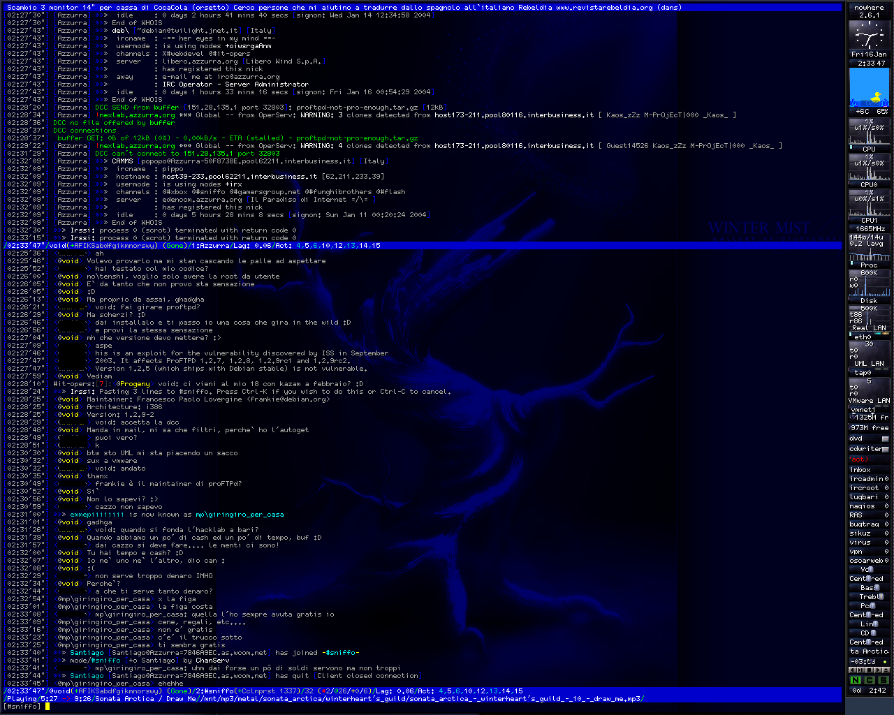
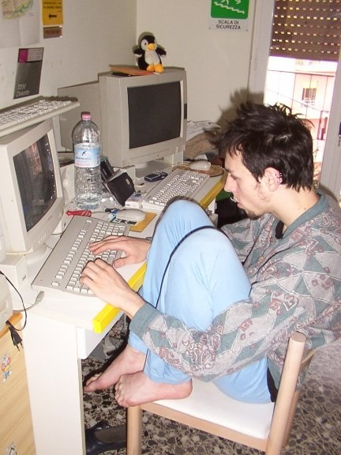
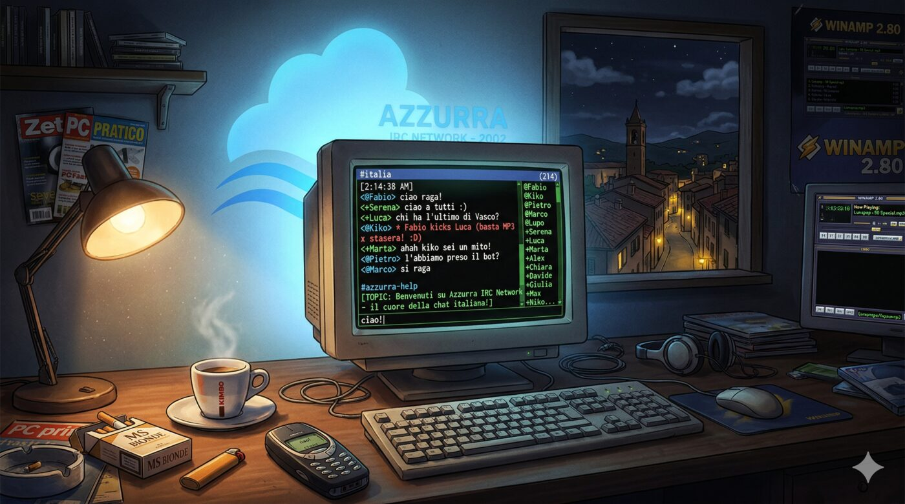
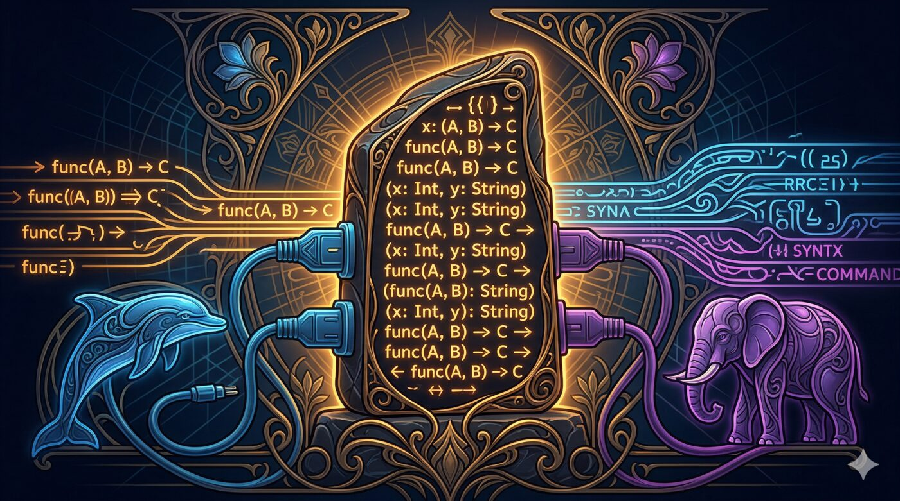
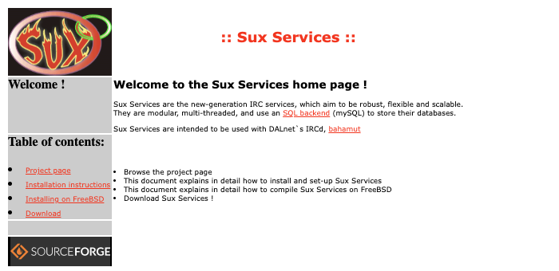

Questo è il sequel di [Forkare Bahamut per Azzurra IRC: IPv6 e SSL nel 2002](/it/posts/2026-04-13-bahamut-fork-azzurra-irc-ipv6-ssl/). Dopo aver forkato il server IRC, ho iniziato a scrivere services da zero.

Una delle cose che mi piace di più del lavorare con [Claude](/tags/ai-generated/) è l'archeologia digitale. Ho passato vent'anni ad accumulare vecchi progetti su dischi di backup, SourceForge, server dimenticati — codice che ho scritto e non ho mai più guardato. Adesso posso puntare Claude su un tarball e dire "converti questo in git" o "spiegami cosa pensava il me ventunenne qui" e avere una conversazione vera e propria col mio passato.

Lo scavo di oggi: sono andato su SourceForge e ho scaricato il repository CVS di [un progetto del 2003](/it/posts/2003-03-16-suxserv-wip/) — **Sux Services**, il mio tentativo di scrivere IRC services da zero, in C, per la [rete IRC Azzurra](https://azzurra.chat). Ho detto "Claude, converti questo repo CVS in git" e pochi minuti dopo avevo un [repository Git](https://github.com/vjt/suxserv) pulito con 954 commit, tre autori, e una storia continua da settembre 2002 a novembre 2005.

<!--more-->

> 🍸 *Capitato qui per caso? Questi IRC services li ho scritti da zero nel 2002 — e ora ho rifatto tutta l'esperienza IRC per il 2026. **[Clicca qui per tornare nel 1995 →](https://irc.sindro.me/)** · oppure leggi **[perché lo faccio →](/posts/2026-04-20-grappa-irc-reinventing-irc-for-2026/)***


Non ho mai finito questo progetto. Ho lasciato la rete prima che fosse pronto per la produzione. Uno sviluppatore lettone l'ha preso in mano, ha scritto 192 commit, e poi la traccia si perde.

Ne [avevo scritto all'epoca](/it/posts/2003-03-16-suxserv-wip/) — un post WIP del marzo 2003, quando NickServ e ChanServ funzionavano e stavo facendo stress test con 100 bot.

Guardare questo codice adesso è — non so quale sia la parola giusta. Commovente, forse. C'è qualcosa nel leggere i propri commit message di vent'anni fa, vedere l'entusiasmo e la frustrazione, riconoscere pattern che avresti usato per i due decenni successivi ma che non sapevi ancora nominare. È come sentire la propria voce in una registrazione di quando eri giovane — familiare e aliena allo stesso tempo.

## Cosa sono gli IRC services

Se non avete mai usato IRC, ecco la versione breve: [IRC](https://en.wikipedia.org/wiki/Internet_Relay_Chat) (Internet Relay Chat) era il protocollo di chat real-time di internet prima di Slack, Discord, e tutto il resto. Reti di server, canali a cui unirsi, nickname da reclamare. Ti connettevi con client come [mIRC](https://www.mirc.com/) su Windows, [XChat](https://xchat.org/) se ti piaceva GTK, [irssi](https://irssi.org/) se vivevi nel terminale, o [BitchX](http://www.bitchx.com/) se volevi che tutti sapessero che eri un hacker. Al suo picco intorno al 2005, [circa un milione di persone](https://netsplit.de/networks/top10.php?year=2005) erano connesse simultaneamente su tutte le reti.



Ma IRC era una giungla. Il [protocollo originale](https://www.rfc-editor.org/rfc/rfc1459) non aveva il concetto di identità persistente — [niente registrazione di nickname, niente proprietà dei canali](https://www.irchelp.org/networks/noserv.html). Chi si connetteva per primo e sceglieva un nickname lo possedeva, finché restava online. Disconnettersi un secondo e qualcun altro poteva prenderselo. Oggi la tua identità su WhatsApp è il tuo numero di telefono, su Discord è il tuo account — chiudi l'app, torni, sei ancora tu. Su IRC, chiudevi il client e smettevi di esistere. `-!- vjt [vjt@casa.mia] has quit [Ping timeout: 180 seconds]` — e il tuo nickname era a disposizione di chiunque.

E restare connessi non era banale. Eravamo nel 2002. La maggior parte della gente si connetteva via dial-up; i più fortunati avevano l'ADSL. I computer erano desktop ingombranti — o accesi o spenti, nessuna modalità sleep, nessuno stato a basso consumo che mantenesse la connessione internet. Restare online 24 ore al giorno solo per impedire che il tuo nickname sparisse significava lasciare un PC tower acceso tutta la notte, occupare la linea telefonica, sperare che la connessione non cadesse. La gente usava [BNC](https://psybnc.org/) — bouncer, processi proxy su server permanentemente connessi — solo per tenere il proprio nickname mentre dormiva. La tua identità digitale richiedeva infrastruttura fisica che probabilmente non potevi permetterti.

I canali se la passavano peggio. Un canale esisteva solo finché qualcuno ci stava dentro — finché almeno una persona aveva il computer acceso, il client aperto, la connessione internet viva. Escono tutti? Il canale sparisce. Il topic, i mode, la lista degli operatori — tutto sparito. La prossima volta che qualcuno entra in `#miocanale`, è una tabula rasa. Sulle piattaforme moderne, il vostro gruppo esiste che ci sia qualcuno online o no — impostazioni, ruoli, cronologia, tutto preservato lato server. Su IRC, lo stato viveva nella memoria dei server e si evaporava nel momento in cui l'ultimo utente si disconnetteva.

Ma c'era di peggio. Le reti IRC erano [federazioni di server](https://daniel.haxx.se/irchistory.html), e i server a volte perdevano il contatto tra loro — un [*netsplit*](https://en.wikipedia.org/wiki/Netsplit). Durante uno split, la rete si spezzava in isole. Immaginate un gruppo WhatsApp che si spacca in due — due copie che funzionano indipendentemente, persone diverse che parlano in ognuna, e quando le due metà si riconnettono, l'app deve capire quale versione è quella vera. La risposta di IRC era più semplice: disconnettere tutti i coinvolti e lasciarli risolvere da soli. Potevi connetterti a un'isola e prendere il nickname di qualcuno, e quando i server si riunivano, entrambi gli utenti avevano lo stesso nick. Il protocollo gestiva la cosa con terra bruciata: ogni istanza del nickname in collisione veniva [disconnessa forzatamente](https://en.wikipedia.org/wiki/IRC_takeover) — *entrambi* gli utenti buttati fuori. L'attaccante, pronto all'evento, si riconnetteva immediatamente. La vittima tornava e trovava il suo nick rubato.


Il [protocollo Timestamp](https://github.com/grawity/irc-docs/blob/master/server/espel-tsora/Undernet-TS.txt) — un'innovazione di [Undernet](https://en.wikipedia.org/wiki/Undernet), opera di [Carlo Wood](https://www.undernet.org/docs/interview-with-carlo-wood) — risolveva il problema delle collisioni: i server registravano quando un utente aveva preso un nickname o era entrato in un canale, e al rejoin dopo un netsplit, il timestamp più vecchio vinceva. Lo squatter perdeva. Ma il TS preveniva gli abusi solo durante gli split — non risolveva il problema fondamentale che senza stato persistente, tutto sulla rete era effimero.

[DALnet](https://docs.dal.net/docs/history.html) ha introdotto la soluzione vera nel 1995: gli **IRC services** — pseudo-utenti che si connettevano alla rete come un server speciale, parlando il protocollo server-to-server, e gestivano la burocrazia che il protocollo stesso non poteva. Non facevano parte del server IRC. Giravano come processo separato, con il proprio database, il proprio parser di protocollo, la propria state machine che tracciava ogni utente e canale della rete. Quando scrivevi `/msg NickServ IDENTIFY miapassword`, stavi parlando a un service.

**NickServ** registrava e proteggeva i nickname. Se qualcuno provava a squattare un nick registrato:

```
-NickServ- This nickname is registered and protected. If it is your
-NickServ- nick, type /msg NickServ IDENTIFY password. Otherwise,
-NickServ- please choose a different nick.
-NickServ- If you do not change within 60 seconds, I will change your nick.
```

**ChanServ** preservava lo stato dei canali — proprietà, access list, impostazioni — attraverso le disconnessioni. **MemoServ** consegnava messaggi offline. **OperServ** dava agli operatori di rete strumenti amministrativi. **RootServ** gestiva le operazioni in god-mode. Insieme, davano a IRC l'identità e lo stato persistente che mancavano al protocollo — le cose che le piattaforme moderne danno semplicemente per scontate.

Non tutte le reti seguirono questa strada. DALnet era la più protettiva; [Azzurra](https://azzurra.chat) seguiva il modello di DALnet da vicino. [IRCnet](https://en.wikipedia.org/wiki/IRCnet) rimase fedele alla giungla originale — nessun servizio di registrazione, mai. [Undernet](https://en.wikipedia.org/wiki/Undernet) aveva channel services ma niente NickServ, usando invece un sistema di autenticazione separato basato su username. [EFnet](https://en.wikipedia.org/wiki/EFnet) funzionava senza services del tutto dopo aver ucciso un NickServ advisory agli albori, nel 1994, aggiungendo alla fine solo [CHANFIX](https://en.wikipedia.org/wiki/EFnet#CHANFIX) — uno strumento automatico di riparazione canali, non veri services. Era divertente.

Nel 2002, le opzioni principali erano [Anope](https://www.anope.org/), [Epona](https://sourceforge.net/projects/epona/), e il venerabile [IRCServices](http://www.ircservices.za.net/) di Andrew Church. Funzionavano. Erano anche codebase C elefantiache con database flat-file proprietari, estensibilità limitata, e accoppiamento stretto a specifiche versioni di IRCd. Io pensavo di poter fare meglio.

Avevo 21 anni ed ero IRCop su Azzurra, la più grande rete IRC italiana. Essere IRCop non era come moderare un server Discord — avevi accesso all'infrastruttura. I server, le connessioni, quello che succedeva sulla rete in tempo reale. Trentamila persone connesse al picco, forse quindici di noi a tenere tutto in piedi. Era una responsabilità tecnica, e si sentiva. Ovvio che pensavo di poter fare meglio.


*Sì, sono io, circa 2004.*

## Il contesto: Azzurra, 2002

Azzurra era — e [lo è ancora](https://azzurra.chat) — la rete IRC italiana. Al suo picco aveva decine di migliaia di utenti connessi simultaneamente — italiani che chattavano, flirtavano, litigavano, scambiavano MP3, facevano girare bot trivia, e facevano tutte quelle cose che la gente faceva online prima che i social media divorassero il mondo. Io mi ero iscritto come utente, ero diventato IRCop, e alla fine mi ero ritrovato immerso nell'infrastruttura.



La rete stava migrando da [ConferenceRoom](https://en.wikipedia.org/wiki/ConferenceRoom) — un server IRC commerciale — a [Bahamut](https://sourceforge.net/projects/bahamut-inet6/), un IRCd open-source. Non Bahamut vanilla, ma un fork con supporto IPv6 e SSL che mantenevamo noi. Io facevo parte del team che gestiva quella transizione: forkare il server, aggiungere l'hostname cloaking, collegare SSL. Quella migrazione è una storia per [un altro post](/it/posts/2026-04-13-bahamut-fork-azzurra-irc-ipv6-ssl/).

Una volta che il lato server era a posto, ho puntato l'attenzione sui services. Quelli esistenti non bastavano. Volevo qualcosa di modulare, threaded, con un vero database backend. Così ho iniziato a scrivere.

## 0.1: il prototipo

Il [primo commit](https://github.com/vjt/suxserv/commit/eb8087d) è arrivato il 30 settembre 2002. I commit message raccontano la storia meglio di quanto potrei fare io:

- [realloc() stuff is BROKEN, fix it :\\](https://github.com/vjt/suxserv/commit/f3c7e25)
- [going mad with those dbufs ...](https://github.com/vjt/suxserv/commit/7043666)
- [debug ...](https://github.com/vjt/suxserv/commit/9ad6773)
- [pff ... O3 ..](https://github.com/vjt/suxserv/commit/87b4362)
- [i will be happy when all this debug shit will be gone.](https://github.com/vjt/suxserv/commit/ca7df24)
- [services are now multithreaded](https://github.com/vjt/suxserv/commit/12c4438)
- [we are now 0.1 =)](https://github.com/vjt/suxserv/commits/80116c5)


[243 commit](https://github.com/vjt/suxserv/commits/80116c5) in tre mesi, tutti miei. Un prototipo grezzo — un demone IRC services [multithreaded](https://github.com/vjt/suxserv/blob/80116c5/src/main.c#L98) costruito su [GLib 2.x](https://docs.gtk.org/glib/), che si connetteva a un server Bahamut e tracciava utenti e canali. Niente database, niente logica di servizio vera e propria — solo il parser di protocollo, le hash table, e l'infrastruttura di threading.

Il codice era un casino. Stavo imparando la programmazione C di sistema in tempo reale, commettendo ogni errore classico: [pattern di realloc sbagliati](https://github.com/vjt/suxserv/commit/f3c7e25), [mutex unlock dimenticati](https://github.com/vjt/suxserv/commit/cfed09b), [buffer overflow](https://github.com/vjt/suxserv/commit/7bd4e4b) scoperti alle [3 di notte](https://github.com/vjt/suxserv/commit/ea08f32). Ma l'architettura prendeva forma.

Per gennaio 2003, avevo uno scheletro funzionante: [negoziazione del protocollo server-to-server](https://github.com/vjt/suxserv/blob/80116c5/src/dispatch.c#L94), [parsing di SJOIN](https://github.com/vjt/suxserv/blob/80116c5/src/dispatch.c#L806), [tracking di utenti e canali](https://github.com/vjt/suxserv/blob/80116c5/src/table.c#L149), gestione base di [PING/PONG](https://github.com/vjt/suxserv/blob/80116c5/src/dispatch.c#L154), e un [core multithreaded](https://github.com/vjt/suxserv/blob/80116c5/src/main.c#L98) con un thread di rete, un thread parser, e un thread per la gestione dei segnali.

## 0.2: la cosa vera

[let\`s go 0.2](https://github.com/vjt/suxserv/tree/76d1351) — 5 gennaio 2003. Stessa codebase, ma ho ristrutturato il core e ho iniziato a costruire i veri services sopra. Nell'anno e mezzo successivo, questo è cresciuto fino a diventare un'implementazione di IRC services vera e propria:

- **Cinque agenti di servizio**: [NickServ](https://github.com/vjt/suxserv/blob/c04df67/src/nickserv.c), [ChanServ](https://github.com/vjt/suxserv/blob/c04df67/src/chanserv.c), [MemoServ](https://github.com/vjt/suxserv/blob/c04df67/src/memoserv.c), [OperServ](https://github.com/vjt/suxserv/blob/c04df67/src/operserv.c), [RootServ](https://github.com/vjt/suxserv/blob/c04df67/src/rootserv.c)
- **[Backend MySQL](https://github.com/vjt/suxserv/blob/c04df67/src/sql.c)**: chiamate MySQL integrate in `sql.c` — l'astrazione driver è arrivata dopo, con Oleg
- **[Caricamento dinamico dei moduli](https://github.com/vjt/suxserv/blob/c04df67/src/modules.c#L129)**: i services compilati come shared object, caricati a runtime via `GModule` di GLib
- **[Supporto IRCd multiplo](https://github.com/vjt/suxserv/blob/d1e20ed/src/unreal32.c)**: Bahamut e UnrealIRCd 3.2 — quest'ultimo interamente opera di Oleg
- **Tutto il pacchetto completo**: registrazione nick, access list dei canali, memo, AKILL, vhost, nick linking, channel mode, kill protection

Vediamo le parti interessanti.

## Il tour del codice

### Perfect hashing con gperf


Il pezzo più elegante dell'architettura era il dispatch dei comandi. Invece di catene di `if/else` o chiamate a `strcmp`, ogni tabella di comandi era generata da [gperf](https://www.gnu.org/software/gperf/) — il generatore GNU di funzioni di hash perfette.

Ecco la tabella dei comandi del protocollo IRC ([`parse.gperf`](https://github.com/vjt/suxserv/blob/d1e20ed/src/parse.gperf)):

```c
struct Message { gchar *cmd; void (*func)(User *, gint, gchar **); };
%%
ADMIN, m_admin
AWAY, m_away
BURST, m_burst
KICK, m_kick
MODE, m_mode
NICK, m_nick
PRIVMSG, m_private
QUIT, m_quit
SJOIN, m_sjoin
%%
```

Gperf prende questa tabella e genera una **[funzione di hash perfetta](https://en.wikipedia.org/wiki/Perfect_hash_function)** — zero collisioni, lookup O(1). Un comando IRC in arrivo viene hashato al suo function pointer handler in tempo costante. Nessuna ricerca, nessun branching.

Lo stesso pattern si ripete per ogni service. [Comandi di NickServ](https://github.com/vjt/suxserv/blob/d1e20ed/src/nickserv-cmd.gperf):

```c
struct ns_cmd { gchar *name; void (*func)(User *, gint, gchar **); guint para; };
%%
HELP, ns_help, 1
REGISTER, ns_register, 2
IDENTIFY, ns_identify, 2
GHOST, ns_ghost, 2
PASSWD, ns_passwd, 2
LINK, ns_link, 1
SET, ns_set, 2
FORBID, ns_forbid, 1
%%
```

[Dieci file gperf](https://github.com/search?q=repo%3Avjt%2Fsuxserv+path%3A*.gperf&type=code) in tutta la codebase. Ogni singolo lookup di comando era O(1). Nel 2003, con migliaia di utenti che martellavano NickServ simultaneamente, questo contava. Oggi probabilmente useresti una hash map senza pensarci due volte. Ma c'è qualcosa di bello nell'hashing perfetto a compile-time — zero overhead a runtime, zero memoria sprecata, zero collisioni, garantito.

### Programmazione generica con le macro


Il C non ha i generici. Nel 2003, i template C++ erano un'opzione ma io scrivevo C — in parte per preferenza, in parte perché GLib era una libreria C, e in parte perché avevo 21 anni e avevo opinioni sul C++.

Quindi ho costruito i generici con le macro. L'header [`table.h`](https://github.com/vjt/suxserv/blame/d1e20ed/include/table.h) è un sistema completo di hash table basato su macro con operazioni thread-safe:

```c
#define TABLE_DECLARE(NAME, DATA_TYPE, HASH_FUNC, KEY_NAME, KEY_TYPE)  \
    LOCAL_TABLE_INSTANCE(NAME);                                        \
    GET_FUNC(NAME, DATA_TYPE, KEY_TYPE)                                \
    ALLOC_FUNC(NAME, DATA_TYPE, KEY_NAME, KEY_TYPE)                    \
    PUT_FUNC(NAME, DATA_TYPE, KEY_NAME)                                \
    DEL_FUNC(NAME, DATA_TYPE, KEY_NAME)                                \
    STEAL_FUNC(NAME, DATA_TYPE, KEY_NAME)                              \
    CLEAN_FUNC(NAME)                                                   \
    COUNT_FUNC(NAME)                                                   \
    DESTROY_FUNC(NAME, DATA_TYPE, KEY_NAME)                            \
    SETUP_FUNC(NAME, DATA_TYPE, HASH_FUNC)
```

Una sola invocazione di macro — `TABLE_DECLARE(user, User, hash_nick, name, gchar)` — genera un'intera hash table type-safe e thread-safe con operazioni `get`, `alloc`, `put`, `del`, `steal`, `clean`, e `count`. Ogni funzione wrappa una `GHashTable` di GLib con mutex e un memory pool `GMemChunk`.

L'uso era pulito:

```c
_TBL(user).get(nickname);     // lookup thread-safe
_TBL(user).alloc(nickname);   // alloca e inserisci
_TBL(user).del(some_user);    // rimuovi e libera
_TBL(channel).count();        // quanti canali?
```

Guardando questo codice adesso, è essenzialmente una vtable — una struct di function pointer, popolata all'inizializzazione. Lo stesso pattern che Go usa per le interfacce, che Rust usa per i trait object. Stavo reinventando il polimorfismo col preprocessore C, una macro alla volta. Funzionava. I messaggi d'errore quando qualcosa andava storto erano, prevedibilmente, incomprensibili.

### Il livello di astrazione SQL



Questo è lavoro di Oleg, non mio. Il mio codice originale aveva chiamate MySQL sparse ovunque. Quando Oleg ha [convertito il backend SQL in un modulo caricabile](https://github.com/vjt/suxserv/commit/3363bd8d), ha progettato una vera [interfaccia driver](https://github.com/vjt/suxserv/blob/d1e20ed/include/sql.h#L49-L75) — una struct di function pointer che astraeva il motore database:

```c
typedef struct {
    const gchar *name;
    gboolean (*connect)(const gchar *, const gchar *, const gchar *,
                        const gchar *, const gchar *);
    void (*shutdown)(void);
    gboolean (*begin)(void);
    gboolean (*commit)(void);
    void (*rollback)(void);
    glong (*query)(SQL_RES **, const gchar *, ...) G_GNUC_PRINTF(2, 3);
    guint (*num_rows)(SQL_RES *);
    gboolean (*fetch_row)(SQL_RES *);
    const gchar *(*get_string)(SQL_RES *, guint);
    gint (*get_int)(SQL_RES *, guint);
    gchar *(*quote)(const gchar *);
    // ... more operations
} SqlDriver;
```

[MySQL](https://github.com/vjt/suxserv/blob/d1e20ed/src/mysql.c) e [PostgreSQL](https://github.com/vjt/suxserv/blob/d1e20ed/src/pgsql.c) implementavano ciascuno questa interfaccia. Il resto della codebase usava macro come `sql_query()`, `sql_begin()`, `sql_commit()` — completamente database-agnostico. Transazioni, iterazione sui risultati, accesso tipizzato alle colonne, quoting corretto.

Quello che mi fa sorridere adesso è quanta cerimonia servisse. Nel 2005, questo era un *design*. Lo schizzavi, pensavi alle firme delle funzioni, scrivevi le macro, implementavi entrambi i driver. Oggi installeresti un ORM e andresti avanti. Ma la simpatia meccanica che sviluppi scrivendo queste cose — capire esattamente quanto costa una query al database, cosa significa un confine di transazione, dove vanno le tue allocazioni — è qualcosa che ti resta addosso.

Lo [schema](https://github.com/vjt/suxserv/blob/d1e20ed/doc/sux-db.mysql) era generato da phpMyAdmin e usava `TYPE=MyISAM` (nemmeno InnoDB). MySQL 3.23. Le password erano MD5. I timestamp erano `timestamp(14)`. Era il 2003.

### Il modello di threading


[Quattro thread](https://github.com/vjt/suxserv/blob/d1e20ed/src/threads.c#L60-L63), ciascuno con un ruolo specifico:

```c
static void network_thread(void);   // I/O asincrono via GLib main loop
static void parser_thread(void);    // parsing protocollo IRC + dispatch
static void signal_thread(void);    // gestione segnali OS
static void master_thread(void);    // gestione ciclo di vita dei thread
```

Il thread parser merita un'occhiata più da vicino. Dorme su una condition variable, aspettando che il thread di rete riempia il buffer di ricezione. Quando arrivano i dati, li divide in righe, fa il parsing di ciascuna attraverso la tabella dei comandi generata da gperf, e fa il dispatch all'handler appropriato:

```c
while(THREAD_IS_RUNNING())
{
    g_mutex_lock(net_readbuf_mutex);
    if(!recvQ->len)
        g_cond_timed_wait(net_readbuf_cond, net_readbuf_mutex, timeout);

    read_data = g_string_assign(read_data, recvQ->str);
    // split into lines, clear the buffer
    g_mutex_unlock(net_readbuf_mutex);

    for(i = 0; i < count; i++)
    {
        timeout_run();
        parse(strings[i]);
    }
}
```

Condition variable, buffer condivisi protetti da mutex, separazione pulita dei thread. Il [thread dei segnali](https://github.com/vjt/suxserv/blob/d1e20ed/src/threads.c#L355-L392) bloccava tutti i segnali globalmente, poi usava `sigwait()` per gestirli in serie — evitando la trappola classica di fare lavoro complesso dentro i signal handler. Quando arrivava un [segnale fatale](https://github.com/vjt/suxserv/blob/d1e20ed/src/threads.c#L151-L158):

```c
static void fatal_termination(gint sig)
{
    g_message("Aieeeee!!! Ship sinks !!! Women and childrens first !!!");
    push_signal(&sig);
    abort();
}
```

Avevo 21 anni.

### Codice rubato, attribuito onestamente

Il parser era adattato dal codice sorgente di Bahamut, e i [commenti lo dicono](https://github.com/vjt/suxserv/blob/d1e20ed/src/parse.gperf#L98):

```c
/*
 * stolen from bahamut/src/parse.c
 */
```

Idem per le [funzioni di hash](https://github.com/vjt/suxserv/blob/d1e20ed/src/hash.c#L70) (`stolen from bahamut/src/hash.c`), il [codice di pattern matching](https://github.com/vjt/suxserv/blob/d1e20ed/src/match.c#L45) (`stolen from bahamut/src/match.c`), le [risposte di errore IRC](https://github.com/vjt/suxserv/blob/d1e20ed/src/irc-replies.c#L20) (`stolen from bahamut/src/s_err.c`), [`ircsprintf`](https://github.com/vjt/suxserv/blob/d1e20ed/src/sux-printf.c#L2) (`taken from bahamut/src/ircsprintf.c`), perfino [`setproctitle`](https://github.com/vjt/suxserv/blob/d1e20ed/src/setproctitle.c#L2) (`stolen from cvs.kerneli.org util-linux`, con un pizzico di `borrowed from sendmail`). Ogni pezzo preso in prestito era creditato in un commento.

Questa era la cultura open source prima di GitHub. Non c'era `npm install`, niente crate registry, nessun package manager. Non c'erano source browser. Scaricavi un tarball, lo estraevi, e leggevi il codice con vim. Quello era l'intero workflow. La barriera per capire il codice di qualcun altro era brutalmente alta — nessun syntax highlighting sul web, nessuna annotazione inline, nessun "jump to definition." Solo caratteri monospace che brillavano su un terminale nero, e tu, che leggevi.

Ma quando trovavi quello che ti serviva — quando la funzione che stavi cercando si materializzava sullo schermo e capivi come funzionava — c'era un senso di soddisfazione difficile da descrivere. Qualcosa di viscerale e vivo. Ti eri guadagnato quella conoscenza stando col codice, riga per riga, in silenzio.

L'attribuzione era informale — un commento, non un file LICENSE — ma c'era. Creditavi da dove veniva il codice perché ti ricordavi cosa significava trovarlo.

### Lo stress tester


Nella directory `tools/` c'è [`netxplode.pl`](https://github.com/vjt/suxserv/blob/d1e20ed/tools/netxplode.pl) — "The Network Daemon Exploder" di Daniel Dent, preso dal suo [progetto su SourceForge](https://sourceforge.net/projects/netxplode/). Uno script Perl che spawna 100 client IRC e martella i services con comandi random:

```perl
my @actions = (
    "NS HELP\n",
    "CS HELP\n",
    "PRIVMSG chanserv :info #netxplodeRAND\n",
    "JOIN #netxplodeRAND\n",
    "NICK netxplodeRAND\n",
    "PRIVMSG nickserv :info netxplodeRAND\n",
    "ADMIN services.*\n",
    "MOTD services.*\n",
);
```

Sostituisci `RAND` con numeri random, spara tutto in una volta, vedi cosa va in segfault. Questo era il nostro framework di load testing. Puntava a [`homes.vejnet.org:6667`](https://github.com/vjt/suxserv/blob/d1e20ed/tools/netxplode.pl#L30) — vejnet, la mia rete di casa. Il [file di configurazione](https://github.com/vjt/suxserv/blob/d1e20ed/doc/example.conf#L49) aveva `my_pass = "codio"` — che, in italiano, beh. Diciamo che non è una parola da contesto professionale.

## Quello che non vedevo allora

Guardando questo codice con 23 anni di esperienza, alcune cose saltano all'occhio:

**L'architettura era genuinamente buona.** La separazione tra parsing del protocollo, dispatch dei comandi, logica di servizio, e accesso al database è pulita. Il sistema di moduli funziona. Il modello di threading è corretto. Per un ventunenne che scriveva C nel 2002, questo è lavoro solido.

**I pattern sono senza tempo.** Il driver SQL basato su vtable è lo stesso pattern delle interfacce Go. Le tabelle di dispatch gperf sono la stessa idea del routing compile-time nei web framework moderni. I generici basati su macro anticipano quello che Rust fa con la monomorfizzazione — generare codice specializzato per ogni tipo a compile time.


**Ma l'error reporting ha dei buchi.** La codebase ha logging decente in molti punti — `g_message()`, `g_warning()`, integrazione syslog. Ma in alcuni percorsi critici, il `exit(EXIT_FAILURE)` originale del prototipo è rimasto lì, mai sostituito. Guardate l'[inizializzazione dei thread](https://github.com/vjt/suxserv/blob/d1e20ed/src/threads.c#L230-L251):

```c
signal_thread_ptr = g_thread_create_full((GThreadFunc)signal_thread,
    NULL, 0, FALSE, TRUE, G_THREAD_PRIORITY_NORMAL, &err);
if(signal_thread_ptr == NULL)
{
    exit(EXIT_FAILURE);
}

network_thread_ptr = g_thread_create_full((GThreadFunc)network_thread,
    NULL, 0, TRUE, TRUE, G_THREAD_PRIORITY_NORMAL, &err);
if(network_thread_ptr == NULL)
{
    exit(EXIT_FAILURE);
}

parser_thread_ptr = g_thread_create_full((GThreadFunc)parser_thread,
    NULL, 0, TRUE, TRUE, G_THREAD_PRIORITY_NORMAL, &err);
if(parser_thread_ptr == NULL)
{
    exit(EXIT_FAILURE);
}
```

Ogni chiamata passa `&err` — un puntatore GError che GLib popola accuratamente con *esattamente cosa è andato storto*. E il codice non ci fa niente. Un thread non parte? `exit(EXIT_FAILURE)` silenzioso. Nessun messaggio di log, nessun syslog, nessuna indicazione di quale thread è fallito o perché. L'informazione sull'errore è lì, che aspetta di essere letta, e il codice se ne va. Un mio amico — [Enrico Perla](https://www.enricoperla.com/), che è poi andato a scrivere un [libro sull'exploitation del kernel Linux](https://www.amazon.com/Guide-Kernel-Exploitation-Attacking-Core/dp/1597494860) — ha guardato questo codice una volta e mi ha detto che era "un monumento all'error reporting." Me lo ricordo ancora. Non aveva torto.

**L'SQL non ha un framework di escaping decente.** Ho introdotto [`sql_sprintf()`](https://github.com/vjt/suxserv/commit/9f97119) a febbraio 2003 — adattata dalla `ircsprintf()` di Bahamut, con escaping per virgolette e backslash — ma era una cosa semplificata, e non l'ho applicata ovunque. Un mese dopo trovavo ancora punti che avevo dimenticato: [`SQL Injection problems.`](https://github.com/vjt/suxserv/commit/96b8493) — un `%s` senza quoting nella ricerca AKILL di OperServ. Se ti dimenticavi di usare `sql_sprintf()`, avevi una potenziale injection. La [`sql_quote()`](https://github.com/vjt/suxserv/commit/be5ea22) di Oleg è arrivata dopo come soluzione corretta a livello driver, che ha risolto il problema in modo sistematico.

**I commit message sono un diario.** `going mad with those dbufs ...`, `pff ... O3 ..`, `sux`, `explanation of life`, `added authism concatenation with girls`. Committavo pensieri, non cambiamenti. La storia CVS si legge come un flusso di coscienza di un ventunenne che stava imparando a fare il programmatore di sistema.


## Oleg aka `@luarvic`

All'inizio del 2005, [Oleg Girko](https://github.com/OlegGirko) si è fatto vivo. Era uno sviluppatore dalla Lettonia, e voleva il supporto PostgreSQL per i services. Gli ho dato accesso in commit.

Quello che è successo dopo è notevole. Tra gennaio e novembre 2005, Oleg ha scritto [**192 commit**](https://github.com/vjt/suxserv/commits/master?author=OlegGirko) — quasi un quarto dell'intero progetto. Non ha solo [aggiunto il supporto PostgreSQL](https://github.com/vjt/suxserv/commit/a279e16). Ha [reso il backend SQL modulare](https://github.com/vjt/suxserv/commit/3363bd8), aggiunto il [supporto per UnrealIRCd 3.2](https://github.com/vjt/suxserv/commit/9eeebd3), implementato il [nick linking](https://github.com/vjt/suxserv/commit/a229f54), i [flag dei canali](https://github.com/vjt/suxserv/commit/99a56fb), la [gestione dei vhost](https://github.com/vjt/suxserv/commit/d5254c1), la [sincronizzazione a due fasi](https://github.com/vjt/suxserv/commit/9944bfb), il [rate limiting](https://github.com/vjt/suxserv/commit/abb21d4), l'[integrazione con syslog](https://github.com/vjt/suxserv/commit/08dc3d3), e decine di bug fix.

I suoi commit message sono metodici e precisi:

- [Preliminary support for modular IRC server frontend.](https://github.com/vjt/suxserv/commit/9eeebd3)
- [Converted SQL backend into loadable module.](https://github.com/vjt/suxserv/commit/3363bd8)
- [Added PostgreSQL database driver.](https://github.com/vjt/suxserv/commit/a279e16)
- [Significantly simplified channel access management.](https://github.com/vjt/suxserv/commit/cd59485)
- [Introduced two-phase synchronisation.](https://github.com/vjt/suxserv/commit/9944bfb)
- [Fixed coredump when applying "WHOIS" command to services name.](https://github.com/vjt/suxserv/commit/5870e9a)
- [Pointer signedness corrections to pass stricter type checks of GCC 4.0.](https://github.com/vjt/suxserv/commit/d1e20ed)

Dove i miei commit erano esplosioni di frustrazione ed entusiasmo, quelli di Oleg si leggono come ingegneria. Ha preso il mio prototipo caotico e lo ha trasformato in qualcosa che si avvicinava alla qualità di produzione. Poi la traccia si perde. 4 novembre 2005 — il suo ultimo commit. Il progetto non è mai andato in produzione su Azzurra.

## La conversione


Il repository CVS originale è stato preservato da SourceForge. Hanno ritirato l'hosting CVS nel 2017, ma hanno tenuto i backup — i repo lato server, non semplici tarball. CVSROOT e tutto il resto. Nessuno aveva scaricato questo repo probabilmente da un decennio, ma era ancora lì, pronto per l'export. Questo è lo spirito de [il vero sistemista](/it/posts/2014-02-28-il-vero-sistemista/) — [tenere internet viva](/it/posts/2007-11-21-when-sysadmins-ruled-the-earth/) anche quando nessuno guarda. Grazie, SourceForge.

L'ho convertito in Git usando `git cvsimport`:

- Due moduli CVS (`suxserv-old` e `suxserv`) sono diventati un'unica storia lineare
- Tre autori mappati alle identità reali
- 954 commit, settembre 2002 a novembre 2005
- 1.5 MB di oggetti git

Il repo ora è su GitHub: [github.com/vjt/suxserv](https://github.com/vjt/suxserv) — un fossile preservato nell'ambra, pushato su una piattaforma che non sarebbe esistita per altri sei anni.

E la [pagina del progetto su SourceForge](https://suxserv.sourceforge.net/)? Ancora online. Ventitré anni dopo, l'HTML non è cambiato. Il logo è ancora lì. I link per il download funzionano ancora. SourceForge è sopravvissuto al progetto, alla rete, e all'intera epoca.



## Ventitré anni dopo

Nel 2002, ho scritto IRC services perché mi servivano. La rete era reale, gli utenti erano reali, i problemi erano reali. Il codice è grezzo in certi punti, ingenuo in altri, ma risolveva problemi reali con vincoli reali: concorrenza, performance, compatibilità di protocollo, portabilità del database.

Tutto quello che ho imparato scrivendo questo codice — threading, gestione della memoria, parsing di protocollo, astrazione del database, la disciplina della programmazione di sistema — è diventato la base per tutto quello che è venuto dopo. Ruby, Rails, Erlang, sistemi distribuiti, gli anni della startup, il lavoro sull'infrastruttura. È iniziato tutto con un IRCop di 21 anni che pensava di poter scrivere services migliori di quelli che già esistevano.

Non ce l'ha fatta, del tutto. Ma il tentativo è valso più del risultato.

---

**P.S. — 17 aprile 2026:** Scrivere questa retrospettiva, insieme al [post sul fork di Bahamut](/it/posts/2026-04-13-bahamut-fork-azzurra-irc-ipv6-ssl/), mi ha fatto venire abbastanza nostalgia da farmi ricominciare a loggarmi su `#it-opers` la sera — la vecchia crew è ancora lì, ventiquattro anni dopo. Qualche sera dopo, da cosa nasce cosa: [Claude entra in #it-opers](/it/posts/2026-04-17-claude-walks-into-it-opers/), una sessione di Claude Code che stava in canale come partecipante vero. E da lì le cose stanno crescendo.

---

**Azzurra IRC, 2002–2026:** [Sux Services 0.2.8 (WIP)](/it/posts/2003-03-16-suxserv-wip/) (2003) • [Bahamut fork: IPv6 + SSL](/it/posts/2026-04-13-bahamut-fork-azzurra-irc-ipv6-ssl/) (2026) • **Sux Services retrospettiva (2026)** • [Claude entra in #it-opers](/it/posts/2026-04-17-claude-walks-into-it-opers/) (2026)

> 🍸 **grappa è live.** I services li ho scritti io; adesso è tornato tutto. Scegli un nome, entra in una chatroom con un click, e sei tornato nel 1995 — nessuna app da installare, nessun account. **[Entra su IRC — irc.sindro.me →](https://irc.sindro.me/)** · **[il perché →](/posts/2026-04-20-grappa-irc-reinventing-irc-for-2026/)**
