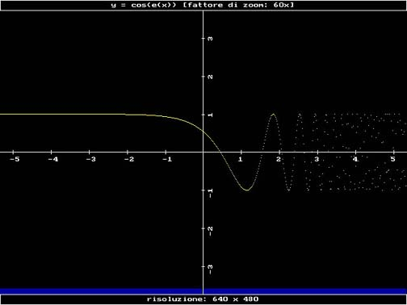
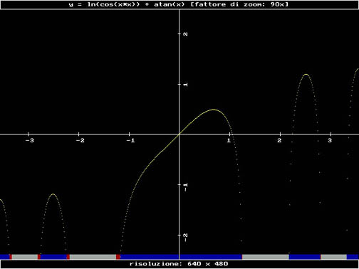
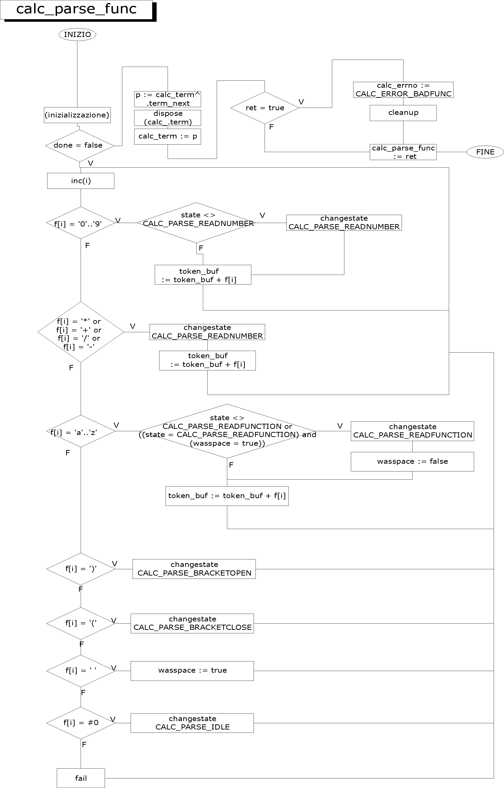
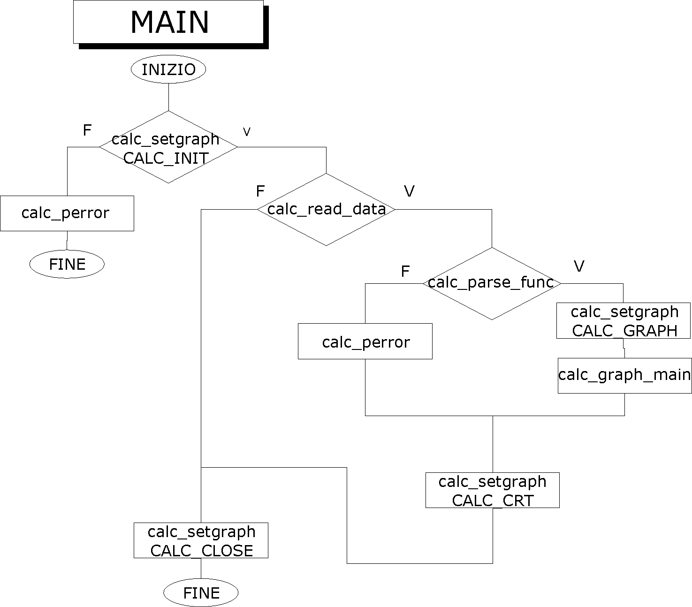

In February 2002 I was 20 years old and taking a Programmazione (Programming) exam. The assignment was: a data structure representing books, stored as binary records in a file. Write a program to list, add, and delete them.

I didn't do that. I built a graphical calculator instead.

<!--more-->

## What the assignment asked for

The professor wanted a `record` of type Book — title, author, year, price — written sequentially to a binary file with `BlockWrite`. A menu: list all books, add a book, delete by index. Maybe search. The kind of program where the hardest part is remembering that Turbo Pascal file offsets are zero-based.

I found this boring.

## What I built instead

[GRcalc](https://github.com/vjt/grcalc) is a function plotter. You type a mathematical expression — `sin(cos(x))`, `ln(cos(x*x)) + atan(x)`, anything composable from trig, logarithmic, and arithmetic operations — and it draws the curve in real time on a Cartesian plane with labeled axes and zoom control.

It ran in 640×480 BGI graphics mode, with drivers for EGA/VGA, CGA, and Hercules [linked directly into the executable](https://github.com/vjt/grcalc/blob/master/src/GRCALC.PAS#L28-L35) so there was nothing to distribute besides the `.EXE`.

Here's `y = cos(e(x))` at 60× zoom:



And `y = ln(cos(x*x)) + atan(x)` at 90× zoom — a more complex composite function with discontinuities where `cos(x²)` goes negative:



The progress bar at the bottom was color-coded: blue where the function is defined, red where it's defined but off-screen, gray where it's undefined (like `ln` of a negative number).

## How it works

The program has three layers: a parser, an evaluator, and a renderer. The [full source](https://github.com/vjt/grcalc/blob/master/src/GRCALC.PAS) is ~1000 lines of Turbo Pascal in a single file.

### The parser

A [state machine](https://github.com/vjt/grcalc/blob/master/src/GRCALC.PAS#L315-L614) that walks the input string character by character and builds a linked list of typed terms. Each term is either a number, a variable (`x`), an operator, a function name, or a bracket.



Every state transition validates syntax — you can't have two operators in a row, a function must be followed by an expression, brackets must balance. If anything fails, the parser sets `calc_errno` and bails out.

The function lookup uses a dispatch table — an array of records mapping name strings to [function pointers](https://github.com/vjt/grcalc/blob/master/src/GRCALC.PAS#L167-L181):

```pascal
calc_func_table : array [1..CALC_FUNX] of record
    func_name : string[5];
    func_handler : calc_func_handler_t;
end = (
    (func_name : 'sin'; func_handler : calc_sin),
    (func_name : 'cos'; func_handler : calc_cos),
    ...
);
```

Same pattern for operators. Adding a new function meant one line in the table and one wrapper procedure.

### The evaluator

The heart of the program is [`get_y_value`](https://github.com/vjt/grcalc/blob/master/src/GRCALC.PAS#L630-L728) — a function that takes an `x` value and walks the linked list, evaluating the expression.

The trick is mutual recursion. `get_y_value` handles the top-level evaluation loop (numbers, operators, variables). When it hits a function term, it calls `evaluate_func`, which grabs the function pointer, advances to the next term, and recurses: if the next term is another function, it calls itself; if it's a bracket, it calls back into `get_y_value` for the sub-expression.

This is how `sin cos tan x` worked — `evaluate_func` chained three calls deep, each one wrapping the next, until it hit the variable and unwound: `sin(cos(tan(x)))`.



### The renderer

For each pixel column on screen, the renderer called `get_y_value` with the corresponding `x` (divided by the zoom factor), scaled the result, and plotted a yellow pixel. If the function was undefined at that point — `ln` of a negative number, division by zero — `calc_errno` flagged it and the progress bar turned gray. If the value exceeded the viewport, the bar turned red.

The [Cartesian axes](https://github.com/vjt/grcalc/blob/master/src/GRCALC.PAS#L770-L836) were drawn with tick marks and labels that adapted to the zoom factor. The top bar showed the function and zoom level, the bottom bar the resolution.

### Error handling

I was in love with C's [`perror(3)`](https://man7.org/linux/man-pages/man3/perror.3.html) at that point in my life, so I built a [miniature version](https://github.com/vjt/grcalc/blob/master/src/GRCALC.PAS#L96-L115): a global `calc_errno`, an array of error strings, and a `calc_perror` procedure that printed the message. Division by zero, undefined domain, syntax errors, graphics init failure — they all went through the same path.

## What's honestly wrong with it

I wrote 10 pages of [documentation](grcalc-doc.pdf) with flowcharts drawn in CorelDRAW, plus 26 pages of printed source code — we had to bring it all in printed form. I compiled a 52KB executable that detected the video card and plotted arbitrary math functions in real time. But reading the code now, twenty-four years later, there are real problems:

**No operator precedence.** `2 + 3 * x` evaluates left-to-right as `(2 + 3) * x`. The parser doesn't build an AST with precedence levels — it builds a flat linked list. You need brackets for correct math: `2 + (3 * x)`. I knew — I was running late and parentheses worked fine.

**Integers only for constants.** You can't type `3.14 * x` because the parser only handles digit characters. No decimal point support. Want π? Use `atan(1) * 4 * x`. Or don't.

**Everything is global state.** `calc_errno`, `calc_term`, `calc_zoom` — all global variables. The evaluator mutates its pointer argument as a side effect to track position in the linked list. It works, but it's the kind of code where adding a second feature breaks the first one.

**The `calc_term_t` record wastes memory.** Every node in the linked list carries fields for a number value, a function pointer, AND an operator pointer — even though each node is only ever one of those types. I actually discuss this in the comments, consider using objects with inheritance, and decide it would make the program "too complex." At 20, I was right for the wrong reasons.

### The bug on line 655 {#the-bug-on-line-655}

In `evaluate_func`, the NUMBER case reads `p^.term_next^.term_value` — that's the *next* node's value, not the current one. It should be `p^.term_value`. This never triggers in practice because you'd have to write something like `sin 5` (a function applied to a literal number without brackets), and nobody does that — you write `sin(5)` or `sin x`. A real bug, hidden by convention. I never caught it in 2002. [Claude](/tags/ai-generated/) found it in 2026.

**`delay(100)` between pixels.** Every pixel gets a 100ms pause so you can watch the curve being drawn. Seconds of forced animation for each plot, no way to skip it.

## The exam

I brought this to the exam on February 20, 2002. Ten pages of documentation and twenty-six pages of printed source code, flowcharts, a working executable. The professor looked at it. She was expecting `type TBook = record`. She was expecting `BlockWrite` and `BlockRead` and a text menu that says `1) Aggiungi libro 2) Cerca libro 3) Esci`.

She got a state machine parser, function pointer dispatch tables, recursive evaluation with mutual recursion, and real-time graphics rendering.

She said: "I don't understand anything from this code. I don't know how to judge it. What's your previous exam score?"

"24 out of 30."

"I can give you 25."

I took the 25. Any score was fine for the intrinsic value of the work. I knew what I'd built.

## What happened next

I left the university after that. Not dramatically — I just stopped going. The gap between what I was learning on my own (parsers, graphics, networking, [IRC servers](/tags/irc/)) and what they were teaching me (books in binary files) was too wide. I went back a few years later and left again, but that's another story.

The code sat on [barnaba.openssl.it](https://barnaba.openssl.it) for the next twenty-four years — a static page I put up as a student and never took down. Today I'm putting it on [GitHub](https://github.com/vjt/grcalc) where it belongs.

GRcalc is not good software. It has bugs, no operator precedence, hardcoded delays. But it's an honest artifact of what a 20-year-old who read too many man pages and not enough textbooks could build when he decided the assignment was boring.

25/30.
