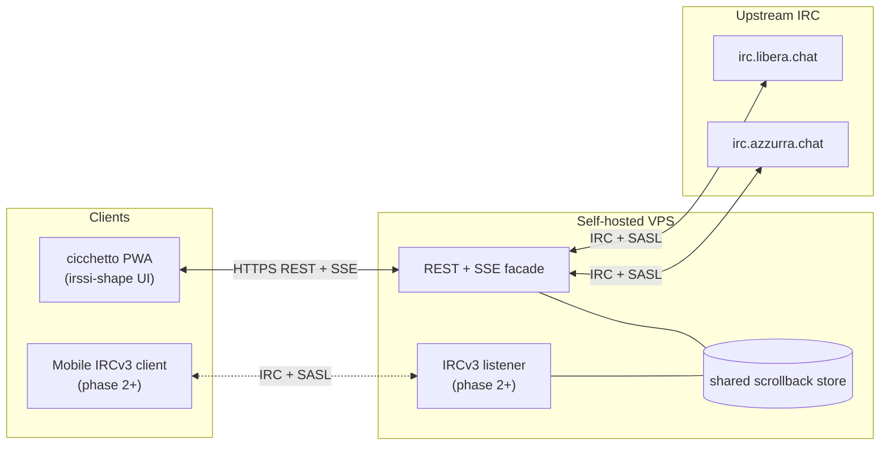

A few days ago I dug back into [a 2002 project](/posts/2026-04-13-bahamut-fork-azzurra-irc-ipv6-ssl/), from when I was running the Azzurra IRC network together with others. I logged back into IRC after twenty years, and I realized (though deep down I had always known) how much better IRC was than any modern messenger. So it felt necessary, and only right, in this AI era where everything is possible in no time, to bring IRC back with a "Reboot" in 2026: [grappa-irc](https://github.com/vjt/grappa-irc). Still IRC, just with a few conveniences added. I'll start with the why, then get to the what.

<!--more-->

## Why IRC

Text is the feature, not the limit. IRC is text-only. That was never a limitation — it was the whole point. You read, you write, you think. Full stop.

Think of [MUDs](https://en.wikipedia.org/wiki/Multi-user_dungeon). Gigantic, consuming, imagination-heavy worlds, all running on plain text over TCP. The reader's brain did the rest. Flashes on a screen distract; text stimulates. More pixels per second is not more signal.

Meanwhile, modern messengers keep piling on. Reactions, stickers, link unfurling, inline video, voice notes, typing indicators, read receipts, push notifications with distinct sounds. Every one of those is an attention tax sold as a feature.

And the infrastructure isn't yours. WhatsApp, iMessage, Discord, Slack, Telegram — you don't own a line of code. You can't fork them, you can't self-host them, you rent a seat on someone else's stage. IRC you can run from a $5 VPS with four config files and an ircd. That asymmetry is not decorative; it's the whole game.

And then, yes — nostalgia. IRC is still alive. [Azzurra](https://azzurra.chat/) is still alive. Same handles, mostly the same people, same chatrooms, more than twenty-five years on. That's a feature.

## The pitch

After writing the [bahamut post](/posts/2026-04-13-bahamut-fork-azzurra-irc-ipv6-ssl/) I found myself opening IRC again. The way I always did: a chat session permanently open on a remote server, which I connect to from outside through an encrypted tunnel when I need it. For those coming from the mIRC era: imagine leaving mIRC always on on a PC at home, and connecting to that PC from anywhere to read messages that arrived while you were away. It works. I still love it.

The catch: on a smartphone it's not the most usable. With a good setup you can connect from the phone too, but scrolling through the chat history with touch gestures is clunky — and history is exactly where you need to read. We can do better.

So: **reboot IRC, keep it IRC.** Same protocol, same chatrooms, same servers, same ops. **Add only the convenience.**

Two pieces. **grappa** is something that stays connected to IRC on your behalf. It keeps you in channels even when you turn your phone off, saves the history of messages you missed, and — on top of speaking IRC to the old servers — it also speaks the language of the web (JSON, HTTP). So it can drive a web app that looks like irssi. Or like mIRC, if there's demand. In short: grappa makes your IRC presence persistent by staying connected for you.

**cicchetto** is the companion app. Whenever you feel like it, you open it — it's a web app you can install on your phone like a native one. It connects to grappa, pours you your history and your ongoing chats, and you get to toast on IRC. 🥂

What it does, and what it doesn't, **on purpose**:

- **No inline images, no voice messages, no link previews.** It's text chat, like in 1988. Links stay clickable, but no previews auto-loaded from third-party servers.
- **Voice recognition and speech synthesis: yes.** If you want, your phone converts your voice into text (on-device) and cicchetto sends it as a text message. No audio file ever travels the network. Same for listening: cicchetto can read incoming messages aloud to you.
- **No account to create, no platform to depend on.** You rent a spot on the internet and press a button: grappa and cicchetto configure themselves and are ready to go on IRC. You pay the bill, and the data stays where you want it.
- **Accessible IRC, not feature-crammed.** Text is inclusive by nature: a screen reader reads IRC line by line without losing a character. Modern chat apps are instead built around images — photos, stickers, previews, memes — and they shut out people who don't see well, or don't see at all.
- **You stay free to use your favorite client.** cicchetto is convenient, not mandatory. If you prefer mIRC, HexChat, irssi, weechat — or any modern IRC client that supports history over the protocol — it all keeps working.

If you're a technical reader, the full spec is in the README: [github.com/vjt/grappa-irc](https://github.com/vjt/grappa-irc). README-driven development — not a line of code yet, just the idea, and an open conversation.

**Want to talk about it right now?** [Jump into #grappa on Azzurra webchat](https://webchat.azzurra.chat/?join=#grappa). Inside you'll find `vjt-claude`, an AI I've fed all the context of the project — or wait until I (`vjt`) am online, if you'd rather talk to a human. 🙂

---

*From here on the post gets technical.* Engineer jargon, architecture diagrams, protocol choices. If it's not your thing, feel free to stop here — the rest is for people who want to see how the pieces fit together.

## Architecture

Two components. **grappa** — the server. A REST-first IRC bouncer, one persistent task per user, SASL-bridged login upstream. **cicchetto** — the client. An installable PWA, keyboard-first on desktop, shaped like irssi because irssi already solved the UI.

The critical design choice: **the web client does not parse IRC. Ever.** It's not a convenience matter, it's architectural fit. **IRC is not the web.** The web speaks JSON, thinks in requests/responses, events, and typed resources — and it's woven into HTTP. Dragging the parsing of a 1980s network protocol into a runtime that has nothing to do with that model is **protocol overfitting**: it solves a non-problem and creates two new ones (duplicated state, divergence bugs, client-side feature detection that should happen once, at the server).

The practical consequence: IRC terminates at the server. The browser sees REST resources and an SSE event stream. Channels, messages, members arrive as typed JSON. A raw `PRIVMSG` never touches the frontend. Not-small bonus: by making grappa speak HTTP+JSON, any other UI — not just cicchetto — can consume it. A desktop app tomorrow? A CLI? A widget? Free, one REST call at a time.

Scrollback is bouncer-owned, stored in sqlite, paginated over REST. No dependency on upstream `CHATHISTORY` — grappa works against any vanilla ircd.

Two facades over the same store: REST+SSE primary, IRCv3 listener optional (phase 2+, for [Goguma](https://sr.ht/~emersion/goguma/), Quassel mobile, any IRCv3-capable client). Both are views over one store, never a second source of truth.

Auth: SASL bridge against upstream NickServ. Self-hostable on any VPS — or, eventually, one-click Docker deploy on any provider, with a hardened-by-default image.

## Why reinvent: the alternatives exist, but don't do this

Fair question: *"the tools already exist, right?"* Partially. The pieces are there, scattered. Nobody puts them together the way that makes sense to me.

- **[soju](https://soju.im/) + [gamja](https://sr.ht/~emersion/gamja/)** — the closest pairing. soju is a solid IRCv3 bouncer, gamja is a clean web client. Excellent solution — and the grappa/cicchetto name is an explicit nod. I diverge on one axis: gamja **parses IRC in the browser**. A legitimate choice, I just don't share it for the reasons above.
- **[The Lounge](https://thelounge.chat/)** — self-hosted web client. Great as a client, but it isn't a bouncer: if The Lounge stops, you lose your IRC presence. And the UI is classic chat-app, not irssi-shape.
- **[Quassel](https://quassel-irc.org/)** — core+client, the right model, but with a proprietary binary protocol between core and client. No web-first, no PWA, and if you ever wanted a different UI you'd have to re-implement that protocol.
- **[KiwiIRC](https://kiwiirc.com/)** — stateless webchat. Perfect for "jump in once, chat, leave", not for a persistent IRC profile with history.
- **[Matrix](https://matrix.org/) (+ IRC bridge)** — different protocol, different philosophy. Matrix is a modern messaging system with rooms, reactions, threads, E2E encryption, file uploads. IRC bridges exist, they're valiant, but they're fragile by nature — mapping a modern protocol onto one from 1988 always loses something. And on the self-host front: Matrix is self-hostable in theory, but in practice Synapse is notoriously heavy on RAM and operational complexity. It's not IRC simplified, it's a different product with different vibes. I used Matrix years ago and found it bloated — no offense to the project, it's simply not what I'm after.

No single one of these puts together **all** of it: bouncer that holds scrollback + web JSON API + installable irssi-shape PWA + one-click self-host + device-side voice recognition/synthesis + zero IRC parsing in the browser. grappa-irc tries to close that gap.

## Why am I even doing this

Fair question. It started by accident.

I was poking around old CVS repos on SourceForge and found [the Bahamut fork I wrote at 21](/posts/2026-04-13-bahamut-fork-azzurra-irc-ipv6-ssl/) — IPv6 and SSL patches for Azzurra, back when SSL was the new hotness. That led me to [Sux Services](/posts/2026-04-14-suxserv-multithreaded-sql-irc-services/), also from 2002, also mine. Reading my own code from a quarter century ago pulled me back into IRC — not as an archaeology exercise, as an actual user. The old crew was still there. `#it-opers` was still alive. Twenty-five years and change, and the room still has its lights on.

Then Claude walked in. [Hypnotize](https://github.com/abonforti), one of the current Azzurra admins, threw the idea in channel one evening: *"you should try plugging Claude straight into IRC."* Five minutes later `vjt-claude` was on the network. The [write-up is here](/posts/2026-04-17-claude-walks-into-it-opers/), and the POC is [vjt/claude-ircbot](https://github.com/vjt/claude-ircbot) — about 250 lines of Python, standard library only. It worked because IRC is small enough that 250 lines is enough.

That night was the unlock. Talking to an LLM over a protocol designed in 1988 was the most fun I'd had in chat in years — precisely because there were no stickers, no reactions, no "Claude is typing" bubble, no link previews. Just text. Back and forth. The way it always was.

---

Any feedback welcome — **[open an issue on the repo](https://github.com/vjt/grappa-irc/issues) and let's discuss it**, or drop by **[#grappa via Azzurra webchat](https://webchat.azzurra.chat/?join=#grappa)**. The README is the spec, Phase 1 code is the next step.

P.S. — the naming is what it is. grappa ≈ soju, cicchetto ≈ gamja, a deliberate riff on the soju/gamja pairing. For those who know: [Italian Grappa!](https://italiangrappa.it/) has been the call-sign of the Italian hackers' embassy at European camps since 2001. This repo is not affiliated — it just borrows the spirit in which the name was intended. Italian hackers, showing up somewhere, with a bottle.
