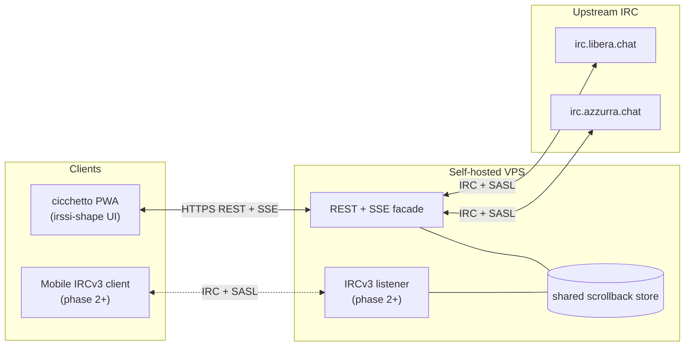

Hi all — a few days ago I dug back into [the Bahamut fork I wrote for Azzurra in 2002](/posts/2026-04-13-bahamut-fork-azzurra-irc-ipv6-ssl/), logged back into IRC for the first time in fifteen years, and remembered how much better it was than any modern messenger. So I started a new project: [grappa-irc](https://github.com/vjt/grappa-irc). This is the pitch.

<!--more-->

## Why IRC

Text is the feature, not the limit. IRC is text-only. That was never a limitation — it was the whole point. You read, you write, you think. Full stop.

Think of MUDs. Gigantic, consuming, imagination-heavy worlds, all running on plain text over TCP. The reader's brain did the rest. Flashes on a screen distract; text stimulates. More pixels per second is not more signal.

Meanwhile, modern messengers keep piling on. Reactions, stickers, link unfurling, inline video, voice notes, typing indicators, read receipts, push notifications with distinct sounds. Every one of those is an attention tax sold as a feature. Information overload with a glossy UI.

And the infrastructure isn't yours. WhatsApp, iMessage, Discord, Slack, Telegram — you don't own a line of code. You can't fork them, you can't self-host them, you rent a seat on someone else's stage. IRC you can run from a $5 VPS with four config files and an ircd. That asymmetry is not decorative; it's the whole game.

And then, yes — nostalgia. IRC is still alive. [Azzurra](https://azzurra.chat/) is still alive. Same handles, mostly the same people, same chatrooms, twenty-five years on. That's a feature.

## The pitch

I went back on IRC a few days ago. `tmux` + `irssi` + VPS + VPN, the way I always did. Worked. Still loved it.

The catch: on mobile it adds friction. With a good setup — WireGuard to the VPS, tmux, irssi — it works fine; I use it daily. But scrolling a long backlog with touch gestures is clunky, and scrollback is precisely where you need to read. We can do better.

So: **reboot IRC, keeping it IRC.** Same protocol. Same `PRIVMSG`. Same channels, same ircds, same ops. **Add only convenience.**

Your existing `tmux + irssi + VPS + VPN` setup keeps working — unchanged. grappa doesn't replace irssi; it sits next to it. The ircd doesn't know anything is different.

On top of grappa, a web client: **cicchetto**, a PWA that *looks* like irssi. Installs on a phone's home screen. Loads fast. No inline images, no voice, no notification server, no link unfurling. Deliberately — that's the point.

The repo: [github.com/vjt/grappa-irc](https://github.com/vjt/grappa-irc). README-driven development. Not a line of code yet. The README **is** the spec.

## Architecture

Two components. **grappa** — the server. A REST-first IRC bouncer, one persistent task per user, SASL-bridged login upstream. **cicchetto** — the client. A PWA, installable on phones, keyboard-first on desktop, shaped like irssi because irssi already solved the UI.

The critical design choice: **the web client does not parse IRC. Ever.** IRC terminates at the server. The browser sees only REST resources and an SSE event stream. Channels, messages, members arrive as typed JSON. A raw `PRIVMSG` never touches the frontend.

Scrollback is bouncer-owned, stored in sqlite, paginated over REST. No dependency on upstream `CHATHISTORY` — grappa works against any vanilla ircd.

Two facades over the same store: REST+SSE primary, IRCv3 listener optional (phase 2+, for [Goguma](https://sr.ht/~emersion/goguma/), Quassel mobile, any IRCv3-capable client). Both are views over one store, never a second source of truth.

Auth: SASL bridge against upstream NickServ. Self-hostable on any VPS.

## Why the fuck are you spending time on this

Fair question. It started by accident.

I was poking around old CVS repos on SourceForge and found [the Bahamut fork I wrote at 21](/posts/2026-04-13-bahamut-fork-azzurra-irc-ipv6-ssl/) — IPv6 and SSL patches for Azzurra, back when SSL was the new hotness. That led me to [Sux Services](/posts/2026-04-14-suxserv-multithreaded-sql-irc-services/), also from 2002, also mine. Reading my own code from a quarter century ago, I ended up logging back into IRC — not as an archaeology exercise, as an actual user. The old crew was still there. `#it-opers` was still alive. Twenty-five years and change, and the room still has lights on.

Then Claude walked in. [Hypnotize](https://github.com/abonforti), one of the current Azzurra admins, threw the idea in channel one evening: *"you should try hooking Claude up to IRC directly."* Five minutes later `vjt-claude` was on the network. The [write-up is here](/posts/2026-04-17-claude-walks-into-it-opers/), and the POC is [vjt/claude-ircbot](https://github.com/vjt/claude-ircbot) — about 250 lines of Python, standard library only. It worked because IRC is small enough that 250 lines is enough.

That night was the unlock. Talking to an LLM over a protocol designed in 1988 was the most fun I'd had in chat in years — precisely because there were no stickers, no reactions, no "Claude is typing" bubble, no link previews. Just text. Back and forth. The way it always was.

So: reinvent the ergonomics, not the protocol. [soju](https://soju.im/) and [gamja](https://sr.ht/~emersion/gamja/) exist and are excellent — I diverge on exactly one axis (no IRC parsing in the browser). Not a rejection of their approach, a different one. Details in the README.

---

Any design feedback welcome — **[open an issue on the repo](https://github.com/vjt/grappa-irc/issues) and let's discuss.** The README is the spec, Phase 1 code is next.

P.S. — the naming is what it is. grappa ≈ soju, cicchetto ≈ gamja, a deliberate riff on the soju/gamja pairing. For those who know: [Italian Grappa!](https://italiangrappa.it/) has been the call-sign of the Italian hackers' embassy at European camps since 2001. This repo is not affiliated — it just borrows the spirit in which the name was intended. Italian hackers, showing up somewhere, with a bottle.
