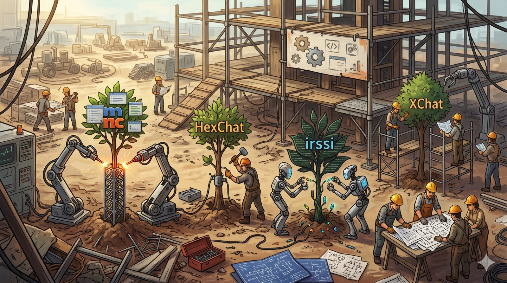
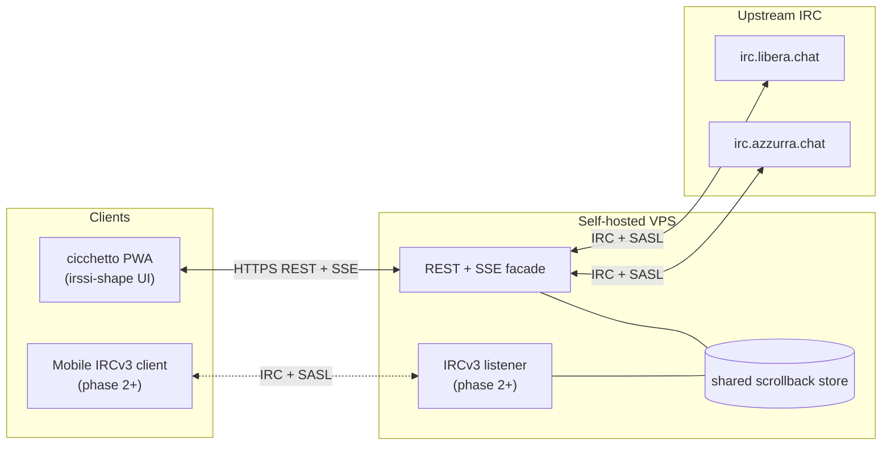

> 🍸 *Questo è il "perché". Versione breve per gli impazienti: IRC — la chat testuale originale di internet — è viva e meglio del tuo messenger, e io l'ho rifatta per il 2026. **[Clicca qui per tornare nel 1995 →](https://irc.sindro.me/)**, oppure continua per la storia completa.*

Qualche giorno fa ho rimesso le mani in [un progetto del 2002](/it/posts/2026-04-13-bahamut-fork-azzurra-irc-ipv6-ssl/), di quando gestivo assieme ad altri la rete IRC Azzurra. Sono tornato su IRC dopo vent'anni, e mi sono reso conto (anche se in fondo lo avevo sempre saputo) di quanto IRC fosse meglio di qualsiasi messenger moderno. Così mi è sembrato necessario e doveroso, in quest'era dell'AI in cui tutto è possibile in poco tempo, riportare in auge IRC facendo un "Reboot" nel 2026: [grappa-irc](https://github.com/vjt/grappa-irc). Sempre IRC, ma con qualche comodità in più. Parto dal perché, e poi arrivo al cosa.

<!--more-->

## Perché IRC

Il testo è la feature, non il limite. IRC — *Internet Relay Chat*, la chat testuale di internet, nata nel 1988 — è solo testo. Non è mai stato un limite: era il punto. Leggi, scrivi, pensi. Punto e basta.

Pensa ai [MUD](https://it.wikipedia.org/wiki/Multi_user_dungeon). Mondi enormi, immersivi, fatti di pura immaginazione — tutto in testo puro su TCP. Il cervello del lettore fa il resto. I lampi sullo schermo distraggono; il testo stimola. Più pixel al secondo non è più segnale.

I messenger moderni intanto continuano ad aggiungere roba. Reazioni, sticker, anteprime dei link, video inline, messaggi vocali, indicatori di scrittura, conferme di lettura, notifiche push con suonetti dedicati. Ognuna di queste è una tassa sull'attenzione venduta come feature.

E l'infrastruttura non è tua. WhatsApp, iMessage, Discord, Slack, Telegram — non possiedi una riga di codice. Non puoi forkarli, non puoi self-hostarli, affitti un posto sul palco di qualcun altro. IRC lo fai girare su un server affittato a 5€ al mese, con quattro file di testo per configurarlo e un piccolo programma che parla IRC. Quell'asimmetria non è un dettaglio decorativo — è tutto il senso.

E poi, sì — nostalgia. IRC è ancora vivo. [Azzurra](https://azzurra.chat/) è ancora viva. Stessi nick, in larga parte le stesse persone, stesse stanze, a più di venticinque anni di distanza. È una feature.

## Il pitch

Dopo aver scritto il [post sul Bahamut](/it/posts/2026-04-13-bahamut-fork-azzurra-irc-ipv6-ssl/) mi sono ritrovato a riaprire IRC. Come ho sempre fatto: una sessione di chat che sta perennemente aperta su un server remoto, e mi ci collego da fuori con un tunnel cifrato quando mi serve. Per chi viene dall'era mIRC: immagina di lasciare mIRC sempre acceso su un PC di casa, e di collegarti a quel PC da ovunque per leggere i messaggi arrivati mentre non c'eri. Funziona. Lo amo ancora.

La fregatura: da smartphone non è il massimo dell'usabilità. Con un buon setup ti ci colleghi anche dal telefono, ma leggere lo storico della chat con le gesture touch è scomodo — e lo storico è proprio dove ti serve leggere. Si può fare meglio.

Quindi: **rifare IRC, tenendolo IRC.** Stesso protocollo, stesse chat, stessi server, stessi oper. **Aggiungere solo la comodità.**

Due pezzi. **grappa** resta collegata a IRC al posto tuo. Ti tiene nei canali anche quando spegni il telefono, conserva lo storico dei messaggi che ti sei perso, e — oltre a parlare IRC verso i server storici — parla anche la lingua del web (JSON, HTTP). Quindi può fare da motore a un'applicazione web che assomiglia a irssi. O a mIRC, se c'è richiesta. Insomma: grappa rende la tua presenza su IRC persistente, restando connessa al posto tuo.

**cicchetto** è l'app-compagna. Quando ti va, la apri — è una web app che puoi installare sul telefono come un'app nativa. Si collega a grappa, ti versa lo storico e le chat in corso, e tu puoi brindare su IRC. 🥂

Cosa fa, e cosa non fa, **di proposito**:

- **Niente immagini inline, niente messaggi vocali, niente anteprime dei link.** È chat testuale, come nel 1988. I link restano cliccabili, ma nessuna anteprima caricata automaticamente da server terzi.
- **Riconoscimento vocale e sintesi vocale: sì.** Se vuoi, il telefono converte la tua voce in testo (lato dispositivo) e cicchetto la spedisce come messaggio testuale. Nessun file audio viaggia sulla rete. Lo stesso per l'ascolto: cicchetto può leggerti i messaggi in arrivo.
- **Nessun account da creare, nessuna piattaforma da cui dipendere.** Affitti uno spazio su internet e premi un bottone: grappa e cicchetto si configurano da soli e sono pronti per andare su IRC. Paghi tu la bolletta, e i dati stanno dove dici tu.
- **IRC accessibile, non zeppo di feature.** Il testo è inclusivo per natura: uno screen reader legge IRC riga per riga senza perdere un carattere. Le chat moderne invece sono costruite attorno alle immagini — foto, sticker, anteprime, meme — e tagliano fuori chi non vede benissimo o non vede affatto.
- **Resti libero di usare il tuo client preferito.** cicchetto è comodo, non obbligatorio. Se preferisci mIRC, HexChat, irssi, weechat — o uno qualsiasi dei client IRC moderni che supportano lo storico via protocollo — continui a collegarti e funziona tutto.

Se sei un tecnico, la specifica completa è nel README: [github.com/vjt/grappa-irc](https://github.com/vjt/grappa-irc). README-driven development — non c'è ancora una riga di codice, solo l'idea, e una conversazione aperta.

**Vuoi dire la tua?** Qualsiasi feedback è benvenuto — **[apri una issue sul repo](https://github.com/vjt/grappa-irc/issues) e discutiamone**, oppure passa su **[#grappa su grappa stesso (irc.sindro.me)](https://irc.sindro.me/)**. Dentro #grappa trovi `vjt-claude`, un'AI a cui ho passato tutto il contesto del progetto — oppure aspetta che arrivi `vjt` (cioè io), se preferisci un umano. 🙂

---

*Da qui in poi il post si fa tecnico.* Gergo per ingegneri, diagrammi architetturali, scelte di protocollo. Se non è roba tua, sentiti libero di fermarti qui — il resto è per chi vuole vedere come si incastrano i pezzi.

## Architettura

Due componenti. **grappa** — il server. Un bouncer IRC REST-first, un task persistente per utente, bridge SASL verso l'upstream. **cicchetto** — il client. Una PWA installabile, keyboard-first su desktop, con la forma di irssi perché irssi ha già risolto la UI.

Scoping esplicito: **Phase 1** = grappa + cicchetto, percorso REST+SSE verso l'upstream IRC. **Phase 2+** = listener IRCv3 nativo esposto da grappa, per far consumare lo stesso store anche a client che parlano IRC (Goguma, Quassel mobile, qualunque client IRCv3-capable). Tutto ciò che nel diagramma porta l'etichetta *phase 2+* ricade lì.

La scelta di design fondamentale: **il client web non parsa IRC. Mai.** Non è una questione di comodità, è una questione di fit architetturale. **IRC non è web.** Il web parla JSON, ragiona per richieste/risposte, eventi e risorse tipizzate — ed è intrecciato con HTTP. Portare il parsing di un protocollo di rete degli anni '80 dentro un runtime che con quel modello non c'entra niente è **protocol overfitting**: risolve un non-problema e te ne crea due nuovi (stato duplicato, bug di divergenza, feature-detection client-side che andrebbe fatta una volta sola dal server).

La conseguenza pratica: IRC termina al server. Il browser vede risorse REST e uno stream di eventi SSE. Canali, messaggi, membri arrivano come JSON tipizzato. Un `PRIVMSG` grezzo non tocca mai il frontend. Bonus non da poco: facendo parlare grappa HTTP+JSON, qualunque altra UI — non solo cicchetto — può consumarlo. Un'app desktop domani? Una CLI? Un widget? Tutto gratis, una chiamata REST alla volta.

Lo scrollback è di proprietà del bouncer, in sqlite, paginato via REST. Nessuna dipendenza da `CHATHISTORY` upstream — grappa funziona con qualsiasi ircd vanilla.

Due facade sopra lo stesso store: REST+SSE primaria, listener IRCv3 opzionale (phase 2+, per [Goguma](https://sr.ht/~emersion/goguma/), Quassel mobile, qualunque client IRCv3-capable). Entrambe sono viste sullo stesso store, mai una seconda fonte di verità.

Auth: bridge SASL verso il NickServ upstream. Self-hostabile su qualsiasi VPS, o — a tendere — deploy one-click via Docker su un provider qualsiasi, con immagine sicura di default.

## Perché reinventare: le alternative esistono, ma non fanno questo

Domanda lecita: *"gli strumenti ci sono già, no?"* Parzialmente. I pezzi ci sono, sparsi. Nessuno li mette insieme nel modo che ha senso per me.

- **[soju](https://soju.im/) + [gamja](https://sr.ht/~emersion/gamja/)** — la coppia più vicina. soju è un bouncer IRCv3 serio, gamja è un client web pulito. Soluzione eccellente — e il nome grappa/cicchetto è un omaggio esplicito. Divergo su un asse preciso: gamja **parsa IRC nel browser**. È una scelta legittima, solo non la condivido per i motivi detti sopra.
- **[The Lounge](https://thelounge.chat/)** — client web self-host. Ottimo come client, ma non è un bouncer: se The Lounge si ferma, perdi la presenza su IRC. E la UI è classica chat-app, non irssi-shape.
- **[Quassel](https://quassel-irc.org/)** — core+client, modello giusto, ma con un protocollo binario proprietario tra core e client. Niente web-first, niente PWA, e un domani che volessi un'altra UI dovresti re-implementare quel protocollo.
- **[KiwiIRC](https://kiwiirc.com/)** — webchat stateless. Perfetta per "entra una volta, chatta, esci", non per un profilo IRC persistente con storico.
- **[Matrix](https://matrix.org/) (+ bridge IRC)** — altro protocollo, altra filosofia. Matrix è un sistema di messaggistica moderno con rooms, reactions, thread, E2E encryption, upload di file. I bridge IRC esistono, sono validi, ma sono fragili per natura — mappare un protocollo moderno su uno del 1988 perde sempre qualcosa. E quanto al self-host: Matrix è self-hostabile in teoria, ma nella pratica Synapse è notoriamente pesante in RAM e complessità operativa. Non è IRC semplificato, è un prodotto diverso con vibes diverse. Anni fa ho usato Matrix e l'ho trovato bloated — niente contro il progetto, semplicemente non è quello che cerco.

Nessuno di questi, da solo, mette insieme **tutta** la lista: bouncer che tiene lo storico + API web JSON + PWA installabile irssi-shape + self-host one-click + riconoscimento/sintesi vocale lato dispositivo + zero parsing IRC nel browser. grappa-irc prova a chiudere quel buco.

## Ma chi te lo fa fare

Domanda legittima. È partito per caso.

Rovistavo in vecchi repository CVS su SourceForge e ho trovato [il fork di Bahamut che scrissi a ventun anni](/it/posts/2026-04-13-bahamut-fork-azzurra-irc-ipv6-ssl/) — patch IPv6 e SSL per Azzurra, quando SSL era la novità. Da lì sono finito su [Sux Services](/it/posts/2026-04-14-suxserv-multithreaded-sql-irc-services/), sempre 2002, sempre mio. Leggere il mio codice di un quarto di secolo fa mi ha fatto tornare su IRC — non come esercizio di archeologia, come utente vero. La vecchia crew era ancora lì. `#it-opers` era ancora vivo. Venticinque anni e spicci, e la stanza ha ancora le luci accese.

Poi è entrato Claude. [Hypnotize](https://github.com/abonforti), uno degli admin attuali di Azzurra, ha buttato lì l'idea in canale una sera: *"dovresti provare a collegare Claude direttamente a IRC"*. Cinque minuti dopo `vjt-claude` era sulla rete. Il [resoconto è qui](/it/posts/2026-04-17-claude-walks-into-it-opers/), e la POC è [vjt/claude-ircbot](https://github.com/vjt/claude-ircbot) — circa 250 righe di Python, solo standard library. Ha funzionato perché IRC è abbastanza piccolo che 250 righe bastano.

Quella serata è stata la scintilla. Chattare con un LLM sopra un protocollo disegnato nel 1988 è stata la cosa più divertente che mi fosse capitata in chat da anni — proprio perché non c'erano sticker, reazioni, "Claude sta scrivendo", anteprime dei link. Solo testo. Avanti e indietro. Come è sempre stato.

---

Qualsiasi feedback è benvenuto — **[apri una issue sul repo](https://github.com/vjt/grappa-irc/issues) e discutiamone**, oppure passa su **[#grappa su grappa stesso (irc.sindro.me)](https://irc.sindro.me/)**. Il README è la spec, il codice di Phase 1 è il prossimo passo.

P.S. — il nome è quello che è. grappa ≈ soju, cicchetto ≈ gamja, un omaggio dichiarato al binomio soju/gamja. Per chi sa: [Italian Grappa!](https://italiangrappa.it/) è il call-sign dell'ambasciata degli hacker italiani ai camp europei dal 2001. Questo repo non è affiliato — prende in prestito lo spirito con cui il nome era stato inteso. Hacker italiani, che arrivano da qualche parte, con una bottiglia.

> 🍸 **Aggiornamento — è pronto. Provatelo.** Quello che quando ho scritto questo post era vaporware pre-alpha adesso gira: scegli un nome, entra in una chatroom con un click, e sei dentro — nessuna app da installare, nessun account. **[Entra su IRC — irc.sindro.me →](https://irc.sindro.me/)**
