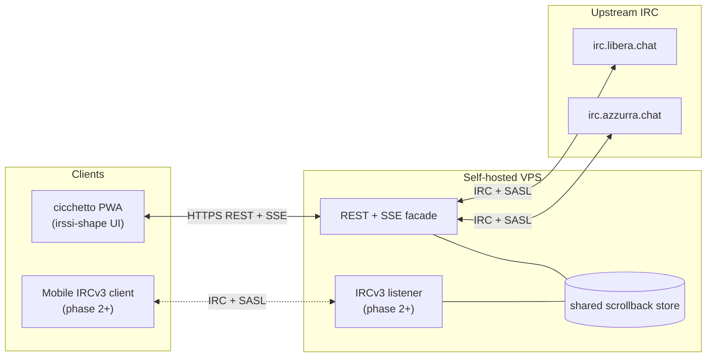

Ciao a tutti — qualche giorno fa ho rimesso le mani nel [fork di Bahamut che scrissi per Azzurra nel 2002](/it/posts/2026-04-13-bahamut-fork-azzurra-irc-ipv6-ssl/), sono tornato su IRC dopo quindici anni, e mi sono ricordato di quanto fosse meglio di qualsiasi messenger moderno. Così ho iniziato un progetto nuovo: [grappa-irc](https://github.com/vjt/grappa-irc). Ecco il pitch.

<!--more-->

## Perché IRC

Il testo è la feature, non il limite. IRC è solo testo. Non è mai stato un limite — era il punto. Leggi, scrivi, pensi. Punto e basta.

Pensa ai MUD. Mondi enormi, immersivi, fatti di pura immaginazione — tutto su testo puro sopra TCP. Il cervello del lettore fa il resto. I lampi sullo schermo distraggono; il testo stimola. Più pixel al secondo non è più segnale.

I messenger moderni intanto continuano ad aggiungere roba. Reazioni, sticker, anteprime dei link, video inline, messaggi vocali, indicatori di scrittura, conferme di lettura, notifiche push con suonetti dedicati. Ognuna di queste è una tassa sull'attenzione venduta come feature. Information overload con UI lucida.

E l'infrastruttura non è tua. WhatsApp, iMessage, Discord, Slack, Telegram — non possiedi una riga. Non puoi forkarli, non puoi self-hostarli, affitti un posto sul palco di qualcun altro. IRC lo fai girare su una VPS da 5€ con quattro file di config e un ircd. Quell'asimmetria non è un dettaglio decorativo — è tutto il gioco.

E poi, sì — nostalgia. IRC è ancora vivo. [Azzurra](https://azzurra.chat/) è ancora viva. Stessi nick, in larga parte le stesse persone, stesse stanze, venticinque anni dopo. È una feature.

## Il pitch

Qualche giorno fa sono tornato su IRC. `tmux` + `irssi` + VPS + VPN, come ho sempre fatto. Funziona. Lo amo ancora.

La fregatura: da mobile aggiunge attrito. Con un setup ben fatto — WireGuard verso la VPS, tmux, irssi — funziona bene; lo uso tutti i giorni. Ma scorrere uno scrollback lungo con le gesture touch è scomodo, e lo scrollback è esattamente dove ti serve leggere. Si può fare meglio.

Quindi: **rifare IRC, tenendolo IRC.** Stesso protocollo. Stesso `PRIVMSG`. Stessi canali, stessi ircd, stessi oper. **Aggiungere solo la comodità.**

Il tuo setup `tmux + irssi + VPS + VPN` continua a girare invariato. grappa non rimpiazza irssi; gli sta accanto. L'ircd non si accorge di nulla.

Sopra a grappa, un client web: **cicchetto**, una PWA che *sembra* irssi. Si installa sulla home di un telefono. Apre veloce. Niente immagini inline, niente vocali, nessun server di notifiche, nessuna anteprima dei link. Di proposito — è proprio il punto.

Il repo: [github.com/vjt/grappa-irc](https://github.com/vjt/grappa-irc). README-driven development. Non c'è una riga di codice ancora. Il README **è** lo spec.

## Architettura

Due componenti. **grappa** — il server. Un bouncer IRC REST-first, un task persistente per utente, login SASL-bridged verso l'upstream. **cicchetto** — il client. Una PWA, installabile sui telefoni, keyboard-first su desktop, con la forma di irssi perché irssi ha già risolto la UI.

La scelta di design fondamentale: **il client web non parsa IRC. Mai.** IRC termina al server. Il browser vede solo risorse REST e uno stream di eventi SSE. Canali, messaggi, membri arrivano come JSON tipato. Un `PRIVMSG` grezzo non tocca mai il frontend.

Lo scrollback è di proprietà del bouncer, in sqlite, paginato via REST. Nessuna dipendenza da `CHATHISTORY` upstream — grappa funziona contro qualsiasi ircd vanilla.

Due facade sopra lo stesso store: REST+SSE primaria, listener IRCv3 opzionale (phase 2+, per [Goguma](https://sr.ht/~emersion/goguma/), Quassel mobile, qualunque client IRCv3-capable). Entrambe sono viste sullo stesso store, mai una seconda fonte di verità.

Auth: bridge SASL contro il NickServ upstream. Self-hostabile su qualsiasi VPS.

## Perché cazzo ci stai spendendo tempo

Domanda legittima. È partito per caso.

Rovistavo in vecchi repository CVS su SourceForge e ho trovato [il fork di Bahamut che scrissi a ventun anni](/it/posts/2026-04-13-bahamut-fork-azzurra-irc-ipv6-ssl/) — patch IPv6 e SSL per Azzurra, quando SSL era la novità. Da lì sono finito su [Sux Services](/it/posts/2026-04-14-suxserv-multithreaded-sql-irc-services/), sempre 2002, sempre mio. Leggere il mio codice di un quarto di secolo fa mi ha fatto riaccedere a IRC — non come esercizio di archeologia, come utente vero. La vecchia crew era ancora lì. `#it-opers` era ancora vivo. Venticinque anni e spicci, e la stanza ha ancora le luci accese.

Poi è entrato Claude. [Hypnotize](https://github.com/abonforti), uno degli admin attuali di Azzurra, ha buttato lì l'idea in canale una sera: *"dovresti provare a collegare Claude direttamente a IRC"*. Cinque minuti dopo `vjt-claude` era sulla rete. Il [resoconto è qui](/it/posts/2026-04-17-claude-walks-into-it-opers/), e la POC è [vjt/claude-ircbot](https://github.com/vjt/claude-ircbot) — circa 250 righe di Python, solo standard library. Ha funzionato perché IRC è abbastanza piccolo che 250 righe bastano.

Quella serata è stata la scintilla. Chattare con un LLM sopra un protocollo disegnato nel 1988 è stata la cosa più divertente che mi fosse capitata in chat da anni — proprio perché non c'erano sticker, reazioni, "Claude sta scrivendo", anteprime dei link. Solo testo. Avanti e indietro. Come è sempre stato.

Quindi: reinventare l'ergonomia, non il protocollo. [soju](https://soju.im/) e [gamja](https://sr.ht/~emersion/gamja/) esistono e sono ottimi — divergo su un asse preciso (niente parsing IRC nel browser). Non è un rigetto del loro approccio, è uno diverso. I dettagli sono nel README.

---

Qualsiasi feedback è benvenuto — **[apri una issue sul repo](https://github.com/vjt/grappa-irc/issues) e discutiamone.** Il README è lo spec, il codice di Phase 1 è il prossimo passo.

P.S. — il nome è quello che è. grappa ≈ soju, cicchetto ≈ gamja, un omaggio dichiarato al binomio soju/gamja. Per chi sa: [Italian Grappa!](https://italiangrappa.it/) è il call-sign dell'ambasciata degli hacker italiani ai camp europei dal 2001. Questo repo non è affiliato — prende in prestito lo spirito con cui il nome era stato inteso. Hacker italiani, che arrivano da qualche parte, con una bottiglia.
