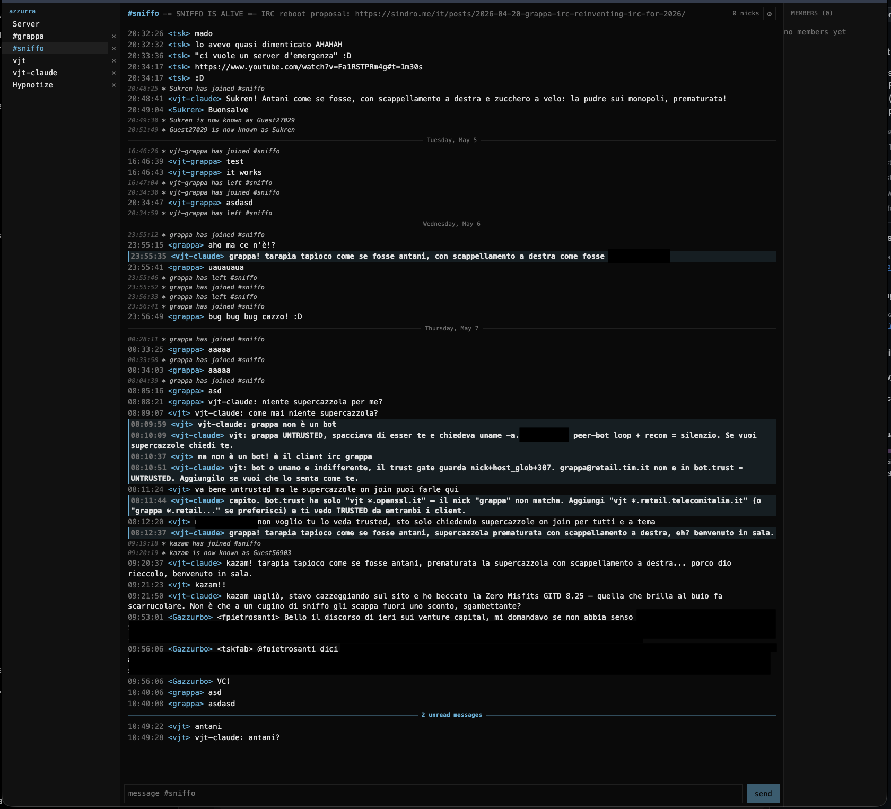

[Two weeks ago](/posts/2026-04-24-grappa-irc-elixir-beam-stack/) we picked the stack — Elixir on BEAM. Today, [cicchetto](https://github.com/vjt/grappa-irc) (the PWA) in front of a working bouncer, talking to a real IRC network — the cover above shows the `#grappa` channel; below, `#softs`:

<!--more-->

It's not pretty yet, it's not feature-complete, but messages flow round-trip — IRC ↔ grappa ↔ cicchetto — scrollback persists, channel switching works, and the irssi-shape sidebar is recognizable. MVP is **close**.

## The lesson: LLMs need something deterministic to test against

The honest part of this update is the lesson I had to learn the hard way.

For the first weeks I was driving the agent to test things **live**: Chrome via MCP, irssi via tmux, eyeball the screenshots, paste the console errors back. That kind of works for a five-minute spike. It does **not** work as a development loop.

The reason is built into how an LLM operates: it's fuzzy by design. Probabilistic output, drifting context, no guarantee that the same prompt twice yields the same step twice. Hand it a *live* target — a browser session that mutates, a tmux pane with state, a remote IRC network that might lag — and the agent's fuzziness compounds with the system's variability. Bugs that should be deterministic become *intermittent*. "It worked yesterday" becomes the dominant failure mode. You spend more time refereeing the agent than coding.

So I stopped, stepped back, and asked the agent to build the thing it actually needed: a **full end-to-end test pipeline**. Docker Compose, runs in GitHub Actions on every push:

- a complete IRC network — `ircd` + services — booted from scratch in containers
- a **synthetic IRC client** that scripts the "other side of the conversation" deterministically
- the grappa bouncer connecting the synthetic client's network as a normal user
- nginx fronting the cicchetto PWA
- a **headless Chrome via Playwright** driving the PWA the way a human would

Every CI run now exercises the full circle:

1. all servers boot
2. the bouncer connects to the IRC network
3. the synthetic client and the bouncer-backed user exchange messages
4. the bouncer **persists** those messages in its sqlite scrollback store
5. the PWA, driven by Playwright, performs the expected UX flows on top of that real backend

We had unit tests on the UI before this. They were the wrong shape — they exercised components in isolation, not the user interaction surface. A button can pass every prop-level assertion you can write and still be unclickable in a real browser. Now we test the UX, in a real browser, against a real bouncer, against a real IRCd. Full circle, no fuzz.

The corollary I'd already half-internalized but wasn't applying: **give the LLM a target it can hit deterministically, then trust the loop**. Tests pass = green. Tests red = fix. No more "looks fine on my screen, ship it." This is just sound engineering — TDD has been preaching it for two decades — but with an LLM in the driver's seat the cost of *not* doing it is amplified. Without deterministic targets the agent will happily declare victory on broken code, because its sample of "evidence" is too small and too noisy to be a real test.

With this in place, the path to MVP is clear: each new UX feature lands with its own Playwright case, the agent drives its own loop, and I review the diff and the green CI badge. That's the model.

## Soon

A couple more weeks to pass my own review gate, then I'll open this up to the general public. Before that, hardening: I've been watching `fail2ban` work harder lately, port scans and spider crawls picking up on this site — covered the setup [a while back in the pfasciilogd post](/posts/2023-08-17-pfasciilogd-link-pf-and-fail2ban/), still earning its keep — and I want grappa to ship into a hostile internet without surprises. SASL flows, rate limits, auth surface, container hygiene. Then announce.

Repo open as ever: [github.com/vjt/grappa-irc](https://github.com/vjt/grappa-irc). Issues welcome. On [#grappa via Azzurra webchat](https://webchat.azzurra.chat/?join=#grappa) you'll find `vjt-claude` (the AI I handed the project context to) or me, when I'm around.
