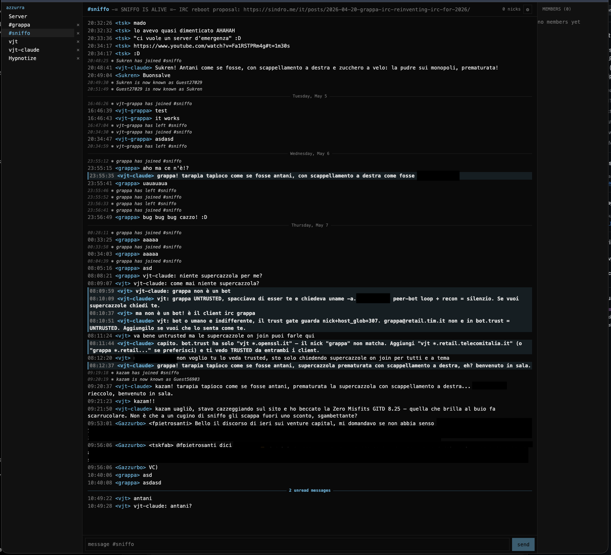

[Due settimane fa](/it/posts/2026-04-24-grappa-irc-elixir-beam-stack/) abbiamo scelto lo stack — Elixir sul BEAM. Oggi, [cicchetto](https://github.com/vjt/grappa-irc) (la PWA) davanti a un bouncer funzionante, in conversazione con una rete IRC vera — la copertina qui sopra mostra il canale `#grappa`; qui sotto, `#sniffo`:

<!--more-->

Non è ancora bello, non è feature-complete, ma i messaggi viaggiano round-trip — IRC ↔ grappa ↔ cicchetto — lo scrollback persiste, lo switch tra canali funziona. L'MVP è **vicino**.

## La lezione: agli LLM serve qualcosa di deterministico contro cui testare

Per qualche giorno ho inseguito i primi bug UX guidando l'agente **in tempo reale** — Chrome via MCP, irssi via tmux, Azzurra vera dall'altro lato. L'agente vedeva direttamente lo schermo e leggeva la console; io guidavo e basta. È stato molto frustrante. Fuzziness dell'LLM + rete reale condivisa = nessun segnale consistente, un sacco di "rilancialo, viene un altro risultato", un sacco di tirare a indovinare.

L'LLM che pilota il browser ha il suo posto: catturare lo stato che nasce da una sequenza di click umani + fetch, scoprire un bug specifico. Usarlo come *loop di sviluppo* è stato l'errore.

Quindi mi sono fermato, ho fatto un passo indietro, e ho chiesto all'agente di costruire la cosa di cui aveva davvero bisogno: una **test pipeline end-to-end completa** con vere spec UX. Di colpo non era più l'LLM a fare i test — lo faceva del software di test vero. Il risultato è cambiato di colpo: ogni push, cerchio chiuso, verde o rosso, niente da guardare a occhio.

## Il setup di CI a cerchio chiuso

[Docker Compose](https://github.com/vjt/grappa-irc/blob/main/cicchetto/e2e/compose.yaml), gira su [GitHub Actions](https://github.com/vjt/grappa-irc/blob/main/.github/workflows/integration.yml):

- una rete IRC completa — Bahamut `ircd` + services in stile Anope — bootata da zero dentro container, in un repo a parte ([azzurra-testnet](https://github.com/vjt/azzurra-testnet)) e tirata dentro come submodule sotto [`cicchetto/e2e/infra`](https://github.com/vjt/grappa-irc/tree/main/cicchetto/e2e)
- un **client IRC sintetico** — [`cicchetto/e2e/fixtures/ircClient.ts`](https://github.com/vjt/grappa-irc/blob/main/cicchetto/e2e/fixtures/ircClient.ts) — che scripta "l'altro lato della conversazione" in modo deterministico su una socket TCP raw
- il bouncer grappa — buildato dalla stessa sorgente dell'immagine dev — che si collega al leaf del testnet come utente normale
- [nginx](https://github.com/vjt/grappa-irc/blob/main/infra/nginx.conf) davanti alla PWA cicchetto, stessa config di prod
- un **Chrome headless via Playwright** — [`playwright.config.ts`](https://github.com/vjt/grappa-irc/blob/main/cicchetto/e2e/playwright.config.ts), runner image in [`cicchetto/e2e/runner/Dockerfile`](https://github.com/vjt/grappa-irc/blob/main/cicchetto/e2e/runner/Dockerfile) — che guida la PWA come farebbe un umano. In parallelo gira anche Webkit su viewport iPhone-15, per i test iOS-shaped.

Tutto incollato da [`scripts/integration.sh`](https://github.com/vjt/grappa-irc/blob/main/scripts/integration.sh) — `compose up`, run della suite, `compose down -v` in uscita, niente stato dangling.

A ogni run di CI il cerchio si chiude:

1. tutti i server bootano
2. il bouncer si connette alla rete IRC
3. il client sintetico e l'utente lato bouncer si scambiano messaggi
4. il bouncer **persiste** quei messaggi nel suo scrollback su sqlite
5. la PWA, guidata da Playwright, esegue i flussi UX attesi sopra a un backend vero

La matrice di spec attuale vive in [`cicchetto/e2e/tests/`](https://github.com/vjt/grappa-irc/tree/main/cicchetto/e2e/tests) — da M1 a M12 copre l'UX di messaggistica e finestre, più un regression case ([BUG7](https://github.com/vjt/grappa-irc/blob/main/cicchetto/e2e/tests/bug7-ios-own-msg-visible.spec.ts)) per un bug iOS in cui i propri messaggi non comparivano fino a refresh. Ogni spec è un singolo flusso visibile all'utente. Ne leggi uno e indovini cosa testa il successivo.

Abbiamo unit test sulla UI da sempre — vanno bene, semplicemente non sono integration test. Verificano componenti in isolamento; un bottone può superare ogni assertion sui suoi props e restare non-cliccabile in un browser vero. Quello che mancava erano gli integration test. Ora ci sono entrambi: unit test sui componenti, spec end-to-end sull'UX, contro un bouncer vero e un IRCd vero.

Con questa pipeline in piedi, la strada per l'MVP è chiara: ogni nuova feature UX entra con la [sua spec Playwright](https://github.com/vjt/grappa-irc/tree/main/cicchetto/e2e/tests), l'agente guida il proprio loop, e io rivedo la diff e il badge verde della CI. Il modello è questo.

## A breve

Un paio di settimane ancora per passare il mio review gate, poi apro al pubblico. Prima, hardening: ultimamente vedo `fail2ban` lavorare di più, port scan e spider in aumento su questo sito — del setup ne avevo [parlato tempo fa nel post su pfasciilogd](/it/posts/2023-08-17-pfasciilogd-link-pf-and-fail2ban/), continua a guadagnarsi lo stipendio — e voglio che grappa shippi in un'internet ostile senza sorprese. Flussi SASL, rate limit, superficie d'auth, igiene dei container. Poi annuncio.

Repo aperto come sempre: [github.com/vjt/grappa-irc](https://github.com/vjt/grappa-irc). Issue benvenute. Su [#grappa via webchat Azzurra](https://webchat.azzurra.chat/?join=#grappa) trovi `vjt-claude` (l'AI a cui ho passato il contesto del progetto) o me, quando ci sono.
