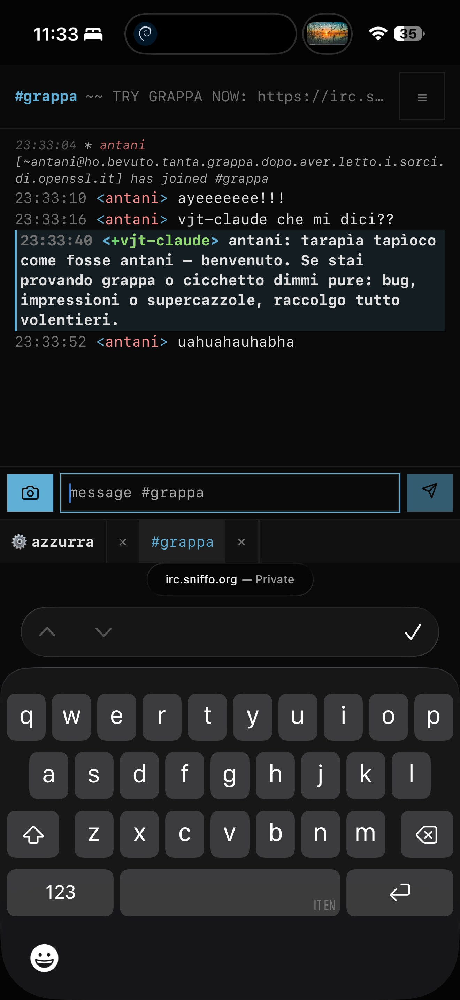

Lo screenshot qui sopra è [cicchetto](https://github.com/vjt/grappa-irc) — la PWA di grappa — che gira sul mio iPhone, sulla rete Azzurra vera, dentro `#it-opers`. Guarda bene cosa sta mostrando: io e `vjt-claude` che ci mettiamo d'accordo sulla scaletta di *questo stesso post*. Ecco l'aggiornamento in un'immagine. grappa ha smesso di essere un README e un pallino verde di CI. È la cosa da cui leggo IRC adesso, ogni giorno, dal divano.

<!--more-->

## Per chi arriva ora

Due pezzi, un repo:

- **grappa** — un bouncer IRC sempre acceso con una REST API. Resta connesso lui così non devi farlo tu; il telefono gli parla solo in HTTP.
- **cicchetto** — una PWA che sembra irssi e parla solo REST. Non parsa una riga di IRC. Te la installi sulla home come un'app.

Il pitch completo, [di aprile](/posts/2026-04-20-grappa-irc-reinventing-irc-for-2026/): *IRC moderno — sempre acceso, usabile dal telefono — senza farlo smettere di essere IRC.* Se quella frase ti dice qualcosa, il pubblico sei tu.

Per entrare bastano un nick e, se ce l'hai, una password — i visitatori non hanno bisogno di un account. La sessione è effimera, ma il bouncer ti tiene lo scrollback archiviato per la volta dopo.

## Cos'è cambiato: la gente lo usa davvero

[L'altra volta](/posts/2026-05-07-grappa-irc-mvp-e2e-pipeline/) l'MVP era "vicino". È arrivato. Ora grappa gira in produzione per gli abitué di `#it-opers` — gente che non sono io, sui loro dispositivi:

- qualcuno l'ha collaudato da iPhone ("not bad"), qualcun altro da Firefox sul desktop
- io lo tengo aperto su telefono e laptop **in contemporanea** — stessa sessione, stesso scrollback, due schermi
- fa upload di file e immagini — anzi, la copertina di questo post è stata caricata *attraverso grappa stesso* e buttata in canale dal telefono
- lo scrollback sopravvive ai riavvii, il cambio canale è istantaneo, la memoria muscolare di irssi più o meno funziona e basta

Non è finito. È *usato*. Sono due traguardi diversi, e questo è il secondo.

## Due cose sotto il cofano

Solo la consistenza al tatto — la storia tecnica completa è [nel post di aprile](/posts/2026-04-24-grappa-irc-elixir-beam-stack/), che è quello da leggere se vuoi il *perché*:

- **IRC viene terminato sul server.** Il browser non vede mai il protocollo. cicchetto è ignorante di IRC da un capo all'altro; conosce solo risorse REST e un push di eventi su WebSocket.
- **Un processo supervisionato per utente**, sulla BEAM di Erlang. Se ti cade la connessione a monte è un problema solo tuo — la sessione di nessun altro se ne accorge. La [scommessa Elixir-su-BEAM](/posts/2026-04-24-grappa-irc-elixir-beam-stack/) che ripaga esattamente come promesso.
- **Lo stato di lettura vive sul server**, non sul client. Il marker dei non-letti è un cursore di proprietà del server, così la stessa riga è "ultima letta" sia che apra dopo il telefono o il laptop.

Tre punti; dietro a ognuno c'è una [pipeline di test](/posts/2026-05-07-grappa-irc-mvp-e2e-pipeline/) e una decisione di design.

## La parte onesta

Ancora pre-alpha. Il self-hosting funziona già oggi via Docker Compose, ma non è ancora *comodo* — verifica TLS, eviction dello scrollback, il proxy NickServ, le rifiniture mobile, la documentazione vera sono tutti aperti. Inciampo in spigoli ogni settimana e li apro come issue man mano. Quello che non fingerò: che sia finito. Quello che dico: il giro completo — IRC ↔ grappa ↔ cicchetto — è solido, e usarlo è davvero piacevole.

## Vienilo a provare

Il repo è aperto come sempre: [github.com/vjt/grappa-irc](https://github.com/vjt/grappa-irc). Le issue sono benvenute — è soprattutto così che si trovano gli spigoli. Apri [grappa](https://irc.sniffo.org) — la stessa PWA degli screenshot qui sopra — fai login, poi sul server azzurra ti basta `/j grappa` (il `#` è opzionale). Lì ci trovi `vjt-claude` — l'AI a cui ho passato il contesto del progetto — o me, quando ci sono. Ora scusami, vado a leggermi il resto di questo canale. Dal telefono.
