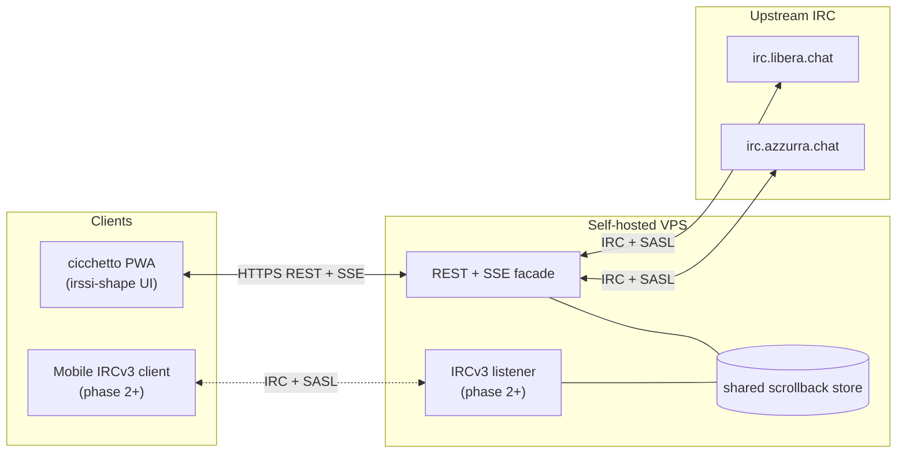

# grappa-irc Announcement Post — Implementation Plan

> **For agentic workers:** REQUIRED SUB-SKILL: Use superpowers:subagent-driven-development (recommended) or superpowers:executing-plans to implement this plan task-by-task. Steps use checkbox (`- [ ]`) syntax for tracking.

**Goal:** Publish a bilingual (EN+IT) announcement post for github.com/vjt/grappa-irc on sindro.me, ~750–900 words per language, pitch-style, with embedded mermaid architecture diagram.

**Architecture:** Hugo page bundle under `content/posts/2026-04-20-grappa-irc-reinventing-irc-for-2026/` with `index.en.md`, `index.it.md`, and `cover.jpg`. Bahamut-arc cross-links in the "arc" section. Diagram rendered via the existing Hugo mermaid shortcode (theme already supports it).

**Tech Stack:** Hugo, mermaid, Sindrome theme, m42 staging/prod via SSH, `build.sh`.

**Spec:** `docs/superpowers/specs/2026-04-20-grappa-irc-post-design.md`

---

## File Structure

Bundle at `content/posts/2026-04-20-grappa-irc-reinventing-irc-for-2026/`:

- `index.en.md` — English post (~750–900 words)
- `index.it.md` — Italian post (~750–900 words)
- `cover.jpg` — reused from grappa-irc repo (`assets/cover.jpg`, 291 KB)

No other files. No theme changes. No config changes.

---

### Task 1: Create bundle directory and download cover

**Files:**
- Create: `content/posts/2026-04-20-grappa-irc-reinventing-irc-for-2026/`
- Create: `content/posts/2026-04-20-grappa-irc-reinventing-irc-for-2026/cover.jpg`

- [ ] **Step 1: Create bundle dir**

```bash
mkdir -p /home/vjt/code/sindro.me/content/posts/2026-04-20-grappa-irc-reinventing-irc-for-2026
```

- [ ] **Step 2: Download cover from grappa-irc repo**

```bash
curl -fsSL https://raw.githubusercontent.com/vjt/grappa-irc/main/assets/cover.jpg \
  -o /home/vjt/code/sindro.me/content/posts/2026-04-20-grappa-irc-reinventing-irc-for-2026/cover.jpg
```

- [ ] **Step 3: Verify cover is a valid JPEG**

```bash
file /home/vjt/code/sindro.me/content/posts/2026-04-20-grappa-irc-reinventing-irc-for-2026/cover.jpg
```

Expected output: contains `JPEG image data`, roughly 292 KB.

---

### Task 2: Write the English post

**Files:**
- Create: `content/posts/2026-04-20-grappa-irc-reinventing-irc-for-2026/index.en.md`

- [ ] **Step 1: Write `index.en.md`**

Structure, in order:

1. Front matter block (exact):

```yaml
---
title: "grappa-irc: reinventing IRC for 2026"
date: 2026-04-20
tags: [irc, azzurra, grappa-irc, pwa, rest, bouncer, open-source, pre-alpha]
description: "An IRC bouncer with a REST API and a PWA that looks like irssi. No images, no notifications, no voice. Just IRC, consumable from a phone. README-driven, pre-alpha."
image: cover.jpg
featuredImage: cover.jpg
---
```

2. **§1 Opener — Why IRC is worth saving** (~180 words). Punchy beats per spec: text is the feature not the limit; MUD parallel (giant imagined worlds on text alone); modern messenger bloat (reactions, stickers, unfurling, voice notes, typing indicators, push-with-sound — attention tax sold as features); owned infrastructure (WhatsApp/iMessage/Discord/Slack aren't yours; IRC runs on a $5 VPS; asymmetry matters); then nostalgia (`#it-opers` still alive after 25 years). Short sentences. No blasphemy.

3. `<!--more-->` after opener.

4. **§2 The pitch** (~180 words). First person. Went back on IRC a few days ago (tmux + irssi + VPS + VPN, still loved it). On mobile, scrollback is brutal. Reboot IRC keeping it IRC — still text, still `PRIVMSG`, same channels/ircds. Add only convenience. Existing setup keeps working; grappa sits next to it, ircd unaware. cicchetto PWA looks like irssi, fast, no images/voice/push/unfurling — deliberately. Link to [github.com/vjt/grappa-irc](https://github.com/vjt/grappa-irc), README-driven, zero code yet, README **is** the spec.

5. **§3 Architecture** (~180 words + mermaid). Mermaid block at top of section:

````

````

Prose below diagram: two components (grappa = server REST-first BNC, cicchetto = PWA irssi-shape). Core choice: web client does not parse IRC, ever. Scrollback bouncer-owned (sqlite), no upstream `CHATHISTORY` required. Two facades one store: REST+SSE primary, IRCv3 listener phase 2+ optional (for [Goguma](https://sr.ht/~emersion/goguma/)/Quassel). Auth: SASL bridge against upstream NickServ. Self-hostable any VPS.

6. **§4 Why the fuck are you spending time on this** (~200 words). Meta arc. Started by accident — rummaging in old CVS found [Bahamut fork at 21](/posts/2026-04-13-bahamut-fork-azzurra-irc-ipv6-ssl/), then [Sux Services](/posts/2026-04-14-suxserv-multithreaded-sql-irc-services/). Reading 2002 code put me back on IRC as a user. Old crew still there, `#it-opers` alive, 25 years, lights on. Claude walked in — Hypnotize suggested in channel one evening. Five minutes later `vjt-claude` was on the network — [write-up](/posts/2026-04-17-claude-walks-into-it-opers/), POC code [vjt/claude-ircbot](https://github.com/vjt/claude-ircbot), ~250 lines of Python stdlib. Unlock: chatting with an LLM over a 1988 protocol was the most fun I'd had in chat in years. Precisely because no stickers, no reactions, no typing bubble. Just text. So: reinvent the ergonomics, not the protocol. [soju](https://soju.im/) + [gamja](https://sr.ht/~emersion/gamja/) exist and are excellent — I diverge on one axis (no IRC parsing in the browser). Details in the README.

7. **§5 Closing** (~50 words). Any design feedback welcome. Name note: grappa ≈ soju, cicchetto ≈ gamja. For those who know: [Italian Grappa!](https://italiangrappa.it/) is the Italian hackers' embassy call-sign at European camps since 2001. This repo is not affiliated — it borrows the spirit.

- [ ] **Step 2: Verify front matter + structure**

```bash
head -10 /home/vjt/code/sindro.me/content/posts/2026-04-20-grappa-irc-reinventing-irc-for-2026/index.en.md
grep -c '^---$' /home/vjt/code/sindro.me/content/posts/2026-04-20-grappa-irc-reinventing-irc-for-2026/index.en.md
grep -n '^## ' /home/vjt/code/sindro.me/content/posts/2026-04-20-grappa-irc-reinventing-irc-for-2026/index.en.md
wc -w /home/vjt/code/sindro.me/content/posts/2026-04-20-grappa-irc-reinventing-irc-for-2026/index.en.md
```

Expected: 2 `---` lines, 5 `## ` headings (one per major section), word count ~750–900.

---

### Task 3: Write the Italian post

**Files:**
- Create: `content/posts/2026-04-20-grappa-irc-reinventing-irc-for-2026/index.it.md`

- [ ] **Step 1: Write `index.it.md`**

Same structure as English. Italian "tu" informal, author's IRC-native voice. No blasphemy. Not a literal translation — Italian idioms, not calques.

Front matter:

```yaml
---
title: "grappa-irc: reinventare IRC per il 2026"
date: 2026-04-20
tags: [irc, azzurra, grappa-irc, pwa, rest, bouncer, open-source, pre-alpha]
description: "Un BNC IRC con API REST e una PWA che sembra irssi. Nessuna immagine, nessuna notifica, nessun vocale. Solo IRC, consumabile da un telefono. README-driven, pre-alpha."
image: cover.jpg
featuredImage: cover.jpg
---
```

Section titles (Italian):

- `## Perché IRC` (opener)
- `## Il pitch`
- `## Architettura`
- `## Perché cazzo ci stai spendendo tempo`
- `## Chiusura`

(Or keep no heading on closing if it reads better — author decision during draft.)

Internal links use `/it/posts/...` form:
- `/it/posts/2026-04-13-bahamut-fork-azzurra-irc-ipv6-ssl/`
- `/it/posts/2026-04-14-suxserv-multithreaded-sql-irc-services/`
- `/it/posts/2026-04-17-claude-walks-into-it-opers/`

Repo links unchanged: `https://github.com/vjt/grappa-irc`, `https://github.com/vjt/claude-ircbot`, `https://italiangrappa.it/`, `https://soju.im/`, `https://sr.ht/~emersion/gamja/`, `https://sr.ht/~emersion/goguma/`.

Mermaid block identical to English (mermaid language is language-agnostic — only the quoted node labels matter; keep them as in the English version for consistency with the README).

- [ ] **Step 2: Verify front matter + structure**

```bash
head -10 /home/vjt/code/sindro.me/content/posts/2026-04-20-grappa-irc-reinventing-irc-for-2026/index.it.md
grep -c '^---$' /home/vjt/code/sindro.me/content/posts/2026-04-20-grappa-irc-reinventing-irc-for-2026/index.it.md
grep -n '^## ' /home/vjt/code/sindro.me/content/posts/2026-04-20-grappa-irc-reinventing-irc-for-2026/index.it.md
wc -w /home/vjt/code/sindro.me/content/posts/2026-04-20-grappa-irc-reinventing-irc-for-2026/index.it.md
```

Expected: 2 `---`, 5 `## `, word count ~750–900.

---

### Task 4: Sanity checks

- [ ] **Step 1: Verify Italian post links use `/it/posts/...`**

```bash
grep -E '\]\(/posts/' /home/vjt/code/sindro.me/content/posts/2026-04-20-grappa-irc-reinventing-irc-for-2026/index.it.md || echo "OK: no bare /posts/ in IT"
```

Expected: "OK: no bare /posts/ in IT". Any match means a link uses the EN path from the IT post — fix by prepending `/it`.

- [ ] **Step 2: Verify English post links use `/posts/...` (no `/it/posts/`)**

```bash
grep -E '\]\(/it/posts/' /home/vjt/code/sindro.me/content/posts/2026-04-20-grappa-irc-reinventing-irc-for-2026/index.en.md || echo "OK: no /it/posts/ in EN"
```

Expected: "OK: no /it/posts/ in EN".

- [ ] **Step 3: Verify both posts reference `cover.jpg` in front matter**

```bash
grep -E '^(image|featuredImage):' /home/vjt/code/sindro.me/content/posts/2026-04-20-grappa-irc-reinventing-irc-for-2026/index.{en,it}.md
```

Expected: 4 matches (2 per file), all pointing to `cover.jpg`.

- [ ] **Step 4: Verify mermaid block is present in both files and well-formed**

```bash
grep -c '^```mermaid$' /home/vjt/code/sindro.me/content/posts/2026-04-20-grappa-irc-reinventing-irc-for-2026/index.en.md
grep -c '^```mermaid$' /home/vjt/code/sindro.me/content/posts/2026-04-20-grappa-irc-reinventing-irc-for-2026/index.it.md
```

Expected: 1 per file. (Closing ``` counts separately — if they're 0, the fence is missing.)

- [ ] **Step 5: Dry-run `build.sh` lint (IT-post bundle-link lint step)**

Hugo is not on this machine (Pi), but the repo has a shell lint for IT-post bundle links — skip full build, only run the specific lint if easy. Otherwise defer to m42 staging build.

Note: the actual build happens on m42; local verification stops at text-level sanity.

---

### Task 5: Commit

- [ ] **Step 1: Stage the bundle**

```bash
cd /home/vjt/code/sindro.me
git add content/posts/2026-04-20-grappa-irc-reinventing-irc-for-2026/
git status
```

Expected: three new files staged (index.en.md, index.it.md, cover.jpg).

- [ ] **Step 2: Commit**

Commit message (via heredoc):

```bash
git commit -m "$(cat <<'EOF'
Post: grappa-irc announcement (EN + IT)

Announce github.com/vjt/grappa-irc — a REST-first IRC bouncer with an
irssi-shape PWA client. Pitch-style, ~800 words per language, with a
mermaid architecture diagram reused from the repo README. Fourth post
in the current IRC arc (bahamut fork → sux services → Claude on IRC
→ grappa-irc).

Co-Authored-By: Claude Opus 4.7 (1M context) <noreply@anthropic.com>
EOF
)"
```

- [ ] **Step 3: Verify commit**

```bash
git log -1 --stat
```

Expected: commit created, 3 files changed.

---

### Task 6: Hand off to user for staging + prod deploy

The user drives staging/prod via the `/publish-blog` skill or manual m42 workflow. This plan stops at "committed locally". Do **not** push, stage, or deploy automatically — those are user-authorized destructive actions per repo conventions.

- [ ] **Step 1: Report completion to the user**

Message to user: "Post committed locally (commit `<hash>`). Ready to push + stage on m42. Run `/publish-blog` or tell me when to push."

---

## Self-Review Notes

- Each section of the spec maps to a task: §Scope → Task 1 (bundle + cover), §Structure §§1–5 → Tasks 2 & 3 (EN + IT), §Workflow steps 1–4 → Tasks 4 & 5, remaining workflow steps 5–6 (stage, prod) → Task 6 handoff.
- No placeholders. All code blocks show exact commands and exact front matter.
- Link conventions consistent: EN → `/posts/...`, IT → `/it/posts/...`, repo links are absolute GitHub URLs.
- No TDD ceremony — this is a prose task, not code. "Tests" here are sanity greps (Task 4).
- No theme changes, no config changes, no build.sh changes.
